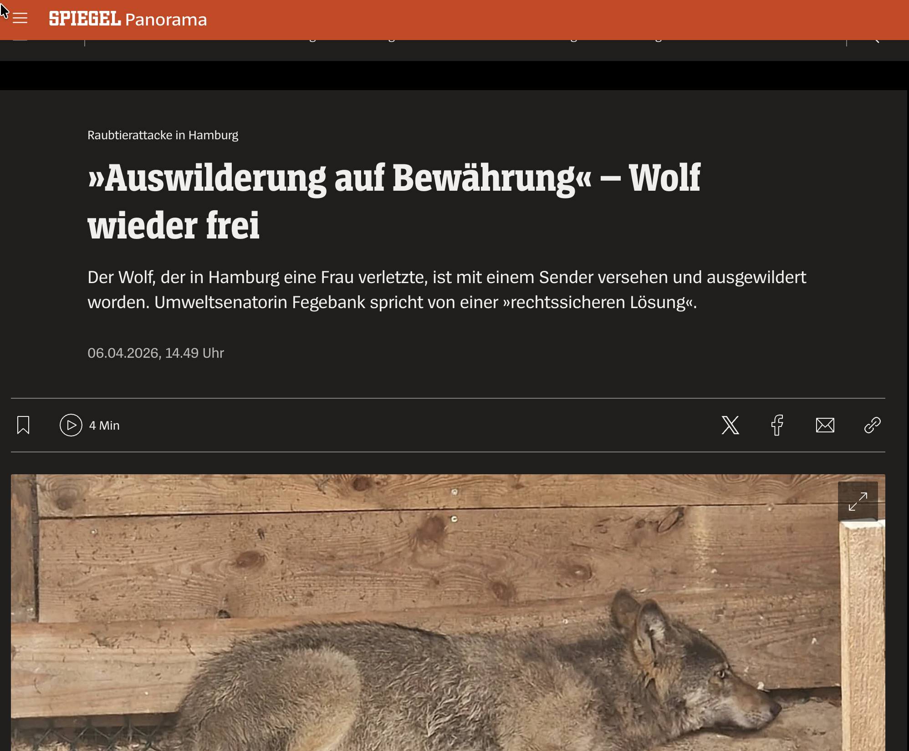
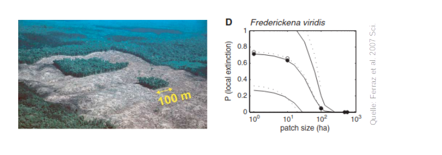
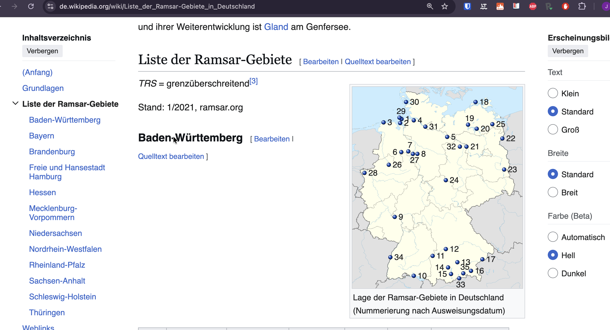

```{r setup}
#| include: false
library(tidyverse)
library(here)

knitr::opts_chunk$set(
  echo = TRUE,
  warning = FALSE,
  message = FALSE,
  fig.height = 4.5,
  fig.width = 4.5
)
```

# Organisatorisches

## Team

-   Johannes Signer (Wissenschaftlicher Mitarbeiter in der Abteilung Wildtierwissenschaften)
    -   Forschungsinteressen: Bewegungsökologie, statistische Methoden in der Ökologie
    -   Werdegang: Ökologie (BSc), Geoinformatik (MSc), angewandte Statistik (MSc) und Forstwissenschaften (PhD)

## Kontakt

-   Email:[jsigner\@uni-goettingen.de](mailto:jsigner@uni-goettingen.de){.email}
-   Verwenden Sie auch das Forum bei StudIP, dort beantworten wir am liebsten Ihre Fragen.

## Wer sind Sie?


## Ablauf

-   12 Termine (10 davon in Präsenz)
-   Präsenztermine Mo: von 9:15 bis ca. 11:45 (Vorlesung und Übung)
-   Für die Übungen brauchen Sie meist einen Laptop. Sollten Sie keinen Laptop zur Verfügung haben, melden Sie sich bitte bei mir.

## Bewertung

1.  Prüfungsvorleistung: ein 60-minütiger Multiple-Choice Test zu den wichtigsten Konzepten der Vorlesung.
2.  Eine Hausarbeit (siehe Website zu Details)

Bei der Prüfung wird **nicht** nach Programmierkenntnissen in R gefragt, sondern nur nach der Interpretation von Ergebnissen.

## Nutzen von KI

- Ich ermutige Sie KI unterstützend zu nutzen. 
- Meine Erfahrung ist, dass man KI gut nutzen kann **wenn man ungefähr weiß** was man braucht, jedoch es schwieriger ist, sich mit KI einen Überblick zu verschaffen. 

:::{fragment}
:::{.callout-warning}

## Wichtig
- Wenn Sie z.B. bei den Übungen nicht wissen, wo Sie anfangen sollen, dann fragen Sie Kommilitonen oder mich.
- Wenn Sie bei einem R-Befehl unsicher sind, bzw. den Fehler nicht gleich entdecken, fragen Sie die KI. 
:::
:::
## Ausblick

-   Artporträts: Wie funktioniert Monitoring bei einzelnen Arten
-   Themen für die Hausarbeit: Zu wissenschaftlichen Arbeiten und Datenanalyse

------------------------------------------------------------------------

### Rahmenbedingungen und Erfassung von Wildtieren (E1 & E2)

-   Wie kann man Wildtiere überhaupt erfassen?
-   Aktive vs. passive Erfassung.
-   Für welche Methoden braucht man welche Daten?

------------------------------------------------------------------------

### Verbreitung von Arten (E3 - E6)

-   Die meisten Methoden erfordern eine statistische Grundausbildung.
-   Regressionen sind sehr oft das Mittel der Wahl, deshalb müssen wir einige Grundlagen wiederholen bzw. anlegen.
-   Keine Angst, dies ist kein Statistikkurs, sondern Statistik ist ein Hilfsmittel.
-   Welche Gebiete bewohnt eine Art? Welche Kovariaten können das Vorkommen einer Art beschreiben?
-   Entkoppeln des Beobachtungsprozesses vom biologischen Prozess.
-   Wir werden diese Einheiten nutzen, um einige statistische Grundlagen zu erarbeiten.

## Was hat Programmierung in einem Wildbio Kurs verloren?

Immer mehr Daten:

-   Ein Fotofallenmonitoring mit 50 Fotofallen, die acht Wochen im Feld sind (mit 30 Fotos pro Kamera und Tag) = `r format(50 * 30 * 7 * 8, big.mark = ".")` Fotos.
-   Ein durchschnittliches Telemetrieprojekt mit 20 Tieren, 1 Lokalisierung pro Stunde und Tier für ein Jahr = `r format(20 * 24 * 360, big.mark = ".")` Datenpunkte.
-   ATLAS-Telemetriesystem: 30 Vögel für 50 Tage mit einer Lokalisierung pro 8 Sekunden: `r format(24 * 60 * 60 / 8 * 30 * 50, big.mark = ".")` Datenpunkte.

------------------------------------------------------------------------

### Abundanz von Wildtieren (E7 & E8)

-   Schätzen von Populationsgrößen, wenn Individuen nicht eindeutig zugeordnet werden können.
-   Schätzen von Populationsgrößen, wenn Individuen eindeutig zugeordnet werden können.
-   Berücksichtigung der Raumnutzung.

------------------------------------------------------------------------

### Arbeiten mit Telemetriedaten (E9 - E12)

-   Woher stammen sie und was kann damit gemacht werden.
-   Finden von Migrationsmuster.

### Streifgebiete

-   Wo halten sich Tiere auf und wie ändern sich Raumansprüche über die Zeit?
-   Haben männliche und weibliche Tiere unterschiedliche Raumansprüche?

### Habitatselektion

-   Gibt es Präferenzen für bestimmte Habitate?
-   Wie kann die Verfügbarkeit von Habitaten quantifiziert werden?

------------------------------------------------------------------------

### Ablauf: Vorlesung

-   13.04.2026: E01: Einführung
-   20.04.2026: E02: Erfassung von Wildtieren
-   27.04.2026: E03: Verbreitung 1
-   05.05.2026: E04: Verbreitung 2
-   11.05.2026: E05: Occupancy-Modelle 1 (online)
-   18.05.2026: E06: Occupancy-Modelle 2
-   25.05.2026: *Keine Vorlesung (Pfingsten/Exkursionswoche)*
-   01.06.2026: E07: Abundanz 1
-   08.06.2026: E08: Abundanz 2

------------------------------------------------------------------------

-   15.06.2026: E09: Telemetrie 1: Random Walks etc.
-   22.06.2026: E10: Telemetrie 2: Streifgebiete
-   29.06.2026: E11: Telemetrie 3: Habitatselektion (online)
-   06.07.2026: E12: Telemetrie 4: Habitatselektion
-   13.07.2026: Test
-   31.08.2026: Abgabe der Hausarbeit

------------------------------------------------------------------------

### Ablauf: Vor- und Nachbereitung

-   Oft gibt es eine Podcast-Episode als Einführung in ein Thema. Bitte hören Sie sich diese vor der Vorlesung an.
-   Nach einer Vorlesung gibt es eine kurze Literaturrecherche, die wir in der folgenden Woche besprechen.

## Motivation

-   Bestände von Wildtiere nehmen zu (z.B. die Wolfspopulation wächst stetig in D).

```{r, echo = FALSE, out.width="50%"}
knitr::include_graphics(("img/bsp/wolf.png"))
```

------------------------------------------------------------------------

```{r, echo = FALSE, out.width="80%"}
knitr::include_graphics(("img/bsp/wolf-2.png"))
```

------------------------------------------------------------------------


------------------------------------------------------------------------



------------------------------------------------------------------------

-   Konflikte zwischen unterschiedlichen Interessen (Land- und Forstwirtschaft, Naturschutz, Freizeit, ...).

```{r, echo = FALSE, out.width="70%"}
knitr::include_graphics(("img/bsp/fischotter.png"))
```

------------------------------------------------------------------------

```{r, echo = FALSE, out.width="80%"}
knitr::include_graphics(("img/bsp/rotmilan.png"))
```

------------------------------------------------------------------------

```{r, echo = FALSE, out.width="80%"}
knitr::include_graphics(("img/bsp/kite.png"))
```

------------------------------------------------------------------------

-   Wildtiere sind oft nicht das eigentliche Problem.

```{r, echo = FALSE, out.width="50%"}
knitr::include_graphics(("img/bsp/gams-0.png"))
```

------------------------------------------------------------------------

```{r, echo = FALSE, out.width="70%"}
knitr::include_graphics(("img/bsp/gams-1.png"))
```

------------------------------------------------------------------------

-   Verbreitungen von Krankheiten.

```{r, echo = FALSE, out.width="80%"}
knitr::include_graphics(("img/bsp/asp.png"))
```

## Was ist Monitoring?

Nach Yoccoz et al. 2001[^1], ist Monitoring:

[^1]: Yoccoz, N. G., Nichols, J. D., & Boulinier, T. (2001). Monitoring of biological diversity in space and time. Trends in ecology & evolution, 16(8), 446-453.

> Ein Prozess zum Beobachten von Zustandsvariablen über die Zeit mit dem Ziel den Zustand des Systems zu untersuchen und Inferenz zu betreiben.

------------------------------------------------------------------------

-   **Zustandsvariablen** sind Messgrößen, die ein System charakterisieren (z.B. die Abundanz einer Tierart, Biodiviersitätsindizes oder Biomasse, genetische Vielfalt).
-   Unter **Inferenz** versteht man, dass man (statistisch) gesicherte Aussagen über das System machen möchte. Beispiele hierfür sind zu untersuchen, ob bestimmte Kovariate einen Populationstrend beeinflussen oder Vorhersagen für die Zustandsvariable in der Zukunft zu machen.

------------------------------------------------------------------------

### Am Anfang steht die Planung

1.  Wieso soll überhaupt ein Monitoring durchgeführt werden?
2.  Was soll untersucht bzw. aufgenommen werden?
3.  Wie soll das Monitoring durchgeführt werden?

------------------------------------------------------------------------

### 1. Wieso soll überhaupt ein Monitoring durchgeführt werden?

Ein Monitoring kann unterschiedliche Motivationen haben:

a.  Beantworten von wissenschaftlichen Fragestellungen. (experimentelle) Ansätze zum Testen von *a priori* Hypothesen. Z.B. wie wirkt sich Fragmentierung von Wald auf die Artenzahl aus?[^2]

[^2]: Ferraz, G. et al. (2007). A large-scale deforestation experiment: effects of patch area and isolation on Amazon birds. Science, 315(5809), 238-241.

```{r, echo = FALSE, out.width="100%"}

```

------------------------------------------------------------------------

b.  Management Grundlage: Für ein objektives Management von (Wildtier)population braucht man verlässliche quantitative Grundlagen. Unterschiedliche Monitorings bieten dafür eine Möglichkeit. Dabei sollten anhand der untersuchten Zustandsvariablen (z.B. Dichte, Verbissintensität, etc.) konkrete Managementempfehlungen abgeleitet werden.

------------------------------------------------------------------------

### 2. Was soll untersucht bzw. aufgenommen werden?

Je nach dem Ziel des Monitorings, leiten sich unterschiedliche Zustandsvariablen ab, die untersucht werden. Typische Beispiele sind z.B. Populationsdichte (bzw. -größe), Verbiss, Überlebensraten, Änderung in der Raumnutzung.

------------------------------------------------------------------------

### 3. Wie soll das Monitoring durchgeführt werden?

Bei der konkreten Durchführung eines Monitorings müssen folgende Punkte festgelegt werden:

a.  Wie oft wird das Monitoring durchgeführt.
b.  Welche Flächen/Populationen werden ins Monitoring eingeschlossen.
c.  Wie wird Fehlern begegnet, dass Tiere
    i.  nicht gesehen werden, bzw.
    ii. die Dichte sich räumlich ändert.

## Motivation für ein Monitoring

-   Forschung
-   Wirtschaftliche Interessen
-   Rechtliche Rahmenbedingungen (z.B. FFH)

# Rechtliche Rahmenbedingungen

## Etwas Terminologie

Internationale Übereinkommen (international conventions)

:   Werden von Staaten geschlossen und müssen durch nationales und/oder EU-Recht umgesetzt werden. Z.B. Berner Konvention

EU-Richtlinie

:   Gibt den Rahmen vor und muss in nationales Recht umgewandelt werden. Z.B. die FFH-Richtlinie

EU-Verordnung

:   Gesetzlicher Rahmen wird von der EU vorgegeben und muss nicht mehr in nationales Recht umgewandelt werden. Z.B. Monitoring von Treibhausgasen-Emissionen.

## Ramsar-Konvention (1971): Übereinkommen über Feuchtgebiete von internationaler Bedeutung

**Ziel:** Schutz und nachhaltige Nutzung von Feuchtgebieten weltweit

-   Ältestes internationales Naturschutzabkommen
-   Vertragsstaaten verpflichten sich, mindestens ein Feuchtgebiet als „Ramsar-Gebiet" auszuweisen
-   Heute: 172 Vertragsstaaten, über 2.400 Ramsar-Gebiete (250 Mio. Hektar)
-   Deutschland: 35 ausgewiesene Gebiete.

**Verbindung zu anderen Abkommen:** Enge Kooperation mit der CBD; Feuchtgebiete sind Teil des CBD-Arbeitsprogramms zu Binnengewässern.

------------------------------------------------------------------------

::: callout-note
Kennen Sie ein Ramsar-Gebiet in Deutschland? Suchen recherchieren Sie eins.
:::

::: fragment

:::

## Übereinkommen über die Erhaltung der europäischen wildlebenden Pflanzen und Tiere und ihrer natürlichen Lebensräume (Berner Konvention)

**Ziel:** Schutz gefährdeter Wildtierarten und ihrer Lebensräume in Europa

-   Erstes europäisches Abkommen zum Schutz der Biodiversität
-   51 Unterzeichnerstaaten (Europarat + Nicht-EU-Länder)
-   Strenger Schutz für über 1.000 bedrohte Tier- und Pflanzenarten (Anhänge I–III)
-   Verpflichtung zur Zusammenarbeit bei grenzüberschreitenden Arten

**Verbindung zu anderen Abkommen:** Direkter Vorläufer der EU-FFH-Richtlinie – viele Bestimmungen wurden 1992 in EU-Recht übernommen.

## Fauna-Flora-Habitat-Richtlinie der Europäischen Union (92/43/EWG; FFH-Richtlinie)

**Ziel:** Schutz europäischer Lebensräume und Arten durch ein einheitliches Schutzgebietsnetz

-   Setzt die Berner Konvention verbindlich in EU-Recht um
-   Gemeinsam mit der Vogelschutzrichtlinie (1979) Grundlage für **Natura 2000**
-   Natura 2000: Größtes Schutzgebietsnetz der Welt – über 27.000 Gebiete in der EU
-   Arten und Lebensraumtypen in Anhängen II, IV und V geregelt
-   Mitgliedstaaten müssen „günstigen Erhaltungszustand" sicherstellen

--------

**Verbindung zu anderen Abkommen:** Praktische Umsetzung der Berner Konvention; trägt zu den CBD- und Kunming-Montreal-Zielen bei (30×30).

## Die Anhänge der FFH-Richtlinie
 
Die FFH-Richtlinie gliedert sich in sechs Anhänge, die genau festlegen, was wie geschützt wird
 
| Anhang | Inhalt | Schutzpflicht |
|---|---|---|
| **Anhang I** | Schutzbedürftige Lebensraumtypen (z.B. Hochmoore, Buchenurwälder, Dünen) | Ausweisung als Natura-2000-Gebiet (SAC = Special Area of Conservation) |
| **Anhang II** | Tier- und Pflanzenarten, für die Schutzgebiete ausgewiesen werden müssen | Ausweisung als Natura-2000-Gebiet (SAC) |
| **Anhang III** | Kriterien zur Auswahl der Schutzgebiete (Repräsentativität, Fläche, Zustand) | Bewertungsgrundlage |
| **Anhang IV** | Streng zu schützende Arten (z.B. alle Fledermäuse, Wolf, Luchs, Meeresschildkröten) | Europaweites Tötungs- & Störungsverbot |
| **Anhang V** | Arten, deren Entnahme aus der Natur reguliert werden darf | Nutzungsbeschränkungen |
| **Anhang VI** | Verbotene Fang- und Tötungsmethoden | Methoden- & Geräteverbot |

---------
 
**Wichtige Unterscheidung:**
- Anhang I & II → bestimmen, **wo** Schutzgebiete entstehen (Natura 2000)
- Anhang IV → gilt **überall** in der EU, unabhängig von Schutzgebieten (strengster Schutz)
- Anhang V & VI → regeln die **Nutzung** und **Jagdmethoden**
 
**Beispiele Anhang IV (streng geschützt, EU-weit):** Alle heimischen Fledermausarten, Wolf, Biber
 


## Globaler Biodiversitätsrahmen (GBF) – verabschiedet unter der CBD (Kunming-Montreal Abkommen 2022)

**Ziel:** Stopp und Umkehr des Biodiversitätsverlusts bis 2030 und darüber hinaus

-   Verabschiedet auf der CBD-COP15 in Montreal (Dezember 2022)
-   Kernziel: **30×30** – 30 % der Land- und Meeresflächen bis 2030 schützen
-   Weitere Ziele: Reduktion schädlicher Subventionen, Wiederherstellung degradierter Ökosysteme (30 %), gerechter Vorteilsausgleich für indigene Gemeinschaften
-   196 Vertragsstaaten (nahezu weltweit)

**Verbindung zu anderen Abkommen:** Dachrahmen unter der CBD; gibt Ramsar, Berner Konvention und FFH/Natura 2000 neue politische Schubkraft und konkrete Flächenziele.

## Wie hängen sie zusammen?

| Abkommen          | Ebene  | Schwerpunkt                       |
|-------------------|--------|-----------------------------------|
| Ramsar            | Global | Feuchtgebiete                     |
| Berner Konvention | Europa | Wildtiere & Habitate              |
| FFH / Natura 2000 | EU     | Verbindliches Schutzgebietsnetz   |
| Kunming-Montreal  | Global | Gesamte Biodiversität, 30×30-Ziel |
