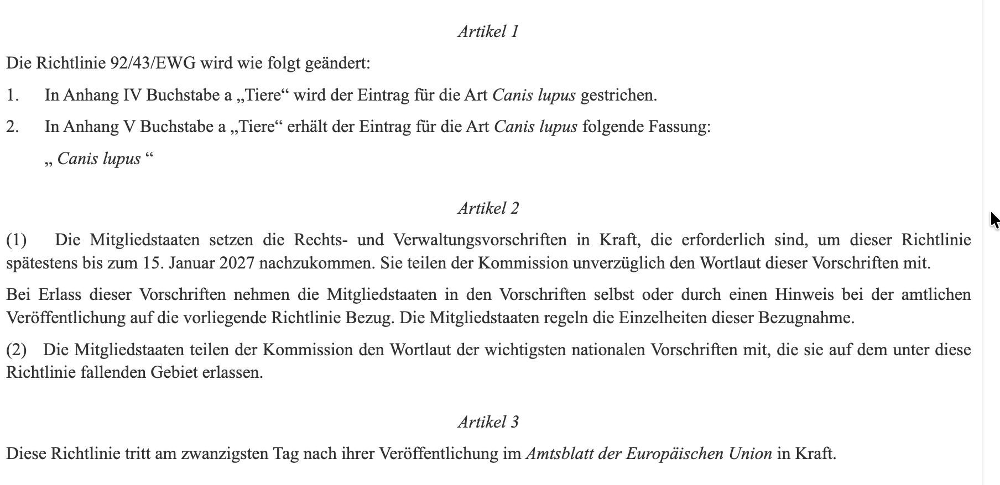
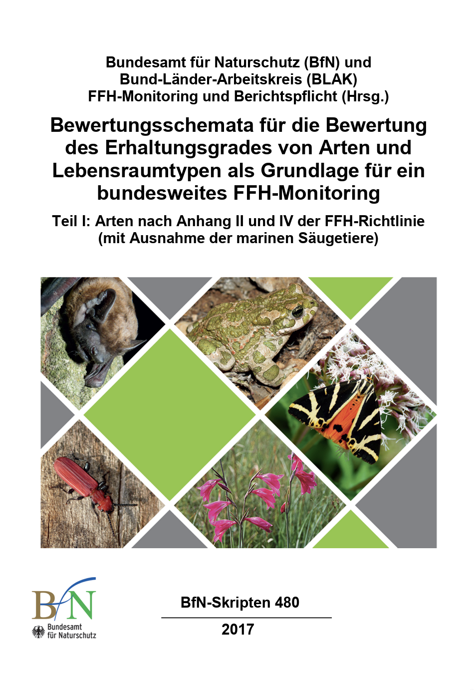
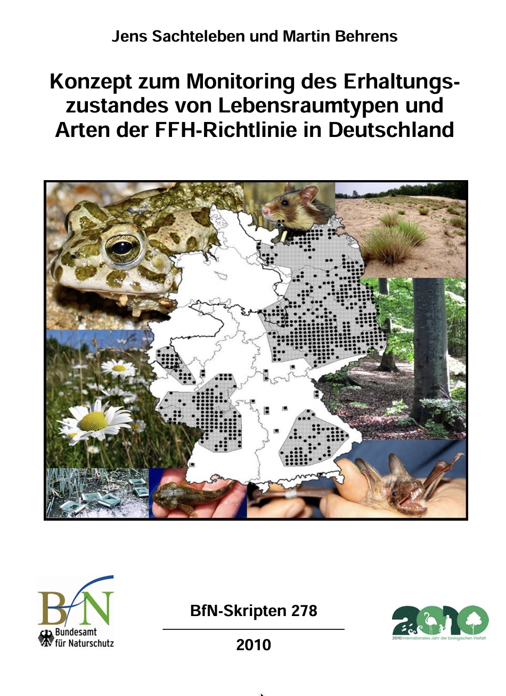

```{r setup}
#| include: false
library(tidyverse)
library(here)

knitr::opts_chunk$set(
  echo = TRUE,
  warning = FALSE,
  message = FALSE,
  fig.height = 4.5,
  fig.width = 4.5
)
```

# Nachträge

## Status Wolf

-   Der Wolf wurde von Anhang IV (streng geschützt) zu Anhang V



Quelle: <https://eur-lex.europa.eu/legal-content/DE/TXT/?uri=CELEX:32025L1237>

------------------------------------------------------------------------

::: callout-tip
## Optionale Information

-   [Debatte aus dem Bundestag und Anhörung](https://www.bundestag.de/dokumente/textarchiv/2026/kw10-de-bundesjagdgesetz-1150486) zur Aufnahme des Wolfes im Bundesjagdgesetzt.
-   [Pressemitteilung zur Aufnahme des Wolfs ins Bundesjagdgesetz](https://www.bmleh.de/SharedDocs/Pressemitteilungen/DE/2026/030-wolf.html)
-   Stellungnahme des NABUs <https://blogs.nabu.de/naturschaetze-retten/guenstiger-erhaltungszustand-wolf/>
:::

------------------------------------------------------------------------

> Nicht nur das, Studien aus Slowenien, Frankreich und Schweden belegen, dass die weitgehende Freigabe der Jagd auf Wölfe nicht zielführend hinsichtlich des Schutzes von Weidetieren ist. Der ist ausschließlich durch geeignete Herdenschutzmaßnahmen zu gewährleisten. Dafür gibt es zahlreiche Beispiele in Deutschland. Weidetiere durch das nun beschlossene Jagdgesetz zu schützen ist ein Trugschluss. Weidetierhalter, die sich darauf verlassen, werden verlassen sein.

Quelle: <https://www.wildtierschutz-deutschland.de/single-post/wolf-im-bundesjagdgesetz>

## Wie Funktioniert das FFH-Monitoring

Für Arten in Anhang II und IV:



--------------

Vorgehen für das generelle Monitoring (z.B. wie die Stichproben festgelegt werden):



# Erfassung von Wildtieren

## Wo sind wir?

-   [13.04.2026: E01: Einführung]{style="color: #888;"}\
-   **20.04.2026: E02: Erfassung von Wildtieren**
-   27.04.2026: E03: Verbreitung 1
-   05.05.2026: E04: Verbreitung 2
-   11.05.2026: E05: Occupancy-Modelle 1 (online)
-   18.05.2026: E06: Occupancy-Modelle 2
-   01.06.2026: E07: Abundanz 1
-   08.06.2026: E08: Abundanz 2
-   15.06.2026: E09: Telemetrie 1: Random Walks etc.
-   22.06.2026: E10: Telemetrie 2: Streifgebiete
-   29.06.2026: E11: Telemetrie 3: Habitatselektion (online)
-   06.07.2026: E12: Telemetrie 4: Habitatselektion

## Kurze Wiederholung/Vorschau


## Motivation

-   Für alle Monitoringvorhaben brauchen wir Daten. Diese müssen wir 'erfassen'.

-   Unter Erfassung ist hier das indirekte oder direkte Beobachten, Zählen oder Messen von Wildtieren in freier Wildbahn gemeint.

-   Reinhardt et al. (2015) Monitoring von Wolf, Luchs und Bär in Deutschland BfN Skript 413 (<https://www.bfn.de/fileadmin/> BfN/service/Dokumente/skripten/Skript413.pdf)

## Was macht es so schwierig Wildtiere zu erfassen?

-   Auffinden der Tiere kann schwierig sein.
-   Die meisten Tiere, die wir untersuchen, bewegen sich.
-   Die Dichten der Tiere variieren in Gebieten und zwischen Tierarten (z.B. Amsel vs. Luchs).

------------------------------------------------------------------------

```{r, echo = FALSE, out.width="90%", fig.align='center', fig.cap="Quelle: https://twitter.com/amymacbiologist/status/1278764537487876096"}
knitr::include_graphics(("img/mlion.jpeg"))
```

## Unterschiedliche Methoden für unterschiedliche Fragestellungen

-   Was möchte ich wissen?
-   Welche Methode kann ich dafür anwenden?
-   Welche Daten brauche ich für welche Methode?

Silvy, N. J., Lopez, R. R., & Peterson, M. J. (2012). Techniques for marking wildlife. The wildlife techniques manual, 1, 230-257.

## Der Versuch einer Einteilung

Wir müssen Entscheidungen treffen, die in folgende Kategorien fallen:

1.  Was für Daten benötigen wir?
    a.  Nachweise
    b.  Anzahlen
        i.  Anzahl Sichtungen
        ii. Anzahl gesehener Tiere
    c.  Individuelle Daten (z.B. Gewicht, Position)
        i.  einmalig
        ii. mehrmalig

------------------------------------------------------------------------

2.  Methoden der Erfassung
    a.  Aktiv (Beobachtung der Tiere im Feld)
        i.  direkt
        ii. indirekt
    b.  Passiv (Beobachtung der Tiere durch technische Hilfsmittel)
        i.  stationär (z.B. Fotofallen)
        ii. mobil (z.B. Telemetrie)
3.  Eingriffe am Tier
    a.  keine
    b.  Markierung
        i.  natürlich
        ii. künstlich

## Methoden der Erfassung

-   Die klassische Methode der Erfassung von Wildtieren ist die direkte oder indirekte Feldbeobachtung mit oder ohne technische Hilfsmittel (z.B. Fernglas).
-   In den vergangen Jahrzehnten sind eine Vielzahl von sensorbasierten Erfassungsmethoden hinzugekommen (z.B. satellitenbasierte Telemetrie oder Fotofallen).

```{r, echo = FALSE, out.width="50%", fig.align='center', fig.cap="Foto: J. Signer"}
knitr::include_graphics(("img/fotofalle.png"))
```

------------------------------------------------------------------------

### Aktiv (Beobachtung der Tiere im Feld)

1.  Direkte Beobachtung: Dies kann die ganz klassische Zählung oder Beobachtung von Tieren im Feld sein.
2.  Indirekte Beobachtung: Suchen bzw. Sammeln von Nachweisen, die auf eine Art hindeuten. Z.B. Federn, Trittsiegel oder Losungen.

\pause

Bei direkten und indirekten Verfahren gilt:

-   Man sollte die Tiere möglichst nicht beeinflussen.
-   Oft sind die Verfahren zeitaufwendig und man braucht freiwillige HelferInnen (-\> Citizen Science).

------------------------------------------------------------------------

Passiv (Beobachtung der Tiere durch technische Hilfsmittel)

Eine unvollständige Liste an Möglichkeiten:

-   Fotofallen, Satellitenbilder, Wärmebildkameras.
-   Telemetriesysteme (z.B. VHF, GPS, stationäre Systeme).
-   Akustisches Monitoring.

## Markierung von Tieren

### Natürliche Markierung

-   Einige Tierarten haben eindeutige natürliche Merkmale, die eine individuelle Identifikation möglich machen. Bei vielen Katzen (z.B. Tiger, Luchs) weißt das Fell eindeutige Muster auf.
-   Johansson et al. 2020[^1] untersuchten die Auswirkungen von Fehlklassifikationen auf Populationsgrößenschätzungen. Sie können auch versuchen Schneeleoparden zu klassifizieren (https: //camtraining.globalsnowleopard.org/leppe/login/).

[^1]: Johansson, Ö., Samelius, G., Wikberg, E., Chapron, G., Mishra, C., & Low, M. (2020). Identification errors in camera-trap studies result in systematic population overestimation. Scientific reports, 10(1), 1-10.

------------------------------------------------------------------------

## Künstliche Markierung

-   Invasiv
    -   Transponder (z.B. PIT-Tags[^2])
    -   Radioaktive Marker
    -   Ohrmarken, Muster im Fell
-   Nichtinvasiv
    -   Halsbänder
    -   Beringung
    -   Farbe

[^2]: Die Abkürzung PIT steht für Passive Integrated Transponders

## Fangen von Tieren

```{r, echo = FALSE, out.width="90%", fig.align='center', fig.cap="Quelle: J. Signer"}
knitr::include_graphics(("img/katti1.jpg"))
```

------------------------------------------------------------------------

```{r, echo = FALSE, out.width="90%", fig.align='center', fig.cap="Quelle: M. Meißner"}
knitr::include_graphics(("img/netzfang.jpg"))
```

------------------------------------------------------------------------

```{r, echo = FALSE, out.width="90%", fig.align='center', fig.cap="Quelle: M. Meißner"}
knitr::include_graphics(("img/krall.JPG"))
```

------------------------------------------------------------------------

```{r, echo = FALSE, out.width="90%", fig.align='center', fig.cap="Quelle: S. Appleby"}
knitr::include_graphics(("img/scott_1.jpg"))
```

## Markieren von Tieren

```{r, echo = FALSE, out.width="90%", fig.align='center', fig.cap="Quelle: S. Appleby"}
knitr::include_graphics(("img/scott_2.jpg"))
```

## Verfolgen von Tieren

```{r, echo = FALSE, out.width="90%", fig.align='center', fig.cap="Quelle: Nationalpark Harz/Bayeerischer Wald"}
knitr::include_graphics(("img/telemetrie.jpg"))
```

## Qualität von Nachweisen

Hinweise (meist von Karnivoren) werden nach ihrer Überprüfbarkeit in

-   Nachweise (C1),
-   bestätigte Hinweise (C2) und
-   unbestätigte Hinweise (C3)

eingeteilt. Diese Kriterien wurden für SCALP (Status and Conservation of the Alpine Lynx Population) in der Schweiz entwickelt.

------------------------------------------------------------------------

-   **Eindeutiger Nachweis (C1)** Lebendfang, Totfund, genetischer Nachweis
-   **Bestätigter Hinweis (C2)** Ein Hinweis, der von einer erfahrenen Person bestätigt wird (z.B. Riss, Trittsiegel)
-   **Unbestätigter Hinweis (C3)** Eine Beobachtung, unscharfe Fotos, etc.
