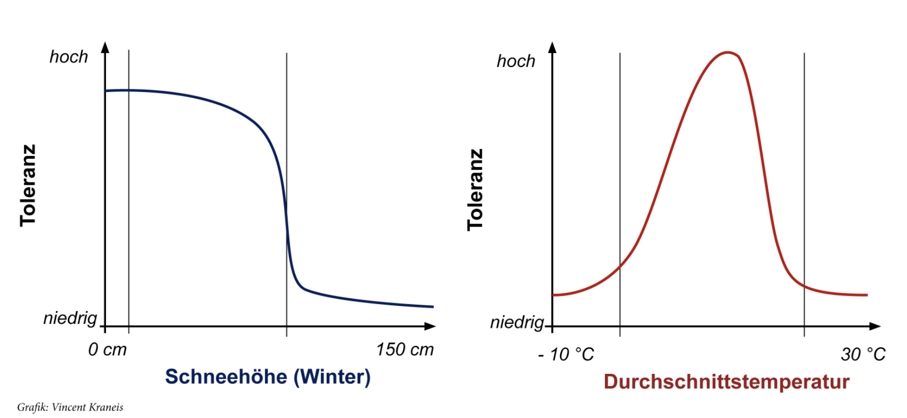
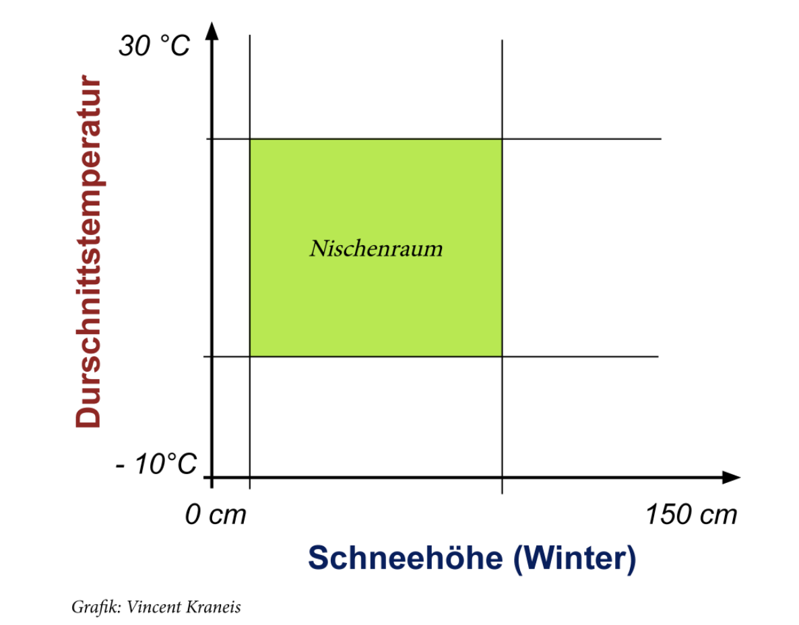
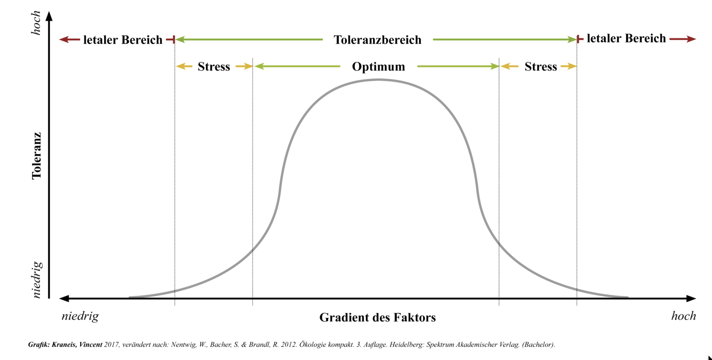
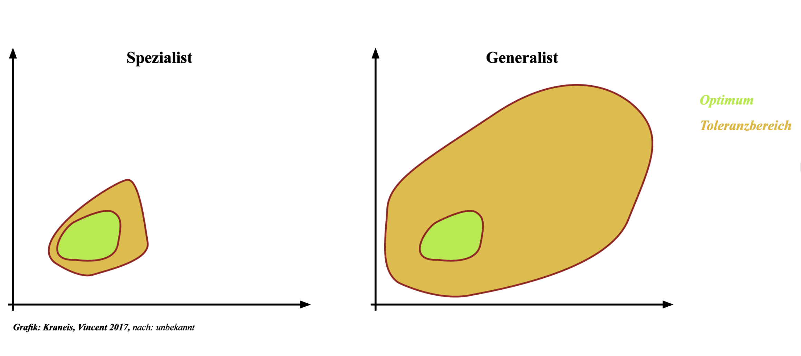
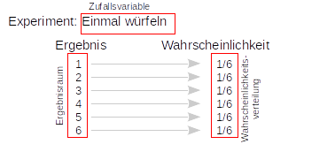
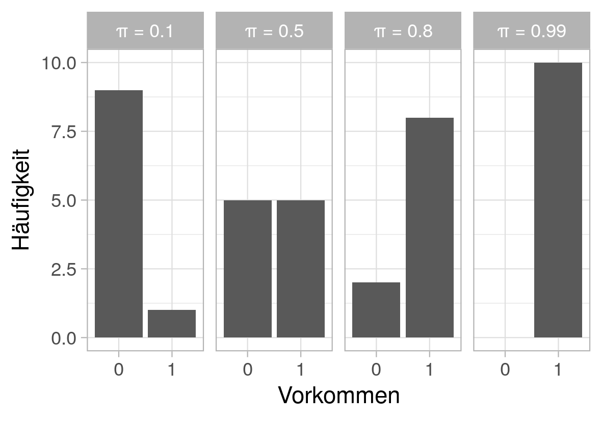
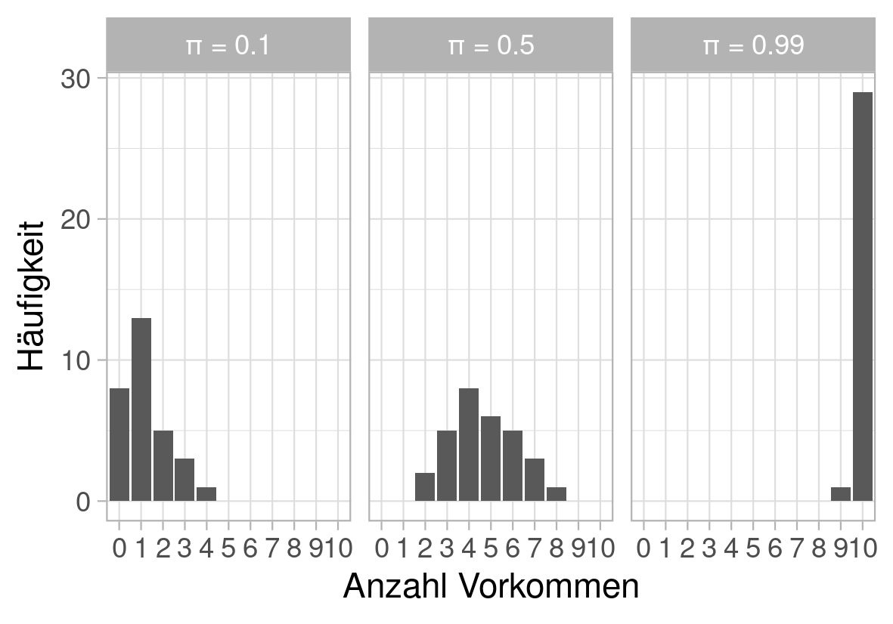
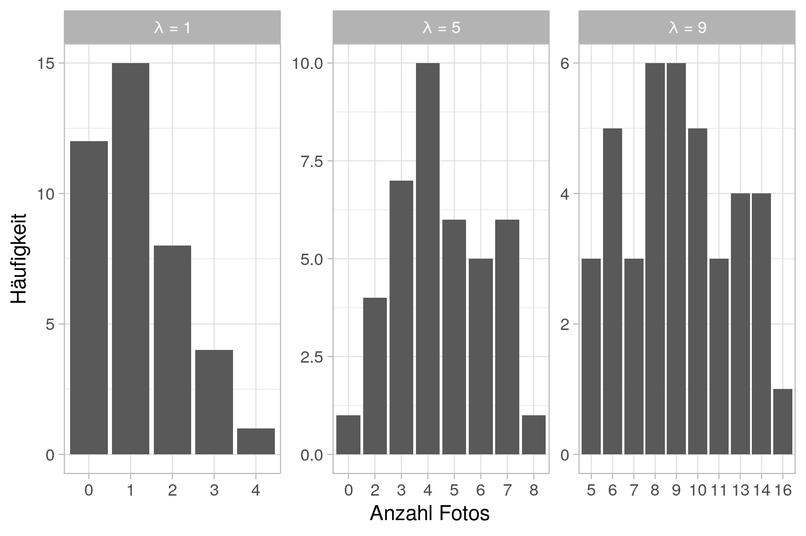
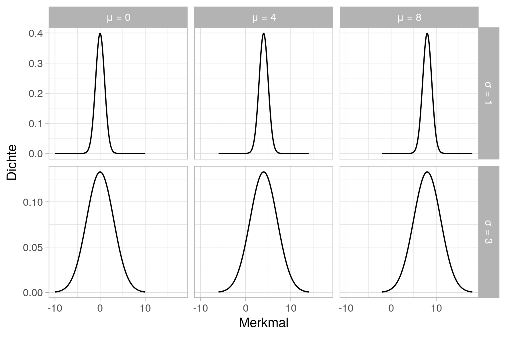

```{r setup}
#| include: false
library(tidyverse)
library(here)

knitr::opts_chunk$set(
  echo = TRUE,
  warning = FALSE,
  message = FALSE,
  fig.height = 4.5,
  fig.width = 4.5
)
```

# Erfassung von Wildtieren

## Wo sind wir?

-   [13.04.2026: E01: Einführung]{style="color: #888;"}
-   [20.04.2026: E02: Erfassung von Wildtieren]{style="color: #888;"}
-   **27.04.2026: E03: Verbreitung 1**
-   05.05.2026: E04: Verbreitung 2
-   11.05.2026: E05: Occupancy-Modelle 1 (online)
-   18.05.2026: E06: Occupancy-Modelle 2
-   01.06.2026: E07: Abundanz 1
-   08.06.2026: E08: Abundanz 2
-   15.06.2026: E09: Telemetrie 1: Random Walks etc.
-   22.06.2026: E10: Telemetrie 2: Streifgebiete
-   29.06.2026: E11: Telemetrie 3: Habitatselektion (online)
-   06.07.2026: E12: Telemetrie 4: Habitatselektion

## Kurze Wiederholung/Vorschau


# Theoretische Grundlagen

## Ein paar Definitionen

-   **Autökologie**: Wechselbeziehung zwischen einer Art (einzelne Individuen) und ihrer Umwelt (abiotisch und biotisch).

-   **Habitat**: Lebensraum einer Art (bzieht sich oft auf Vegetationstypen)

-   **Biotop**: Lebensraum einer Lebensgemeinschaft (-\> Habitate sind Teilbereiche eines Biotops, die nicht unbedingt von allen Arten der Lebensgemeinschaft genutzt werden)

## Habitatansprüche

Was müssen Wildtiere in ihrem Habitat vorfinden?

::: fragment
-   Schutz, Unterschlupf, Nistmöglichkeiten
-   Nahrung, Wasser
-   Fortpflanzungspartner
-   Das "richtige" Klima (Temperatur, Luftfeuchte)
:::

## Habitatwahl

= Verhaltensökologische Prozesse, mit denen Tiere sich ihre Habitate auswählen...

Unter welchen Gesichtspunkten sollten sich Tiere ihre Habitate auswählen?

::: callout-note
Evolution -\> Anpassung -\> Fitnessmaximierung
:::

## Hierarchien der Habitatwahl

::: incremental
1.  Ebene: Wahl des Artverbeitungsareal (z.B. Wo kommt er Wolf vor? Nördliche Grenze)
2.  Ebene: Wahl von Aktionsräume (= Streifgebiete) innerhalb des Artverbeitungsareal.
3.  Ebene: Wahl bestimmter Habitate innerhalb des Streifgebietes
4.  Ebene: Wahl Wahl bestimmter Komponenten innerhalb der gewählten Habitate
:::

## Ökologische Nische

Gesamtheit aller abiotischen und biotischen Faktoren, die das Überleben einer Art beeinflussen

:::::: columns
::: {.column width="50%"}

:::

:::: {.column width="50%"}
::: fragment

:::
::::
::::::

## Toleranz und Stress

Ein Umweltfaktor, für den eine Art die geringste Toleranz zeigt wird als **limitierend** bezeichnet.

-   Limitierende Faktoren sind geeignet, um das Vorkommen bzw. die Verbreitung einer Art vorherzusagen bzw. zu erklären.
-   Die Verbreitung einer Art ist davon abhängig



## Ökologische Nische 2

-   Fundamentale Nische: Hier kann eine Art vorkommen, außerhalb kann sie nicht vorkommen.
-   Realisierte Nische: Hier kommt eine Art tatsächlich vor

::: fragment
-   Stenöke Arten: Spezialisten -\> Enge Nische (z.B. Schneeleopard)
-   Euryöke Arten: Generalisten -\> Breite Arten (z.B. Rotfuchs)
:::

------------------------------------------------------------------------



# Quantifizierung der Ökologischen Nische

## Die Fragestellung

-   Wie kann man die Verbreitung vom Europäischen Luchs erklären und vorhersagen?
-   Es gibt aus unterschiedlichen Monitorings Vorkommensdaten, die z.B. über GBIF bezogen werden können:

## Wie kann das Vorkommen erklärt werden?

### Modelle ...

-   ... kommen in vielen Alltagssituationen zum Einsatz.
-   ... sollen eine *sinvolle* Vereinfachung der Realität darstellen.
-   ... "All models are wrong but some are useful" (George Box)

## Was für Modelle gibt es?

Statistische Modelle

:   Versuchen die Variabilität in den Daten durch korrelative Zusammenhänge zu erklären. Keine biologischen Mechanismen.

Mechanistische Modelle

:   Versuch von biologischen Prozessen zu simulieren, um beobachtete Muster zur erklären.

## Stichprobe oder Grundgesamtheit

-   Meist können wir die Grundgesamtheit nicht beproben/erfassen, dies kann aus logistischen, ethischen oder finanziellen Gründen sein.
-   Jedes Element aus der Grundgesamtheit muss mit der gleichen Wahrscheinlichkeit in der Stichprobe sein, ansonsten kann es sein, dass wir **nicht** von der Stichprobe auf die Grundgesamtheit schließen können.

------------------------------------------------------------------------

## Verteilungen von Zufallsgrößen

-   Zufallsgrößen[^1] (= Merkmalsausprägung; z.B. Streifgebietsgröße, Gewicht, Vorkommen), können unterschiedlichen Verteilungen folgen.

-   Ob eine Art an einem Standort vorkommt oder nicht, folgt einer anderen Verteilung als die Streifgebietsgrößen von besenderten Tieren.

-   Eine Art kann vorkommen oder nicht (z.B. 0 = absent und 1 = präsent). Während für Streifgebietsgrößen theoretisch jede positive Zahl zulässig wäre.

-   Wir brauchen im Verlauf dieser Veranstaltung vier Verteilungen: Die **Bernoulli-Verteilung** (ja/nein), die **Binomial-Verteilung** (viele Bernoulli-Verteilungen), die **Poisson-Verteilung** (Zähldaten) und die **Normalverteilung** (stetige Daten), die **Beta-Verteilung**.

[^1]: Diese werden auch oft als Zufallsvariablen bezeichnet werden.

------------------------------------------------------------------------

### Was ist eine Verteilung?

-   Eine Verteilung ist eine mathematische Funktion, die angibt wie wahrscheinlich es ist einen bestimmten Wert einer Zufallsgörße zu beobachten.

-   Anhand von Parametern[^2] kann man die Form und Lage von Verteilungen beeinflussen.

    {fig-align="center" width="450"}

[^2]: Man kann sich einen Parameter wie eine Stellschraube vorstellen, der die Form und Lage einer Verteilung beeinflusst.

------------------------------------------------------------------------

### Bernoulli-Verteilung

-   Die Bernoulli-Verteilung hat lediglich einen Parameter $\pi$, der angibt wie wahrscheinlich es ist eine 1 zu beobachten.

------------------------------------------------------------------------

)

------------------------------------------------------------------------

### Beispiel

-   Sie machen eine Verbissaufnahme und bestimmen: Es gibt Verbiss oder nicht.
-   Sie führen ein "Experiment" durch und es gibt zwei mögliche Ergebnisse:
    -   Verbiss
    -   Kein Verbiss
-   Die Wahrscheinlichkeit, dass ein Plot verbissen ist, wird mit dem Parameter $\pi$ gesteuert.

------------------------------------------------------------------------

### Binomial-Verteilung

-   Die Binomial-Verteilung ist eine Verallgemeinerung der Bernoulli-Verteilung. Es werden viele $k$ Bernoulli-Experimente modeliert.
-   Das heißt mit einer Binomial-Verteilung, kann modelliert werden, dass viele Bernoulli-Experimente mit der Wahrscheinlichkeit $\pi$ durchgeführt werden.

### Beispiel

-   Sie machen eine Verbissaufnahme und bestimmen: Es gibt Verbiss oder nicht.
-   Diese Aufnahme wird zehnmal wiederholt und am Schluss zählen sie wie oft bei diesen zehn Aufnahmen Verbiss gesehen wurde.

------------------------------------------------------------------------



------------------------------------------------------------------------

### Poisson-Verteilung

-   Die Poisson-Verteilung hat ebenfalls nur einen Parameter $\lambda$, der angibt wie oft ein Ereignis im Mittel eintritt (z.B. wie viele Fotos werden an einem Tag gemacht).



------------------------------------------------------------------------

### Normalverteilung

-   Die Normalverteilung hat zwei Parameter:
    -   Der Mittelwert ($\mu$) gibt die Lage an.
    -   Die Varianz ($\sigma^2$) gibt die Variabilität um den Mittelwert an. Die Wurzel von $\sigma^2$ wird auch häufig als Standardabweichung ($\sigma$) bezeichnet.

------------------------------------------------------------------------



------------------------------------------------------------------------

### Überlegen Sie

Mit welcher Verteilung könnte man folgende Beobachtungen modellieren:

1.  Unterkieferlänge bei Rehen.
2.  Die Wahrscheinlichkeit, dass eine Fotofalle auslöst.
3.  Die Anzahl Losungshaufen auf einem Transekt.
4.  Die Rottengröße bei Wildschweinen.

::: {#timer-1 .timer seconds="180" starton="interaction"}
:::

------------------------------------------------------------------------

### Antwort

1.  Normalverteilung
2.  Bernoulli-Verteilung, viele Fotofallen: Binomial-Verteilung
3.  Poisson-Verteilung
4.  Poisson-Verteilung; Die Normalverteilung besitzt stetige Zufallsvariablen und kann negative Werte annehmen, weswegen sie hier nicht passend ist.
