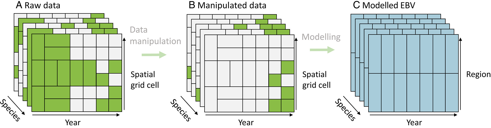
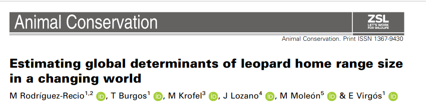
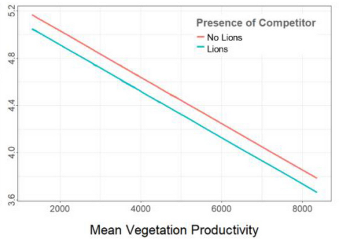
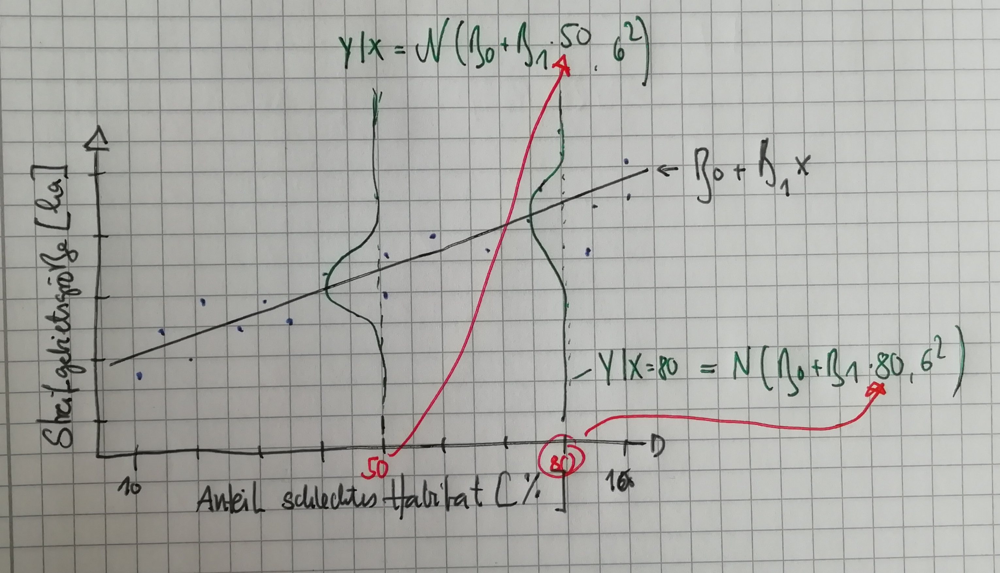

```{r setup}
#| include: false
library(tidyverse)
library(here)

knitr::opts_chunk$set(
  echo = TRUE,
  warning = FALSE,
  message = FALSE,
  fig.height = 4.5,
  fig.width = 4.5
)
```

## Wo sind wir?

-   [13.04.2026: E01: Einführung]{style="color: #888;"}
-   [20.04.2026: E02: Erfassung von Wildtieren]{style="color: #888;"}
-   [27.04.2026: E03: Verbreitung 1]{style="color: #888;"}
-   **05.05.2026: E04: Verbreitung 2**
-   11.05.2026: E05: Occupancy-Modelle 1 (online)
-   18.05.2026: E06: Occupancy-Modelle 2
-   01.06.2026: E07: Abundanz 1
-   08.06.2026: E08: Abundanz 2
-   15.06.2026: E09: Telemetrie 1: Random Walks etc.
-   22.06.2026: E10: Telemetrie 2: Streifgebiete
-   29.06.2026: E11: Telemetrie 3: Habitatselektion (online)
-   06.07.2026: E12: Telemetrie 4: Habitatselektion

## Kurze Wiederholung/Vorschau


## Group on Earth Observations Biodiversity Observation Network (GEO BON)

:::::: columns
::: {.column width="50%"}
**Was ist GEO BON?**\

- Globales Netzwerk zur Biodiversitätsbeobachtung\
- Teil der internationalen GEO-Initiative

**Ziele:**\

- Koordination von Biodiversitätsmonitoring\
- Entwicklung von EBVs

:::

:::: {.column width="50%"}
::: fragment
**Ziele von GEO BON:**

- Aufbau von Beobachtungsnetzwerken\
- Förderung von Datenstandards\
- Unterstützung politischer Entscheidungsprozesse
- Schnittstelle zwischen Wissenschaft & Politik\
- Globaler Rahmen für Biodiversitätsdaten

:::
::::
::::::

## Essential Biodiversity Variables (EBV)

:::::: columns
::: {.column width="50%"}
**Was sind EBVs?**\

- Standardisierte Schlüsselvariablen der Biodiversität\
- Vergleichbar mit „Klimavariablen“ für Biodiversität

**Ziel:**\

- Globale Veränderungen messbar machen\
- Einheitliche Datengrundlage schaffen
:::

:::: {.column width="50%"}
::: fragment
**Beispiele für EBV-Klassen:**\

- Abundanz von Arten
- Vorkommen von Arten
- Ökosystemstruktur\
- Genetische Vielfalt

**Nutzen:**\

- Monitoring von Biodiversität\
- Unterstützung internationaler Ziele 

:::
::::
::::::

## Boyd et al. 2023

-   Biodiversitätsstatus & Trends sollten messbar sein\
-   Wichtig für:
    -   Monitoring von Zielen\
    -   Bewertung von Naturschutzmaßnahmen
-   Das Problem, Rohdaten sind:
    -   heterogen (verschiedene Quellen)\
    -   unterschiedlich in Raum & Zeit\
    -   schwer vergleichbar

**Mögliche Lösung:**\
- 🧬 *Essential Biodiversity Variables (EBVs)* als Brücke zwischen Daten & Indikatoren

----

**Wichtige EBV-Klassen:**\
- Genetik\
- Arten (Verbreitung & Häufigkeit)\
- Gemeinschaften & Ökosysteme

**Arten als EBV:**\
- Konzept: *Species–Space–Time Cube*\
- Dimensionen: Art × Raum × Zeit

**Messgrößen:**\
- Abundanz (Anzahl Individuen)\
- Vorkommen (Occurrence)

In der Praxis oft:\
- Occurrence-Daten (z. B. Citizen Science)\
- + Modelle zur Schätzung fehlender Informationen

## Vom Rohdatensatz zu EBVs

**Species–Space–Time Cube:**\
Kombination aus: 

- Arten
- Raum
- Zeit

:::: {.fragment}




::::


------------------------------------------------------------------------

**Workflow in drei Schritten:**

**🟫 A: Rohdaten (EBV-usable)**\
- Daten aus verschiedenen Quellen\
- Unterschiedliche Auflösung & Qualität\
- Viele Lücken und Inkonsistenzen

**🟨 B: Aufbereitete Daten (EBV-ready)**\
- Standardisierung von Raum & Zeit\
- Entfernung ungenauer Daten\
- → weniger Daten, aber vergleichbar

**🟦 C: Modellierte EBVs**\
- Statistische Modelle füllen Datenlücken\
- Schätzung von Artenvorkommen\
- Aggregation zu Indikatoren

## Die Fragestellung

-   Wie kann man die Verbreitung vom Europäischen Luchs erklären und vorhersagen?
-   Es gibt aus unterschiedlichen Monitorings Vorkommensdaten, die z.B. über GBIF bezogen werden können.

## 🌍 GBIF – Global Biodiversity Information Facility

:::::: columns
::: {.column width="50%"}
**Was ist GBIF?**\
- Globales Netzwerk für Biodiversitätsdaten\
- Freier Zugang zu Artenvorkommen weltweit

**Ziele:**\
- Daten vernetzen & zugänglich machen\
- Forschung und Naturschutz unterstützen\
- Open Science fördern
:::

:::: {.column width="50%"}
::: fragment
**Daten:**\
- Artenbeobachtungen (z. B. Citizen Science)\
- Museums- & Sammlungsdaten\
- Vorkommensdaten weltweit

**Anwendungen:**\
- Analyse von Artenverbreitung\
- Klimawandel-Forschung\
- Naturschutzplanung
:::
::::
::::::

## Übung Teil 1: Laden der Daten

Verwenden Sie Funktion `read_rds()` aus dem Pakte `tidyverse` und laden Sie den Datensatz `lynx.rds`. Der Datensatz besteht aus 3 Spalten:

-   `x` und `y` sind die Koordinaten von 100 \* 100 km Kacheln in geographische Koordinaten.
-   `lynx` gibt an ob der Luchs in einer Kachel vorkommt oder nicht.

Erstellen Sie eine Abbildung (Karte) mit der räumlichen Verteilung der Luchsvorkommen.

## Übung Teil 2: Wahrscheinlichkeit, dass der Luchs in einer Zelle vorkommt

1.  Berechnen Sie die Wahrscheinlichkeit, dass der Luchs in einer Zelle vorkommt. Ignorieren Sie Kovariaten und räumliche Zusammenhänge.
2.  Berechnen Sie nun die Wahrscheinlichkeit, dass der Luchs in einer Zelle vorkommt für 4 unterschiedliche Szenarien und berücksichtigen Sie die Kovariaten Anteil Wald (Spalte `anteil_wald`) und den Breitengrad (Spalte `y`).
    i.  Anteil Wald \< 0.5 und Breitengrad \< 50
    ii. Anteil Wald \< 0.5 und Breitengrad \> 50
    iii. Anteil Wald \> 0.5 und Breitengrad \< 50
    iv. Anteil Wald \> 0.5 und Breitengrad \> 50

## Lineares Model

-   Oft haben wir als Ziel den Erwartungswert einer Verteilung zu modellieren, als Funktion von Kovariaten. Z.B. den Mittelwert einer Normalverteilung oder die erwartete Wahrscheinlichkeit einer Bernoulli- oder Binomialverteilung.

-   Wir wollen nun überprüfen, ob sich der Mittelwert anhand von Kovariaten erklären/modellieren lässt.

## Übung Teil 3: Vorkommenswahrscheinlichkeit mit LM

Berechnen Sie erneut die Wahrscheinlichkeit, dass der Luchs in einer Zelle vorkommt, aber diesmal mittels eines linearen Models:

1.  Verwenden Sie erst ein lineares Modell, das nur einen Intercept hat (`y ~ 1`) und speichern Sie das Ergebnis als `m1` ab.
2.  Passen Sie ein zweites Model an und fügen Sie die Kovariaten Breitengrad und Anteil Wald hinzu und speichern Sie dieses Model als `m2` ab.
3.  Machen Sie für `m2` eine Vorhersage für die Vorkommenswahrscheinlichkeit von Luchsen und verwenden Sie für die zwei Kovariaten den beobachteten Wertebereich.

# (Generalisierties) lineares Modell

## Was modellieren wir?

-   Beim linearen Modell modelieren wir den bedingten Mittelwert (Erwartungswert) einer Normalverteilung.

Erwartungswert

:   Ist der Wert einer Zufallsvariabel, den wir im Mittel erwarten. Bei einer Normalverteilung ist es dir Mittelwert.

## Wenn die Parameter sich ändern

-   Oft wollen wir den Einfluss von verschiedenen Kovariaten auf eine Zielgröße berechnen:
    -   Ändert sich die Streifgebietsgröße eines Stückes Rotwild im Verlauf seines Lebens?
    -   Ist die Anzahl Fotos einer Fotofalle abhängig von der Tageszeit?
    -   Beeinflusst die Seehöhe das Vorkommen einer Art?
-   Wir können Parameter einer Verteilung als lineare Funktion von Kovariaten modellieren.

------------------------------------------------------------------------

-   Beispielsweise könnten wir überlegen: Die Streifgebietsgröße ist eine Maßzahl für die Futterqualität und somit vermuten wir, dass besseres Habitat zu kleineren Streifgebieten führt.

-   $\text{Streifgebietsgröße} = f(\text{Habitat})$

-   $\text{Streifgebietsgröße} = N(\mu = \text{Habitat})$

-   Oder etwas mathematischer aufgeschrieben: $\text{Streifgebietsgröße}_i = N(\mu = \beta_0 + \beta_1 x_i, \sigma)$.

------------------------------------------------------------------------

Wie sieht das jetzt aus?

```{r, echo = FALSE}
set.seed(123)
x <- runif(25, 10, 70)
y <- rnorm(25, mean = 400 + 10 * x, 75)
dat <- tibble(x, y)
ggplot(dat, aes(x, y)) + geom_point() +
  geom_smooth(method = "lm", se = FALSE, col = "red", lty = 2) +
  theme_light() + labs(x = "Anteil schlechtes Habitat [%]", 
                       y = "Streifgebietsgröße [ha]")


names(dat) <- c("habitat", "hr_groesse")
```

## Ein Beispiel



-   Welche Kovariaten beeinflussen die Streifgebietsgrößen von Leoparden.

------------------------------------------------------------------------



------------------------------------------------------------------------

Wir modellieren immer den Mittelwert einer Normalverteilung bedingt auf einen bestimmten Wert der Kovariaten.



------------------------------------------------------------------------

```{r}
m1 <- lm(hr_groesse ~ habitat, data = dat)
summary(m1)$coef
```

Für eine komplette Zusammenfassung des Modells, siehe

```{r, eval = FALSE}
summary(m1)
```

## Überlegen Sie

Können Sie das Beispiel des Streifgebietes auf unser Moderellierung des Luchsvorkommens übertragen?

Wie sieht: $\text{Streifgebietsgröße}_i = N(\mu = \beta_0 + \beta_1 x_i, \sigma)$ aus? Wie müsste es aussehen?

## Genarlisiertes Lineares Modell

-   Im **G**eneralsierten **L**inearen **M**model ist das der Erwartungswert einer anderen Verteilung (z.B. der Binomial-, Poisson- oder auch der Normalverteilung).

Ein GLM besteht aus drei Teilen:

1.  Die Verteilung der Zielvariable
2.  Der systematische Teil des Models (= **Lineareprädiktor**) und wird oft mit $\eta$ abgekürzt.
3.  Eine Funktion $g(\cdot)$, die den Erwartungswert der Zielvariable mit dem Linearenprädiktor verbindet. Diese Funktion heiß **Linkfunktion**. Jede Linkfunktion hat eine **Umkehrfunktion**, die den Linearenprädiktor zurück zum bedingten Mittelwert transformiert.

## Mehrere Modelle

-   Es können nicht lineare Zusammenhänge in einem (G)LM berücksichtigt werden, indem Kovariaten z.B. quadriert werden.
-   Im Luchsbeispiel, könnten wir z.B. `anteil_wald` und `anteil_wald^2` berücksichtigen.

```{r, echo = FALSE}
x <- seq(-4, 4, by = 0.01)

y <- 1 * x + -1 * x^2
plot(x, y, type = "l", col = "red")
lines(x, -20 + 1 * x + 1 * x^2)
```

## Welches Modell passt am besten zu den Daten?

AIC

:   Das AIC (Akaike Information Criterion) misst wie gut ein Modell auf die Daten passt. Das AIC hat keine Einheiten und je niedriger der Wert ist, desto besser ist ein Modell.

## Zusammenfassung und Ausblick

-   Wir haben soeben das einfache lineare Modell besprochen. Wir nehmen für die Variable, die wir modellieren wollen und auch **Zielvariable** genannt wird, eine Normalverteilung an.
-   Der Mittelwert dieser Normalverteilung ändert sich in Abhängigkeit von erklärenden Variablen (oder auch **Kovariaten** genannt).
-   Beim multiplen linearen Modell hängt die Zielvariable von mehr als einer Kovariaten ab (also z.B. Habitat und Geschlecht).
