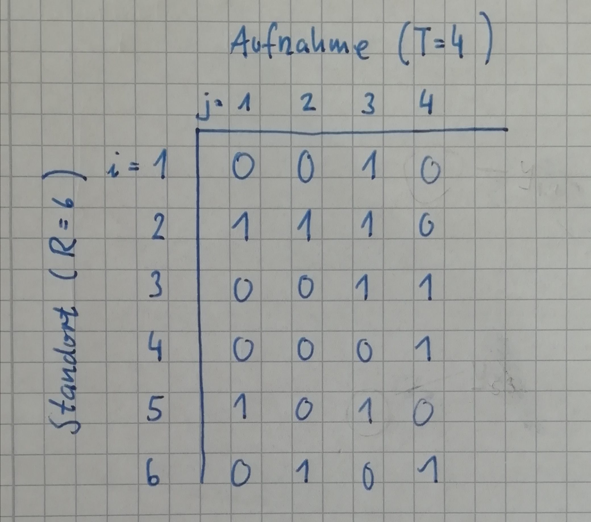
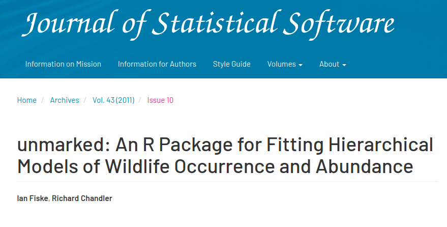
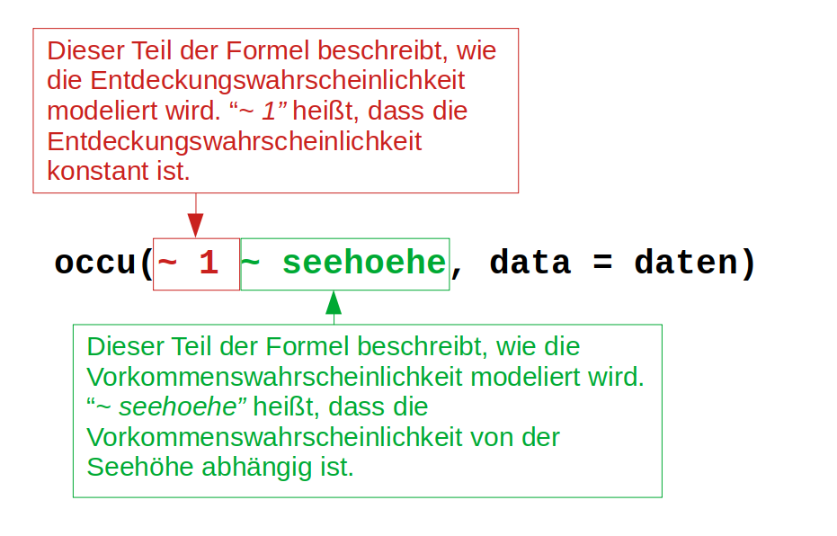

```{r setup}
#| include: false
library(tidyverse)
library(rcartocolor)
library(here)
library(AHMbook)
library(unmarked)
library(modelr)


knitr::opts_chunk$set(
  echo = TRUE,
  warning = FALSE,
  message = FALSE,
  fig.height = 4.5,
  fig.width = 4.5
)
```

## Wo sind wir?

-   [13.04.2026: E01: Einführung]{style="color: #888;"}
-   [20.04.2026: E02: Erfassung von Wildtieren]{style="color: #888;"}
-   [27.04.2026: E03: Verbreitung 1]{style="color: #888;"}
-   [05.05.2026: E04: Verbreitung 2]{style="color: #888;"}
-   [.05.2026: E05: Occupancy-Modelle 1 (online)]{style="color: #888;"}
-   **18.05.2026: E06: Occupancy-Modelle 2**
-   01.06.2026: E07: Abundanz 1
-   08.06.2026: E08: Abundanz 2
-   15.06.2026: E09: Telemetrie 1: Random Walks etc.
-   22.06.2026: E10: Telemetrie 2: Streifgebiete
-   29.06.2026: E11: Telemetrie 3: Habitatselektion (online)
-   06.07.2026: E12: Telemetrie 4: Habitatselektion

## Kurze Wiederholung/Vorschau


## Hintergrund: Daten

### Was wird analysiert:

-   Wo kommt eine Tierart vor?
-   Welche Kovariaten wirken sich auf
    -   das Vorkommen, bzw.\
    -   das Entdecken

der Art aus. Man möchte herausfinden, welcher Teil eines Gebietes von einer Art genutzt wird.

------------------------------------------------------------------------

### Was für Daten werden benötigt

-   Eine Identifikation des Individuum ist nicht nötig.
-   Mehrere Standorte müssen **\> 1 Mal** aufgesucht werden.
-   Nachweise der Art können aktiv (z.B. visuell) oder passiv (z.B. Losungen oder Spuren) aufgezeichnet werden.
-   Die Standorte sollten so gewählt werden, dass sie voneinander unabhängig sind.

## Das Vokommen von Eichhörnchen in der Schweiz

-   Als Beispiel wollen wir uns die Verbreitung von Eichhörnchen in der Schweiz ansehen. Dazu wurden an 265 Standorten (1 km$^2$) zwischen 1 h und 6 h nach Eichhörnchen gesucht.\
-   Die Standorte wurden dreimal besucht.
-   Können wir eine Vorhersage machen, wie viel Prozent der Fläche der Schweiz von Eichhörnchen besetzt sind?


------------------------------------------------------------------------

```{r, echo = FALSE}
sq0 <- read.table(file.path(find.package("AHMbook"), "extdata", "SwissSquirrels.txt"), header = TRUE) 
sq <- sq0 %>%
  mutate(x = coordx, y = coordy)
theme_set(theme_light())

ggplot() + geom_raster(aes(x, y, fill = elevation), Switzerland, alpha = 1) +
    scale_fill_carto_c(palette = "Fall") +
    coord_equal() +
    labs(fill = "") +
    theme(legend.position = "bottom", legend.key.width = unit(0.1, "npc"))
```


- Digitales Höhen Model (DHM bzw. engl. DEM = Digital Elevation Model) für die Schweiz. 


------------------------------------------------------------------------

Hier wurde gesucht (236 von 42275 möglichen Quadraten)

```{r, echo = FALSE}
ggplot() + geom_raster(aes(x, y, fill = elevation), Switzerland, alpha = 0.3) +
    geom_point(aes(x, y), data = sq) +
    scale_fill_carto_c(palette = "Fall", guide = NULL) +
    coord_equal()
```

------------------------------------------------------------------------

### Anzahl Sichtungen pro Quadrat

```{r, echo = FALSE}
sq %>% rowwise() %>% mutate(sd = sum(det071, det072, det073, na.rm = TRUE)) %>%
    ggplot() + geom_raster(aes(x, y, fill = elevation), Switzerland, alpha = 0.3) +
    geom_point(aes(x, y, col = factor(sd))) +
    scale_fill_carto_c(palette = "Fall", guide = NULL) +
    coord_equal() +
    labs(col = "n")
```

------------------------------------------------------------------------

### Was beeinflusst das Vorkommen?

```{r, echo = FALSE}
sq1 <- sq %>% rowwise() %>% mutate(sd = sum(det071, det072, det073, na.rm = TRUE),
                            vorkommen = c("nein", "ja")[(sd > 0) + 1]) %>%
    dplyr::select(ele, forest, vorkommen, x, y) %>% ungroup()

ggplot(sq1) + geom_raster(aes(x, y, fill = elevation), Switzerland, alpha = 0.3) +
    geom_point(aes(x, y, col = vorkommen)) +
    scale_fill_carto_c(palette = "Fall", guide = NULL) +
    coord_equal() +
    labs(col = "Kommt vor:") +
    theme(legend.position = "bottom")
```

------------------------------------------------------------------------

### Hängt das Vorkommen von der Seehöhe ab?

```{r, echo = FALSE}
sq1 %>%
    ggplot(aes(ele, vorkommen)) + geom_jitter(alpha = 0.3) +
    labs(x = "Seehöhe", y = "Vorkommen")
```

------------------------------------------------------------------------

Einteilung der Seehöhe in Höhenklassen.

```{r, echo = FALSE}
sq1 %>% mutate(seehoehe = cut_number(ele, 5)) %>%
  ggplot(aes(seehoehe, fill = vorkommen)) + geom_bar(position = "fill") +
  theme(axis.text.x = element_text(angle = 45, hjust = 1)) +
  labs(x = "Seehöhe", y = "Anzahl", fill = "Vorkommen")
```

------------------------------------------------------------------------

### Wie sieht das mit Wald aus?

```{r, echo = FALSE}
sq1 %>% mutate(wald = cut_number(forest, 5)) %>%
    ggplot(aes(wald, fill = vorkommen)) + geom_bar(position = "fill") +
    labs(x = "Wald", y = "Anzahl", fill = "Vorkommen")
```

------------------------------------------------------------------------

Wir wollen die Belegungsrate $\psi$ von Eichhörnchen in Abhängigkeit von Seehöhe und Waldbedeckung modellieren.

:::: {.columns}

::: {.column width="50%"}

```{r, echo = FALSE}
sq2 <- sq1 %>% mutate(wald = cut(forest, 5, label = FALSE),
               alt = cut(ele, 5, label = FALSE)) %>%
    group_by(wald, alt) %>%
    summarise(n = n(), pi = mean(vorkommen == "ja"))

sq2 %>% ggplot(aes(x = wald, y = alt)) + geom_raster(aes(fill = pi)) +
    scale_fill_carto_c(palette = "Peach") +
    theme_light() + labs(x = "Waldanteil", y = "Seehöhe", fill = "psi")
```

:::

::: {.column width="50%"}

$\psi$ ist hier die Vorkommenswahrscheinlichkeit für Quadrate, mit einem bestimmtes Waldanteil und Seehöhe. 
:::

::::


------------------------------------------------------------------------

Die Anzahl Quadrate für jede Kombination: 

```{r, echo = FALSE}
sq2 %>% ggplot(aes(x = wald, y = alt)) + geom_raster(aes(fill = pi)) +
    geom_text(aes(label = n)) +
    scale_fill_carto_c(palette = "Peach") +
    theme_light() + labs(x = "Waldanteil", y = "Seehöhe", fill = "psi")
```

------------------------------------------------------------------------

Zufällige Einteilung, lieber kontinuierlich modellieren

$$
\psi_i = g^{-1}(\beta_0 + \beta_1 * \text{seehöhe}_i + \beta_2 * \text{wald}_i)
$$

-   $\psi_i$ ist die Belegungsrate, dass ein Standort von einem Eichhörnchen besiedelt ist.
-   $g^{-1}$ stellt sicher, dass der Wert von $\psi$ in das Intervall von 0 bis 1 fällt.
-   $\beta_0 + \beta_1 * \text{seehöhe}_i + \beta_2 * \text{wald}_i$ beschreibt den Zusammenhang zwischen der Wahrscheinlichkeit $\psi_i$ und den Kovariaten in einer 1 km$^2$ großen Zelle.

------------------------------------------------------------------------

```{r, echo = FALSE}
sq1$y <- sq1$vorkommen == "ja"
```

-   Wir passen zwei Modelle an

```{r, echo = TRUE}
m1 <- glm(y ~ ele + forest, data = sq1, family = binomial())
m2 <- glm(y ~ ele + I(ele^2) + forest, data = sq1, family = binomial())
```

Im zweiten Modell `m2` haben wir einen quadratischen Term (= Polynom 2. Ordnung) für Seehöhe, dies ermöglicht nicht-lineare Effekte für Seehöhe zu berücksichtigen (z.B. wenn intermediäre Seehöhen bevorzugt werden). 


--------

### Welches Modell passt am besten zu den Daten?

AIC

:   Das AIC (Akaike Information Criterion) misst wie gut ein Modell auf die Daten passt. Das AIC hat keine Einheiten und je niedriger der Wert ist, desto besser ist ein Modell.


```{r}
AIC(m1, m2)
```

------------------------------------------------------------------------

```{r, echo = FALSE}
data_grid(sq1, ele = seq_range(ele, 100), 
          forest = c(25, 50, 75)) %>%
  gather_predictions(m1, m2, type = "response") %>%
  ggplot(aes(ele, pred, col = as.factor(forest), group = forest)) + geom_line() +
  scale_color_carto_d() +
  facet_wrap(~ model) +
  theme_light() + 
  labs(col = "Waldanteil [%]", y = "Belegungsrate", 
              x = "Seehöhe")
```

------------------------------------------------------------------------

Damit könnten wir auch eine Vorhersage für die ganze Schweiz machen (`m2`).

```{r, echo = FALSE}
p.glm <- Switzerland %>% mutate(ele = elevation) %>% 
  add_predictions(m2, type = "response") %>% 
  ggplot(aes(x, y)) + geom_raster(aes(fill = pred)) +
  scale_fill_carto_c(palette = "Peach") +
  theme_light() +
  theme(legend.position = "bottom") +
  labs(fill = "Belegungsrate") +
  coord_equal() 
p.glm
```

------------------------------------------------------------------------

### Aber was ist mit den drei Sichtungen?

Ist es immer gleich wahrscheinlich ein Eichhörnchen zu entdecken?

```{r, echo = FALSE}
dt1 <- sq %>% dplyr::select(det071:dur073) %>% mutate(site = 1:n()) %>% 
    pivot_longer(-site) %>% mutate(what = str_extract(name, "^[a-z]{3,4}"), 
                                   rep = str_extract(name, "[0-9]{3}$")) %>% 
    dplyr::select(-name) %>% 
    pivot_wider(values_from = value, names_from = what)

dt1 <- dt1 %>% mutate(seen = factor(c("nein", "ja")[det + 1])) %>% 
    filter(!is.na(seen))

ggplot(dt1, aes(date, seen)) + geom_jitter(alpha = 0.05, size = 3) +
    labs(x = "Tag im Jahr (1 = 1. April)", y = "Eichhörnchen gesehen")
```

------------------------------------------------------------------------

```{r, echo = FALSE}
ggplot(dt1, aes(dur, seen)) + geom_jitter(alpha = 0.05, size = 2) +
    labs(x = "Dauer der Aufnahme (min)", y = "Eichhörnchen gesehen")
```

------------------------------------------------------------------------

-   Occupancymodelle bieten die Möglichkeit die Entdeckungswahrscheinlichkeit ($p$) und die Belegungsrate ($\psi$) zusammen zu modellieren.
-   $p$ ist meist $< 1$ und dies impliziert, dass wenn bei einem Besuch kein Individuum einer Art gesehen wurde, kann dies zwei Gründe haben:
    -   Kein Individuum war da.
    -   Ein oder mehrere Individuen waren präsent, wurden aber nicht gesehen.

------------------------------------------------------------------------

Etwas Notation

-   Es werden an $i = 1, ..., R$ Standorten $j = 1, ... , T$ Aufnahmen durchgeführt.
-   $y_{ij} = 1$ wenn ein Individuum der Art bei der $i$-ten Aufnahme am Standort $j$ gefunden wurde, ansonsten ist $y_{ij} = 0$.

{fig-align="center"}

## Statistische Modellierung

-   Die Modellierung erfolgt in zwei Schritten:

    -   Der biologische Prozess: $z_i \sim \text{Ber}(\psi_i)$ (= **state process**)
    -   Der Beobachtungsprozess: $y_{ij} \sim \text{Ber}(z_i \times p_{ij})$ (= **observation process**)

-   $z_i$ ist eine **latente** Zufallsvariable (d.h., wir können sie nicht direkt beobachten), die angibt ob am Standort $i$ die Art mit der Wahrscheinlichkeit $\psi$ präsent ist oder nicht.

-   $y_{ij}$ ist die Beobachtung am Standort $i$ zum Zeitpunkt $j$. Die Wahrscheinlichkeit, dass ein Individuum beobachtet wird hängt von der Wahrscheinlichkeit $\psi$ (das die Art überhaupt vorkommt) und $p$ (das die Art gesehen) wird ab.

-   Die Parameter $\psi$ und $p$ müssen geschätzt werden.

------------------------------------------------------------------------

Die Parameter $\psi$ und $p$ können wiederum als Funktion von Kovariaten modelliert werden:

-   $\psi_i = g^{-1}(\beta_0 + \beta_1 x_i)$

Das heißt, wir können die Belegungsrate ($\psi_i$) einer Art am Standort $i$ als lineare Kombination von Kovariaten modellieren. Z.B. könnte es für eine Art wahrscheinlicher sein im Wald als im Offenland vorzukommen.

------------------------------------------------------------------------

-   $p_{ij} = g^{-1}(\alpha_0 + \alpha_1 x_{ij})$

Das heißt, wir können die Entdeckungswahrscheinlichkeit für eine Art am Standort $i$ zum Zeitpunkt $j$ als lineare Funktion von Kovariaten modellieren. Z.B. können wir die Hypothese aufstellen, dass die Entdeckungswahrscheinlichkeit vom Wetter oder der Tageszeit abhängt.

## Eichhörnchen in der Schweiz

Zur Schätzung von $\psi$ und $p$ gibt es das R-Paket `unmarked`.

{fig-align="center"}

------------------------------------------------------------------------

Mit der Funktion `occu()` können die Parameter eines Belgungsmodells (=Occupancymodells) geschätzt werden. Dafür müssen der Funktion `occu()` zwei Argumente übergeben werden:

{fig-align="center"}

------------------------------------------------------------------------

-   `formula`: Beschreibt wie das Modell spezifiziert ist. Beispielsweise würde `~ datum ~ seehoehe` bedeuten, dass die Entedeckungswahrscheinlichkeit von Eichhörnchen vom Datum (`datum`) abhängt und die Belegungsrate von der Seehöhe (`seehoehe`). Will man einen Parameter konstant halten (z.B. dass das Vorkommen immer gleich ist), dann schreibt man einfach `~ 1`. Also die Formel `~ datum ~ 1` modeliert die Entedeckungswahrscheinlichkeit abhängig vom Datum (`date`) und eine konstante Belegungsrate (`~ 1`).

-   `data`: Ein spezielles `data.frame`, das `unmarkedFrameOccu` genannt wird. Mit der Funktion `unmarkedFrameOccu()` kann so ein `data.frame()` erstellt werden.

## Beispiel Eichhörnchen in der Schweiz

```{r}
head(sq0)
```

-   `coordx` und `coordy` sind die Koordinaten.
-   `ele`, `route` und `forest` sind die Seehöhe, Transektlänge und Waldbedeckung.
-   `det*` gibt an, ob ein Eichhörnchen gesehen wurde (`1`) oder nicht (`0`).

------------------------------------------------------------------------

-   `date*` ist das Datum an dem das Transekt ausgeführt wurde (Tage seit dem 1.4.).
-   `dur*` ist die Länge der Aufnahme.

<!-- - Falls Sie die Analysen nach machen möchten, befindet sich ein R-Skript dazu auf StudIP (`occu_eichhoernchen.R`).  --->

------------------------------------------------------------------------

### Variablen skalieren

-   In unserem Beispiel sind die Variablen `ele` (Seehöhe) und Waldanteil `forest` sehr unterschiedlich skaliert.
-   `ele` hat Werte von `r min(sq$ele)` bis `r max(sq$ele)`, während `forest` Werte zwischen 0 und 100 haben kann.
-   Diese Unterschiede und die Tatsache, dass `ele` sehr hohe Werte hat, können zu numerischen Problemen führen.
-   Variablen werden deshalb häufig Standardisiert, dabei wird der Mittelwert abgezogen und durch die Standardabweichung dividiert.
-   Die Variable ist dann um 0 zentriert und erstreckt sich bis zu $\pm3$.

------------------------------------------------------------------------

```{r}
head(sq$ele)
sq$ele_scaled <- (sq$ele - mean(sq$ele)) / sd(sq$ele)
sq$forest_scaled <- (sq$forest - mean(sq$forest)) / sd(sq$forest)
```

```{r, echo = FALSE}
sq$site <- 1:nrow(sq)
```

An der Verteilung an sich hat sich **nichts** geändert!

------------------------------------------------------------------------

```{r, echo = FALSE}
sq %>% dplyr::select(site, ele, ele_scaled) %>% pivot_longer(-site) %>% 
  ggplot(aes(value)) + geom_density() + facet_wrap(~ name, scale = "free") +
  theme_light()

```

------------------------------------------------------------------------

Als erstes muss man einen `unmarkedFrameOccu` erstellen:

```{r}
library(unmarked)
of <- unmarkedFrameOccu(
  y = sq[, c("det071", "det072", "det073")],  # R * J Matrix
  siteCovs = sq[, c("ele_scaled", "forest_scaled")],
  obsCovs = list(
    date = sq0[, c("date071", "date072", "date073")],
    dur = sq0[, c("dur071", "dur072", "dur073")]
  )
)
```

Hinweis: Mit der Funktion `list()` können wir unterschiedliche Kovariaten (z.B. `date`) übergeben, für die wir jeweils R \* J Beobachtungen haben.

Damit können wir jetzt mit den Kovariaten `ele`, `forest`, `date` und `duration` beliebige Modelle erstellen.

------------------------------------------------------------------------

### Anpassen eines Models

```{r occu0}
m0 <- occu(
  ~ 1 # Modell für p
  ~ ele_scaled + forest_scaled, # Modell für psi
  data = of)
```

Und ein zweites Modell mit einem quadratischen Effekt für Seehöhe.

```{r occu1}
m1 <- occu(
  ~ 1 # Modell für p
  ~ ele_scaled + I(ele_scaled^2) + forest_scaled, # Modell für psi
  data = of)
```

`I(ele^2)` heißt, dass wir für die Belegungsrate $\psi$ einen quadratischen Effekt berücksichtigen.

------------------------------------------------------------------------

```{r, depends = "occu1"}
summary(m1)
```

------------------------------------------------------------------------

Was heißt das jetzt?

```{r, echo = FALSE}
x <- seq_range(sq0$ele, 100) 
xs <- (x - mean(sq0$ele)) / sd(sq0$ele)
nd <- data.frame(ele_scaled = xs, forest_scaled = 0)

nd <- bind_rows(
  cbind(m = "m0", ele = x, predict(m0, nd, type = "state")),
  cbind(m = "m1", ele = x, predict(m1, nd, type = "state"))
)

ggplot(nd, aes(ele, Predicted, col = m)) + 
  geom_ribbon(aes(ymin = lower, ymax = upper, fill = m), alpha = 0.1, col = NA) +
  geom_line() +
  labs(x = "Seehöhe", y = "Belegungsrate", fill = "Modell", col = "Modell")

```

------------------------------------------------------------------------

```{r, echo = FALSE}
x <- seq_range(sq0$ele, 100) 
w <- c(25, 50, 75, 100)
nd <- expand.grid(ele = x, forest = w)

nd$ele_scaled <- (nd$ele - mean(sq0$ele)) / sd(sq0$ele)
nd$forest_scaled <- (nd$forest - mean(sq0$forest)) / sd(sq0$forest)

nd <- bind_rows(
  cbind(m = "m0", nd, predict(m0, nd, type = "state")),
  cbind(m = "m1", nd, predict(m1, nd, type = "state"))
)


nd %>% mutate(wald_lab = paste0("Waldanteil = ", forest, " %")) %>% 
ggplot(aes(ele, Predicted, col = m)) + 
  geom_ribbon(aes(ymin = lower, ymax = upper, fill = m), alpha = 0.1, col = NA) +
  geom_line() +
  labs(x = "Seehöhe", y = "Belegungsrate", fill = "Modell", col = "Modell") +
  facet_wrap( ~ wald_lab)

```

------------------------------------------------------------------------

Und was heißt das für $p$? Bis jetzt wurde $p$ konstant gehalten. Gibt es einen Effekt von Jahreszeite (`date`) und Suchdauer (`dur`)?

```{r occu2}
m2 <- occu(
  ~ dur + date # Modell für p
  ~ ele_scaled + I(ele_scaled^2) + forest_scaled, # Modell für psi
  data = of)
summary(m2)
```

------------------------------------------------------------------------

```{r, echo = FALSE}
x <- seq_range(sq0$ele, 100) 
w <- c(25, 50, 75, 100)
nd <- expand.grid(ele = x, forest = w)

nd$ele_scaled <- (nd$ele - mean(sq0$ele)) / sd(sq0$ele)
nd$forest_scaled <- (nd$forest - mean(sq0$forest)) / sd(sq0$forest)

nd <- bind_rows(
  cbind(m = "m0", nd, predict(m0, nd, type = "state")),
  cbind(m = "m1", nd, predict(m1, nd, type = "state")),
  cbind(m = "m2", nd, predict(m2, nd, type = "state"))
)


nd %>% mutate(wald_lab = paste0("Waldanteil = ", forest, " %")) %>% 
ggplot(aes(ele, Predicted, col = m)) + 
  geom_ribbon(aes(ymin = lower, ymax = upper, fill = m), alpha = 0.1, col = NA) +
  geom_line() +
  labs(x = "Seehöhe", y = "Belegungsrate", fill = "Modell", col = "Modell") +
  facet_wrap( ~ wald_lab)

```

------------------------------------------------------------------------

Auch die Enteckungswahrscheinlichkeit kann dargestellt werden:

```{r, echo = FALSE}
x <- seq(50, 600, 10)
d <- c(10, 30, 60, 100)
nd <- expand.grid(dur = x, date = d)


nd <- bind_rows(
  cbind(m = "m0", nd, predict(m0, nd, type = "det")),
  cbind(m = "m1", nd, predict(m1, nd, type = "det")),
  cbind(m = "m2", nd, predict(m2, nd, type = "det"))
)


nd %>% mutate(date_lab = paste0(date, " (Tage seit 1.4)")) %>% 
ggplot(aes(dur, Predicted, col = m)) + 
  geom_ribbon(aes(ymin = lower, ymax = upper, fill = m), alpha = 0.1, col = NA) +
  geom_line() +
  labs(x = "Suchzeit [min]", y = "Entdeckungswahrscheinlichkeit", fill = "Modell", col = "Modell") +
  facet_wrap( ~ date_lab)

```

----------

### Welches Modell passt am besten

```{r, echo = FALSE, results='asis'}
data.frame(
  model = c("m0", "m1", "m2"), 
  AIC = c(m0@AIC, m1@AIC, m2@AIC)
) |> mutate(dAIC = AIC - min(AIC)) |> 
  arrange(dAIC) |> 
  knitr::kable()
```


## Erweiterungen

Wir haben uns den einfachsten Fall eines Occupancymodells angeschaut. Es gibt zahlreiche Erweiterungen dazu anderen Designs (z.B. mehrere Sessions) oder zum gleichzeitigen modellieren mehrere Arten.

## Selbsttest: Occupancy Modelle

Welche Voraussetzungen müssen für eine Occupancyanalyse erfüllt sein?

1.  Individuen müssen eindeutig identifizierbar sein.
2.  Es muss mindestens eine Aufnahme pro Standort vorhanden sein.
3.  Es ist zwingend erforderlich, dass alle Individuen gezählt werden.

------------------------------------------------------------------------

Wie interpretieren Sie die folgende Abbildung?

```{r, echo = FALSE, out.width="50%"}
x <- 0:500
plot(x, plogis(eta <- 3 + -0.025 * x), type = "l",
     ylab = "Entdeckungswahrscheinlichkeit (p)", xlab = "Distanz zu Wasser [m]", las = 1)
```

1.  Die Belegungsrate nimmt mit zunehmender Distanz zu Wasser ab.
2.  Die Belegungsrate wird von der Distanz zu Wasser nicht beeinflusst.
3.  Die Entdeckungswahrscheinlichkeit nimmt mit zunehmender Distanz zu Wasser ab.
