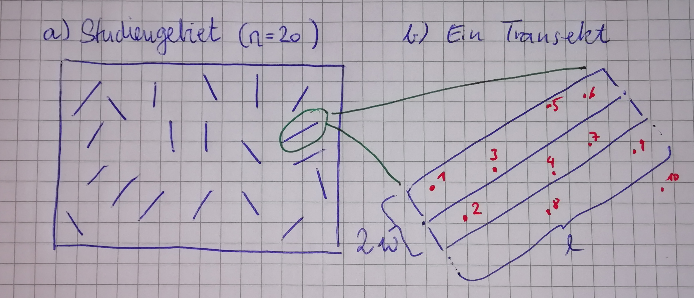
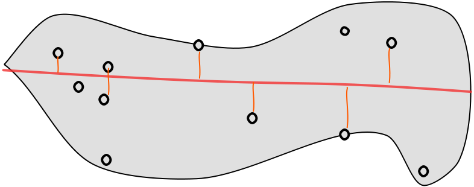
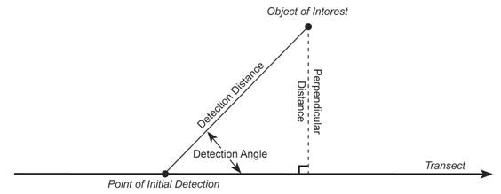
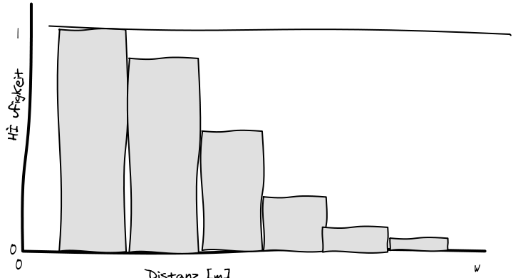
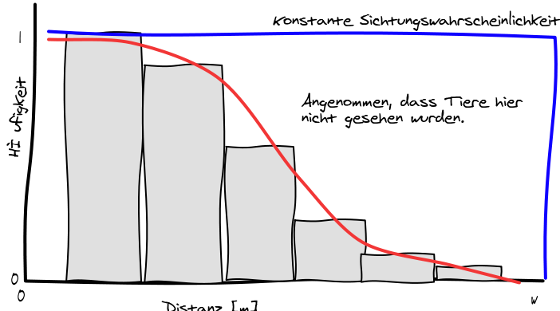
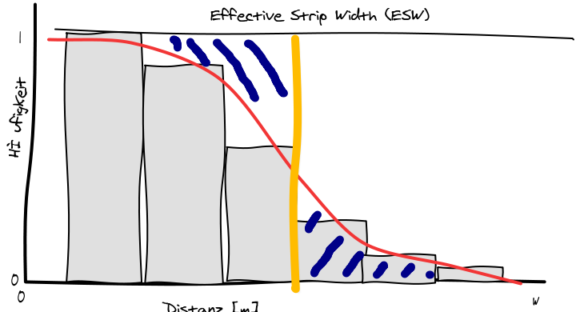
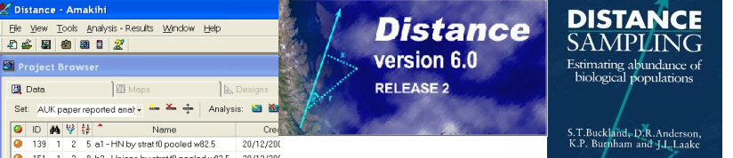

```{r setup}
#| include: false
library(tidyverse)
library(rcartocolor)
library(here)
library(AHMbook)
library(unmarked)
library(modelr)


knitr::opts_chunk$set(
  echo = TRUE,
  warning = FALSE,
  message = FALSE,
  fig.height = 4.5,
  fig.width = 4.5
)
```

## Wo sind wir?

-   [13.04.2026: E01: Einführung]{style="color: #888;"}
-   [20.04.2026: E02: Erfassung von Wildtieren]{style="color: #888;"}
-   [27.04.2026: E03: Verbreitung 1]{style="color: #888;"}
-   [05.05.2026: E04: Verbreitung 2]{style="color: #888;"}
-   [11.05.2026: E05: Occupancy-Modelle 1 (online)]{style="color: #888;"}
-   [18.05.2026: E06: Occupancy-Modelle 2]{style="color: #888;"}
-   **01.06.2026: E07: Abundanz 1**
-   08.06.2026: E08: Abundanz 2
-   15.06.2026: E09: Telemetrie 1: Random Walks etc.
-   22.06.2026: E10: Telemetrie 2: Streifgebiete
-   29.06.2026: E11: Telemetrie 3: Habitatselektion (online)
-   06.07.2026: E12: Telemetrie 4: Habitatselektion

## Kurze Wiederholung/Vorschau


## Ziele und Schätzer

-   Grundlagen der Transektmethoden zur Schätzung von Populationsgrößen kennen.
-   Schätzen von Populationsgrößen mit Transekten, N-Mixture-Modelle und Distance Sampling.
-   Einen Überblick über andere Methoden zur Populationsgrößenschätzung haben.

------------------------------------------------------------------------

-   Populationsgrößenschätzungen kommen bei vielen wildbiologischen Fragestellungen und Managemententscheidungen zum Einsatz (z.B. Abschussplanung für Jagden, Wiederansiedlung, Monitoring).
-   Einige Methoden versuchen die Tiere im Feld zu zählen und für die unvollständige Auffindungswahrscheinlichkeit zu korrigieren.

------------------------------------------------------------------------

Die grundlegende Formel auf welche sich die meisten Verfahren beziehen ist

$$
\hat{N} = \frac{C}{\hat{p}}
$$

wobei $\hat{N}$ die geschätzte Anzahl Tiere in einem Studiengebiet ist, $C$ die Anzahl an gezählten Tieren im Feld und $\hat{p}$ die geschätzte Wahrscheinlichkeit, mit der Tiere gesehen werden.

-   Dabei liegt in aller Regel die Schwierigkeit darin $\hat{p}$ zu schätzen, da $p$ meist unbekannt ist und geschätzt werden muss[^1].

[^1]: Man verwendet oft die Schreibweise $\hat{p}$ für den geschätzten Wert von $p$.

------------------------------------------------------------------------

### Ein fiktives Beispiel

-   Wir zählen Rehe in zwei unterschiedlichen Studiengebieten. Studiengebiet A ist bewaldet, während Studiengebiet B überwiegend aus Offenland besteht.
-   Wir haben in beiden Studiengebieten 40 Rehe gezählt (d.h. $C_A = C_B = 40$).
-   Wir wissen jedoch, dass die Auffindungswahrscheinlichkeit für Studiengebiet A 0,4 ($\hat{p}_A = 0{,}4$) und für Studiengebiet B 0,75 ($\hat{p}_B = 0{,}75$) ist.
-   Daraus ergibt sich eine geschätzte Populationsgröße für Studiengebiet A $\hat{N}_A = \frac{40}{0{,}4} = 100$ und für Studiengebiet B $\hat{N}_B = \frac{40}{0{,}75} \approx 53{,}34$.

------------------------------------------------------------------------

Dies wirft nun zwei Fragen auf:

1.  Wie zählt man die Tiere? Also wie kommt man zu $C_A$ und $C_B$? Siehe Einheit 2.
2.  Wie schätzt man die Auffindungswahrscheinlichkeit? Diese und folgende Einheiten.

------------------------------------------------------------------------

### Abundanz oder Dichte?

-   Je nach Methode schätzt man die Abundanz einer Population oder die Dichte.
-   Die Dichte ist die Anzahl an geschätzten Individuen pro Flächeneinheit (z.B. $m^2$, $ha$, $km^2$ oder $100 km^2$).
-   Als Abundanz versteht man hingegen die Anzahl Individuen pro Studiengebiet (z.B. ein Nationalpark, Landkreis oder ein Revier).
-   Es ist leicht eine Dichte in eine Abundanz umzurechnen, indem man einfach die Größe des Studiengebiets mit der Dichte multipliziert, wenn das gesamte Gebiet repräsentativ beprobt wurde.
-   Wenn man aus einer Abundanz eine Dichte berechnen möchte, besteht oft die Schwierigkeit, dass man die Größe des beprobten Studiengebietes nicht sicher sagen kann.

------------------------------------------------------------------------

### Vollzensus

Die analytisch -- jedoch nicht logistisch -- einfachste Situation ist ein Vollzensus. Dabei wird jedes Individuum einer Population gezählt. 

In diesem Spezialfall ist  $\hat{p} = 1$ und somit 

$$\hat{N} = \frac{C}{1} = C$$. 

Diese Situation kommt in der Praxis äußerst selten vor, außer evtl. in kleinen bis mittelgroßen Gattern.

------------------------------------------------------------------------

### Überlegen Sie:

In einem Studiengebiet wurden 57 Tiere gezählt mit einer Entdeckungswahrscheinlichkeit von 0.47. Was wäre eine bessere Schätzung, die die Anzahl der Tiere im Studiengebiet wiedergibt, wenn man die Entdeckungswahrscheinlichkeit berücksichtigt?

1.  57
2.  24
3.  121
4.  58


:::: {.fragment}

### Antwort

Bei Berücksichtigung der Entdeckungswahrscheinlichkeit von $0{,}47$ ergibt sich eine Tieranzahl von 121 Tieren. Die Rechnung lautet $57/0{,}47=121{,}28$.
::::


## Einfache Transektverfahren

-   Auf Transekten[^2] wird nach Tieren oder Nachweisen von Tieren gesucht.
-   Bei Transekten wird angenommen, dass alle Tiere bzw. Nachweise eines Tieres, die sich auf dem Transekt befinden mit einer Wahrscheinlichkeit von 1 gefunden und gezählt werden.

[^2]: Unter einem Transekt versteht man eine imaginäre gerade Linie, die im besten Fall zufällig durch das Studiengebiet gelegt wird. Jedoch können Transekte oft auch entlang von Wegen, Straßen oder ähnlichem liegen.

------------------------------------------------------------------------

-   Durchführung von Transektaufnahmen: Es wird eine beliebige Anzahl an Transekten (im Idealfall \> 30[^3]) in einem Studiengebiet zufällig verteilt.



[^3]: Damit man den zentralen Grenzwertsatz bei der Berechnung der Konfidenzintervalle nutzen kann.

------------------------------------------------------------------------

-   Je nach Gegebenheit des Geländes kann die zufällige Verteilung von Transekten mehr oder weniger praktikabel sein.
-   Oft wird auf bestehende Infrastrukturen zurückgegriffen (z.B. Forststraßen bei der Scheinwerfertaxation).
-   Jeder Transekt wird dann nach Tieren oder Spuren von Tieren abgesucht.
-   Eine Schätzung der Dichte erhält man, wenn man die Anzahl an gesehenen Nachweisen $C$ durch die Fläche ($2w * l$; $w$ ist die Breite[^b] und $l$ die Länge des Transekts) des Transekts dividiert.

[^b]: Unter Breite $w$ versteht man hier, die Distanz vom Transekt auf **eine** Seite. D.h., die Gesamtbreite des Transekts ist $2w$. 

------------------------------------------------------------------------

Die Dichte im Studiengebiet berechnet sich aus der mittleren geschätzten Dichte $\hat{D_i}$ pro Transekt ($i = 1, \dots, n$, wobei $n$ hier die Anzahl Transekte im Studiengebiet ist),

$$
\hat{\bar{D}} = \frac{1}{n}\sum_{i = 1}^n \hat{D}_i
$$ und die Standardabweichung $s$

$$
\hat{s} = \sqrt{\frac{1}{n-1}\sum_{i = 1}^n \left(\hat{D}_i - \hat{\bar{D}}\right)^2}
$$

------------------------------------------------------------------------

Mit der Standardabweichung $\hat s$ lässt sich dann *leicht* ein $(1 - \alpha)$-Konfidenzintervall berechnen.

$$
\hat{\bar{D}} \pm t_{1-\frac{\alpha}{2}, n-1} \frac{\hat{s}}{\sqrt{n}}
$$

Wobei $t_{1-\frac{\alpha}{2}, n-1}$ das $(1-\frac{\alpha}{2})$-Quantil einer t-Verteilung mit $n-1$ Freiheitsgraden ist. In R kann man dies mit der Funktion `qt()` berechnen (näherungsweise kann auch der Wert 1.96 verwendet werden).

------------------------------------------------------------------------

### Überlegen Sie:

Mit welchem Faktor muss die Stichprobenanzahl ($n$) steigen, damit sich das Konfidenzintervall halbiert (bei gleichen Werten für $\hat{\bar{D}}$ und $\hat s$).

1.  $\approx$ Faktor 1
2.  $\approx$ Faktor 2
3.  $\approx$ Faktor 3
4.  $\approx$ Faktor 4

```{r, include = FALSE}
x <- rnorm(1000)

s1 <- sample(x, 100)
mean(s1)
sd(s1) / sqrt(100)

s2 <- sample(x, 400)
mean(s2)
sd(s2) / sqrt(400)
```

:::: {.fragment}
### Antwort

Die Stichprobenanzahl $n$ steht im Nenner eines Bruchs und in einer Wurzel. Der Bruch halbiert sich, wenn der Faktor 4 angewendet wird ($\sqrt{4}=2$).
::::

## Beispiel Losungszählungen

Durchführung von Losungszählungen:

1.  Es wird eine feste Anzahl von Punkten in einem Studiengebiet festgelegt.
2.  An jedem Punkt wird dann ein Transekt erstellt.
3.  Wir nehmen für das Studiengebiet eine Größe von $5700 ha$ an. Wir könnten z.B. festlegen, dass an jedem Punkt ein Transekt beginnt, der $100m$ lang und $1m$ breit ist (d.h. die Fläche des Transekts wäre $A=2 * 1m * 100m = 200m^2$).
4.  Jeden Transekt säubern und vorhandenen Losungsgruppen entfernen.
5.  Nach einer bestimmten Anzahl Tagen (z.B. 20 Tagen) werden dann genau die selben Transekte wieder begangen und alle Losungsgruppen gezählt.

------------------------------------------------------------------------

Berechnen der Dichte:

$$\hat{D}_i  = \frac{\text{Anzahl Losungsgruppen}}{A * \text{Defäkationsrate} * \text{Zeit in Tagen}}$$

$A$ ist die Größe des Transekts. Die Defäkationsrate (in Losungsgruppen pro Tier pro Tag) müssen wir der Literatur entnehmen (20 Losungsgruppen pro Tier und 24 Stunden können wir für Rehwild als gegeben annehmen) und die Zeit ist die Anzahl an Tagen zur Losungsakkumulation.

------------------------------------------------------------------------

Nach einem Zeitraum von 20 Tagen wurde folgende Anzahl an Losungsgruppen pro Transekt beobachtet:

```{r, echo = FALSE, results="asis"}
n <- 20
set.seed(123)
c <- rpois(n, 1.5)
cat(c)
```

------------------------------------------------------------------------

Des Weiteren wissen wir aus der Literatur, dass wir eine Defäkationsrate von 20 annehmen können. Somit können wir folgende Variablen definieren:

```{r}
counts <- c(1, 2, 1, 3, 4, 0, 1, 3, 1, 1, 4, 1, 2, 2, 0, 3, 1, 0, 1, 4)
n <- 20 # Anzahl Transekte
A <- 200 # Fläche eines Transektes (in unserem Fall immer gleich) in m^2
r <- 20 # Defäkationsrate (Losungsgruppen pro Tier pro Tag)
t <- 20 # Zeit in Tagen
```

Somit lassen sich die erwarteten Rehe pro Transekt berechnen. Die Einheit ist Individuen pro $m^2$.

```{r}
D <- counts / (A * r * t) 
D
```

------------------------------------------------------------------------

Für ein besseres Arbeiten mit den Dichten, können wir Dichten in Individuen pro $100 ha$ (= $1km^2$) umrechnen.

```{r}
D <- D * 1e6
D
```

Die gemittelte Dichte für das ganze Studiengebiet ist dann:

```{r}
mean(D)
sd(D)
```

------------------------------------------------------------------------

Um die Unsicherheit zu quantifizieren (wir haben ja keinen Vollzensus gemacht) sollten wir *immer* ein Konfidenzintervall mitberechnen und angeben.

```{r}
KI <- mean(D) + qt(c(0.025, 0.975), n - 1) * sd(D) / sqrt(n)
KI
```

------------------------------------------------------------------------

-   Das Ergebnis ist so zu interpretieren, dass es im Studiengebiet eine geschätzte Rehwilddichte von `r round(mean(D), 2)` Rehen pro $km^2$ gibt mit einem 95% Konfidenzintervall von `r round(KI[1], 2)` bis `r round(KI[2], 2)`.
-   Das Konfidenzintervall überlappt mit einer Wahrscheinlichkeit von 95% den wahren Wert der Dichte (im frequentistischen Sinne: bei wiederholter Stichprobenziehung würden 95% der so berechneten Intervalle den wahren Parameter einschließen).

------------------------------------------------------------------------

Als letzten Schritt können wir nun die Abundanz für das Studiengebiet berechnen. Dafür muss lediglich die Dichte mit der Größe des Studiengebiets multipliziert werden.

```{r}
# 5700 ha = 57 km^2 und die Dichte liegt in Ind pro km^2 vor.
mean(D) * (5700 / 100) 
```

Das Gleiche sollten wir nun auch noch für das Konfidenzintervall tun.

```{r}
KI * (5700 / 100)
```

Somit könnten wir die Aussage treffen, dass wir für das Studiengebiet eine Population von `r round(mean(D) * (5700 / 100), 2)` schätzen mit einem Konfidenzintervall von `r round(KI * (5700 / 100), 2)[1]` bis `r round(KI * (5700 / 100), 2)[2]` Tieren.

------------------------------------------------------------------------

### Überlegen Sie:

Ein Studiengebiet besteht aus 30 % Wald und 70 % Heide. Sie können insgesamt 30 Transekte für Losungstransekte anlegen, wie verteilen Sie diese?

1.  15 Transekte im Wald und 15 Transekte in der Heide.
2.  10 Transekte im Wald und 20 Transekte in der Heide.
3.  20 Transekte im Wald und 10 Transekte in der Heide.

:::: {.fragment}
### Antwort

Das Studiengebiet sollte sich auch in den Transekten widerspiegeln, weswegen die Transekte proportional zu den Flächenanteilen verteilt werden sollten: 70 % in der Heide und 30 % im Wald. Bei 30 Transekten sollten sich also 20 in der Heide und 10 im Wald befinden (2. Antwortmöglichkeit).
::::

# Distance Sampling

## Die Idee

-   Annahme beim Transektverfahren: Man sieht alle Individuen einer Art im Transekt mit einer Wahrscheinlichkeit von 1.



------------------------------------------------------------------------

### Messen von Distanzen und Winkel

-   Distanz: Maßband, Rangefinder
-   Winkel: (Elektro)-Kompass

{fig-align="center"}

------------------------------------------------------------------------

### Berechnen der Distanz

{fig-align="center"}

$$ \text{Distanz} = sin(\text{gemessener Winkel}) \cdot \text{gemessene Distanz} $$

Verteilung der gemessenen Distanzen

------------------------------------------------------------------------

### Histogramm

-   Verteilung der Häufigkeit für $n$ Ausprägungen eines Merkmals.
-   Auf der x-Achse: $k$ gleich große Klassen.
-   Es gibt kein richtiges oder falsches $k$.
-   Als Richtwert: $k = \sqrt{n}$.
-   Auf der y-Achse werden die relativen oder absoluten Häufigkeiten dargestellt.

In R verwendet man normalerweise den Befehl `hist()`.

------------------------------------------------------------------------

### Wahrscheinlichkeiten sind nicht gleich

{fig-align="center"}

## Distance: Finden einer Funktion..



Berechnen der durchschnittlichen Entdeckungswahrscheinlichkeit: $$\hat{p}_a = \frac{\text{Fläche unter der roten Kurve}}{\text{Fläche unter dem blauen Rechteck}}$$

## Berechnen der Dichte

Wir erinnern uns, die Dichte wurde berechnet mit:

$$\hat{D_i} = \frac{C_i}{2wL}$$

Jetzt können wir für die Entdeckungswahrscheinlichkeit korrigieren mit $\hat{p}_a$:

$$\hat{D_i} = \frac{C_i}{2wL\hat{p}_a}$$

Wobei jetzt die Breite $w$ entweder die maximale Entfernung oder eine vorher definierte Distanz ist.

## Effective Strip Width (ESW)

Die Breite, $w$, multipliziert mit der mittleren Entdeckungswahrscheinlichkeit $\hat{p}_a$ wird oft als *Effective Strip Width* (ESW) angegeben.

{fig-align="center"}

## Anforderungen Distance

1.  Individuen, die direkt auf dem Transekt sind, werden mit einer Wahrscheinlichkeit von 1 gesehen.
2.  Individuen werden gesichtet, bevor sie sich bewegen.
3.  Distanzen und Winkel werden genau gemessen.
4.  Individuen sind unabhängig voneinander.
5.  Die Transekte sind zufällig verteilt.

## Was machen bei Verletzungen

**1. Individuen, die direkt auf dem Transekt sind, werden mit einer Wahrscheinlichkeit von 1 gesehen**

-   Wichtigste Annahme.
-   Möglichkeiten um sicherzustellen, dass alle Individuen auf dem Transekt gesehen werden:
    -   Langsames gehen
    -   Video Kameras (insbesondere bei geflogenen Transekten)
    -   Einsetzen von Hunden
    -   Mehrere Beobachter

------------------------------------------------------------------------

### 2. Individuen werden gesichtet, bevor sie sich bewegen

-   Zufällige und vom Beobachter unabhängige Bewegung ist kein Problem, wenn ein Individuum nicht mehrmals gezählt wird.
-   Bewegung, Flucht oder Anziehung des Beobachters ist ein Problem.

------------------------------------------------------------------------

### 3. Distanzen und Winkel werden genau gemessen

-   Benutzen von technischen Hilfsmittel

{fig-align="center"}

------------------------------------------------------------------------

### 4. Individuen unabhängig voneinander

-   Wenn die Tierart in Gruppen vorkommt ist diese Anforderung nicht gegeben. In DISTANCE gibt es die Möglichkeit Gruppen von Individuen zu berücksichtigen.

### 5. Die Transekte sind zufällig verteilt

-   Oft ist es ein Problem, das Transekte in der Nähe von Straßen sind.
-   Wieso kann das ein Problem sein?:
    -   Tiere werden von der Straße angezogen
    -   Tiere meiden die Straße

## Programm

Die Schwierigkeit liegt im Schätzen der Funktion, die die Sichtungswahrscheinlichkeit beschreibt.

{fig-align="center"}

-   Sehr umfangreich
-   Zur freien Verfügung
-   Kann hier bezogen werden: [https://distancesampling.org/](https://distancesampling.org/)
-   Natürlich gibt es auch Pakete für R (`Distance` und `RDistance`).

------------------------------------------------------------------------

### Überlegen Sie:

Was sagt die ESW (Effective Strip Width):

1.  Eine Empfehlung wie breit ein Transekt sein sollte.
2.  Die durchschnittlich geschätzte Transektbreite.
3.  Die fiktive Distanz, bis zu der eine Entdeckungswahrscheinlichkeit von 1 gegeben ist.

::: fragment
### Antwort

3.  ist richtig. Die ESW ist die fiktive Transektbreite, innerhalb derer alle Individuen mit Wahrscheinlichkeit 1 entdeckt würden – und dabei dieselbe Anzahl an Sichtungen ergäbe wie das reale, breitere Transekt mit abnehmender Entdeckungswahrscheinlichkeit.
:::
