```{r setup}
#| include: false
library(tidyverse)
library(rcartocolor)
library(here)
library(AHMbook)
library(unmarked)
library(modelr)


knitr::opts_chunk$set(
  echo = TRUE,
  warning = FALSE,
  message = FALSE,
  fig.height = 4.5,
  fig.width = 4.5
)
```

## Wo sind wir?

-   [13.04.2026: E01: Einführung]{style="color: #888;"}
-   [20.04.2026: E02: Erfassung von Wildtieren]{style="color: #888;"}
-   [27.04.2026: E03: Verbreitung 1]{style="color: #888;"}
-   [05.05.2026: E04: Verbreitung 2]{style="color: #888;"}
-   [05.2026: E05: Occupancy-Modelle 1 (online)]{style="color: #888;"}
-   [18.05.2026: E06: Occupancy-Modelle 2]{style="color: #888;"}
-   [01.06.2026: E07: Abundanz 1]{style="color: #888;"}
-   **08.06.2026: E08: Abundanz 2**
-   15.06.2026: E09: Telemetrie 1: Random Walks etc.
-   22.06.2026: E10: Telemetrie 2: Streifgebiete
-   29.06.2026: E11: Telemetrie 3: Habitatselektion (online)
-   06.07.2026: E12: Telemetrie 4: Habitatselektion

## Kurze Wiederholung/Vorschau


# Fang-Wiederfang

## Das Prinzip

-   Wie viele Fische gibt es in einem See?
-   Wie viele Tiger gibt es in einem Nationalpark?
-   Wie viele Steinadler gibt es in den Alpen?
-   Wie viele Luchse gibt es im Bayrischen Wald?
-   Wie viele Individuen einer Käferart gibt es im Lehrrevier?

------------------------------------------------------------------------

Alle Fragestellungen haben gemeinsam, dass die Tierart:

-   schwer zu finden ist,
-   in sehr geringen Dichten vorkommt.

------------------------------------------------------------------------

### Fang-Wiederfang (capture-mark-recapture): Idee

-   Fangen von $n$ Individuen zum Zeitpunkt ($t = 1$).
-   Die gefangenen Individuen werden markiert.
-   Die gefangenen Individuen werden wieder freigelassen.
-   Nach einem bestimmten Zeitraum erneutes Fangen.

------------------------------------------------------------------------

### Imaginärer See - Wie viele Fische gibt es?

1.  Fische werden gefangen (Zufallsstichprobe), $n_1$ wird bestimmt.
2.  Alle Fische werden markiert (z.B. durch Farbe).
3.  Alle markierten Fische werden zurück in den See gelassen.
4.  Erneutes fangen (Zufallsstichprobe), bestimmen von $n_2$ und $m_2$.

------------------------------------------------------------------------

### Wir wissen:

$$
\frac{n_1}{\hat{N}} = \frac{m_2}{n_2}
$$

wobei

-   $n_1$: Anzahl Fische in der ersten Probe.
-   $n_2$: Anzahl Fische in der zweiten Probe.
-   $m_2$: davon bereits markierte Fische aus der ersten Probe.
-   $\hat N$: geschätzte Populationsgröße in Anzahl Individuen.

------------------------------------------------------------------------

### Schätzen von $n$:

Wir wissen bereits:

$$
\frac{n_1}{\hat{N}} = \frac{m_2}{n_2}
$$

auflösen nach $\hat{N}$:

$$
\hat{N} = \frac{n_1*n_2}{m_2}
$$

-   Dieser Schätzer wird auch **Lincoln-Petersen** Schätzer genannt.

------------------------------------------------------------------------

### Konfidenzintervalle

Zum Berechnen von Konfidenzintervallen verwenden wir die folgende Formel:

$$ SD = \hat{N} \sqrt{\frac{(\hat{N} - n_1)(\hat{N} - n_2)}{n_1 n_2 (\hat{N} - 1)}} $$ dann können wir berechnen:

------------------------------------------------------------------------

$$ \hat{N} \pm 2 * SD $$

D.h. wir setzten ein:

-   Untere Grenze (LCI): $\hat{N} - 2 * SD$
-   Obere Grenze (UCI): $\hat{N} + 2 * SD$

------------------------------------------------------------------------

### Beispiel: Gelbhalsmaus

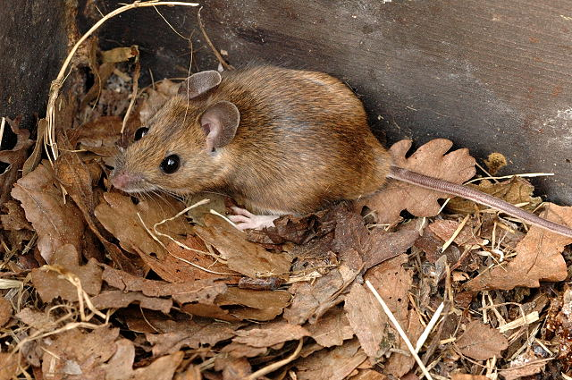{fig-align="center"}

------------------------------------------------------------------------

-   Individuen wurden mit Sherman-Fallen gefangen.
-   Individuen wurden mit PIT Tags markiert.

```{r}
dat2 <- readRDS(here::here("daten/apfl.rds"))
dat2
```

------------------------------------------------------------------------

```{r}
n1 <- sum(dat2$o1)
n2 <- sum(dat2$o3)
m2 <- sum(dat2$o3[dat2$o1 == 1])

Nh <- n2 / (m2 / n1)
Nh
```

Schätzen eines Konfidenzintervalls

```{r}
SD <- Nh * sqrt(((Nh - n1) * (Nh - n2)) / (n1 * n2 * (Nh - 1)))
Nh + c(-2, 2) * SD
```

------------------------------------------------------------------------

### Überlegen Sie:

Es wurde eine Populationsgröße von `r round(Nh)` Individuen geschätzt. Wie kommen wir zur Dichte (z.B. Individuen pro ha)?


:::: {.fragment}


Es handelt sich um ein Fallengrid mit einer Entfernung von 10 m zueinander. Insgesamt existieren 64 Fallen (8x8). Es wurden 70x70 m sicher beprobt. Die Division von 4900 $m^2$ 52 Individuen führt zu einer Überschätzung, da es Streifgebiete gibt, die nur partiell in der Probefläche liegen. Eine Lösung ist die Pufferung (siehe unten).

::::

------------------------------------------------------------------------

Wie kommt man zu einer Dichte?

```{r, fig.width=9, fig.height=8, out.width="60%"}
trps <- readRDS(here::here("daten/apfl_traps.rds"))
plot(trps$x, trps$y, asp = 1)
```

------------------------------------------------------------------------

Wir könnten den Fallengrid als Bezugsgröße heranziehen:

```{r}
Nh / (70 * 70) * 10000
```

Oder besser mit einem Puffer von 10 m

```{r}
Nh / (80 * 80) * 10000
```

Oder 20 m?

```{r}
Nh / (90 * 90) * 10000
```

------------------------------------------------------------------------

-   In der Praxis werden oft die Fangstandorte mit der MMDM gepuffert.
-   MMDM (= Mean Maximum Distance Moved) und ist der Mittelwert der maximalen Distanz zwischen zwei Fangstandorten aller Individuen.


### Annahmen

1.  Markierungen gehen nicht verloren.
2.  Jedes Individuum wird mit der gleichen Wahrscheinlichkeit gefangen.
3.  Markierungen beeinflussen das Verhalten der Tiere nicht und führen nicht zu erhöhter Mortalität.
4.  Es findet keine Immigration oder Emigration statt (Population bleibt konstant).

Was versteht man unter Emigration und Immigration?

------------------------------------------------------------------------

### Fallen Neutralität

-   Individuen dürfen Fallen nicht bewusst meiden bzw. sich davon angezogen fühlen.
-   Es muss darauf geachtet werden, dass einmal gefangene Individuen nicht die Fallen meiden.
    -   Fallen vor dem Fang im Feld stehen lassen.
    -   Der 2. Fang kann rein visuell sein (z.B. Skalski *et al.* 2005[^1], Ohrmarken bei Rothirschen).

[^1]: Skalski, J. R., Millspaugh, J. J., & Spencer, R. D. (2005). Population estimation and biases in paintball, mark–resight surveys of elk. Journal of Wildlife Management, 69(3), 1043-1052.

------------------------------------------------------------------------

### Geschlossene Populationen

Wir haben bis jetzt immer angenommen, dass keine Migration, Zuwachs oder Reduktion stattfindet. Diese Annahme hält über verhältnismäßig kurze Perioden.

### Offene Populationen

Wir können diese Restriktionen lockern, aber die Verfahren werden komplizierter.


## Räumliche Fang-Wiederfang-Methoden

-   Alle Fang-Wiederfang-Methoden, die wir bis jetzt kennen gelernt haben, vernachlässigen den Raum.
-   Man geht davon aus, dass die **Abundanz** und **Fangwahrscheinlichkeit** konstant sind (keine räumlichen Effekte).
-   Spatial Capture Recapture (SCR) verwendet die Position der *Fänge*.

------------------------------------------------------------------------

Eine gute konzeptionelle Übersicht gibt es bei Tourani 2022 (<https://onlinelibrary.wiley.com/doi/full/10.1002/ece3.8468>)

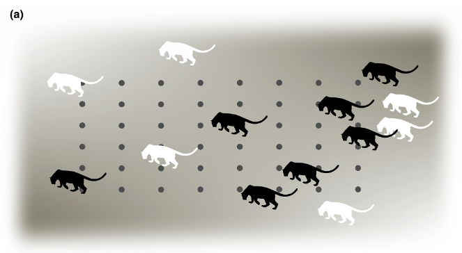

------------------------------------------------------------------------

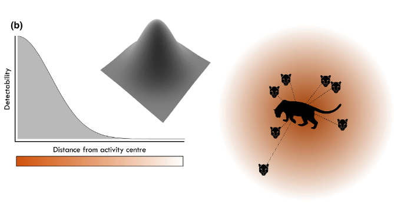

------------------------------------------------------------------------

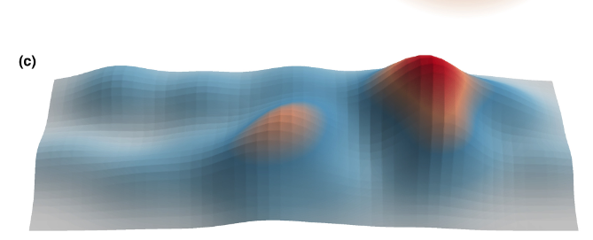

------------------------------------------------------------------------

Datenstruktur klassischer Fang-Wiederfangmethoden:

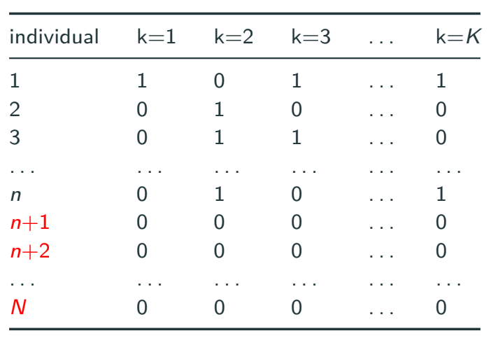

------------------------------------------------------------------------

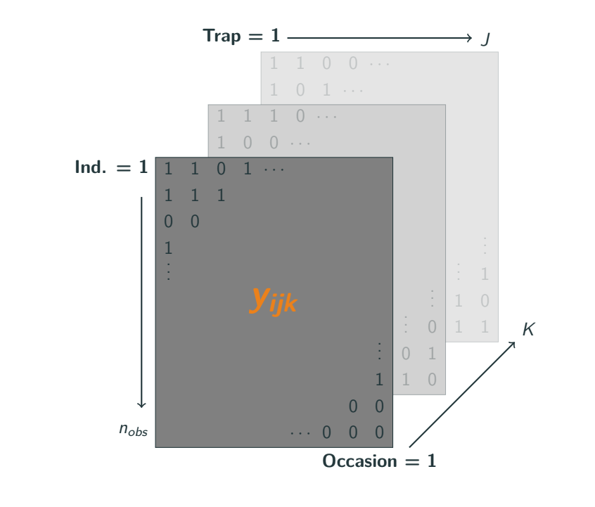

------------------------------------------------------------------------

Somit kann die *Fangwahrscheinlichkeit* als Funktion der Distanz zwischen der Position einer Falle ($\mathbf{x}_j$) und dem Aktivitätszentrum ($\mathbf{s}_i$) des Tieres modelliert werden:

$$p_{ijk} = p_0\times \exp\left(- \frac{dist(\mathbf{x}_j, \mathbf{s}_i)^2}{2\sigma^2} \right)$$

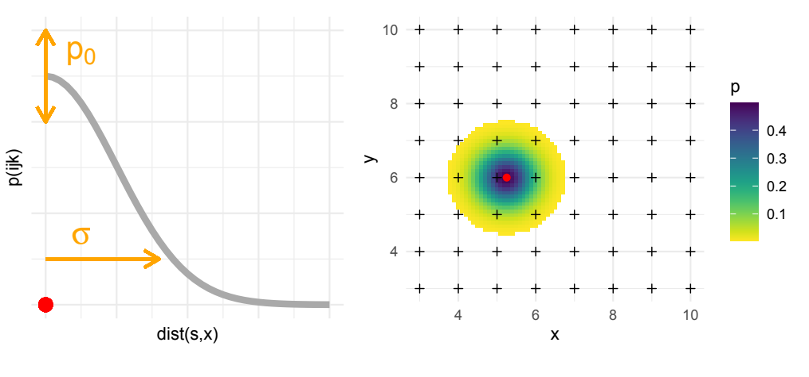

------------------------------------------------------------------------

Es müssen drei Parameter geschätzt werden:

-   $p_0$: Die Fangwahrscheinlichkeit am Aktivitätszentrum des Individuums.
-   $\sigma$: Parameter, der den Abfall der Fangwahrscheinlichkeit von Tieren modelliert.
-   $D$: Die Dichte der Tiere.

Alle Parameter können wiederum eine Funktion von Kovariaten sein.

------------------------------------------------------------------------

Ist die Fangwahrscheinlichkeit für beide Individuen gleich?

```{r, fig.width=9, fig.height=8, out.width="60%", echo = FALSE}
trps <- readRDS(here::here("daten/apfl_traps.rds"))
plot(trps$x, trps$y, asp = 1, xlab = "x", ylab = "y")
points(-3, 44, col = "red", pch = 20, cex = 3)
points(-3, 44, pch = 20, cex = 1)
points(35, 35, col = "yellow", pch = 20, cex = 3)
points(35, 35, pch = 20, cex = 1)
```

------------------------------------------------------------------------

Umsetzung in R:

-   Es gibt momentan zwei R-Pakete, die es ermöglichen SCR Modelle anzupassen. Das sind: `secr` und `oscr`.


------------------------------------------------------------------------

```{r}
library(oSCR)

dat3 <- readRDS(here::here("daten/oscr_dat.rds"))
trps <- as.data.frame(readRDS(here::here("daten/oscr_trps.rds")))


x <- data2oscr(
  edf = dat3,
  sess.col = 2,
  occ.col = 3,
  id.col = 4,
  sex.col = 5,
  trap.col = 1,
  ntraps = 64,
  K = 5,
  tdf = list(trps))
```

------------------------------------------------------------------------

```{r, out.width="100%", fig.height=4, fig.width=5}
spiderplot(x$scrFrame)
```

------------------------------------------------------------------------

```{r, out.width="50%"}
ssDF <- make.ssDF(scrFrame = x$scrFrame, buffer = 10, res = 5)
```

------------------------------------------------------------------------

```{r}
m1 <- oSCR.fit(model = list(
  D ~ 1,
  p0 ~ 1,
  sig ~ 1),
  scrFrame = x$scrFrame, ssDF = ssDF)

m2 <- oSCR.fit(model = list(
  D ~ 1,
  p0 ~ 1,
  sig ~ sex),
  scrFrame = x$scrFrame, ssDF = ssDF)
```

------------------------------------------------------------------------

```{r}
m1$AIC
m2$AIC
```

------------------------------------------------------------------------

```{r}
get.real(m1, newdata = data.frame(x = 1), type = "det")
get.real(m1, newdata = data.frame(x = 1), type = "sig")
get.real(m1, newdata = data.frame(x = 1), type = "dens")
```

------------------------------------------------------------------------

Wie viele Tiere gibt es?

```{r}
d1 <- get.real(m1, type = "dens")
sum(d1[[1]]$estimate)
sum(d1[[1]]$lwr)
sum(d1[[1]]$upr)
```

------------------------------------------------------------------------

Und jetzt für Modell 2

```{r}
get.real(m2, newdata = data.frame(sex = c("male", "female")), 
         type = "det")
get.real(m2, newdata = data.frame(sex = c("male", "female")), 
         type = "sig")
get.real(m2, newdata = data.frame(sex = 1), type = "dens")
```

------------------------------------------------------------------------

```{r}
d2 <- get.real(m2, type = "dens")

sum(d2[[1]]$estimate)
sum(d2[[1]]$lwr)
sum(d2[[1]]$upr)
```

------------------------------------------------------------------------

```{r, echo = FALSE, out.width="90%", fig.width=6, fig.height=4}
p0 <- get.real(m2, newdata = data.frame(sex = c("male", "female")), type = "det")
sig <- get.real(m2, newdata = data.frame(sex = c("male", "female")), type = "sig")

x <- seq(0, 25, 0.1)

plot(x, p0$estimate[1] * exp(-(x^2 / (2 * sig$estimate[1]^2))), type = "l", col = "red", ylim =c(0, 0.15), xlab = "Distanz [m]", 
     ylab = "Fangwahrscheinlichkeit")
lines(x, p0$lwr[1] * exp(-(x^2 / (2 * sig$lwr[1]^2))), type = "l", col = "red", lty = 2)
lines(x, p0$upr[1] * exp(-(x^2 / (2 * sig$upr[1]^2))), type = "l", col = "red", lty = 2)

lines(x, p0$estimate[2] * exp(-(x^2 / (2 * sig$estimate[2]^2))))
lines(x, p0$lwr[2] * exp(-(x^2 / (2 * sig$lwr[2]^2))), type = "l", lty = 2)
lines(x, p0$upr[2] * exp(-(x^2 / (2 * sig$upr[2]^2))), type = "l", lty = 2)

legend("topright", col = c("red", "black"), legend = c("männlich", "weiblich"), lty = 1)
```

------------------------------------------------------------------------

### Überlegen Sie

Was sagt der Parameter $\sigma$ im SCR-Modell aus:

1.  Die Wahrscheinlich, dass ein Tier gefangen wird.
2.  Wie stark die Fangwahrscheinlichkeit abnimmt, als Funktion von der Distanz zum Aktivitätszentrum.
3.  Die Dichte an Tieren.

\pause

### Antwort

Die richtige Antwort ist 2.

## Ein Beispiel: Rotwild im Nationalpark Bayerischer Wald und Sumava Nationalpark

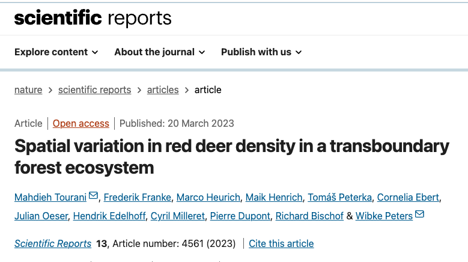

------------------------------------------------------------------------

### Mehtoden

-   Untersuchung der Rotwildichte
-   Sammeln von 1578 Losungen (-\> 1120 Individuen)
-   Schätzen der Dichte mit SECR
-   Geschätzt 2851 Individuen
-   Räumlich sehr heterogene Verteilung

------------------------------------------------------------------------

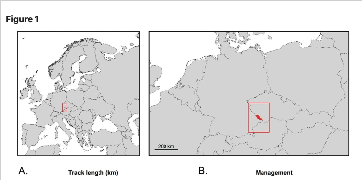

------------------------------------------------------------------------

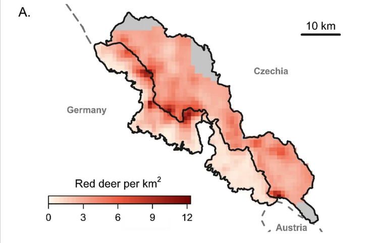

------------------------------------------------------------------------

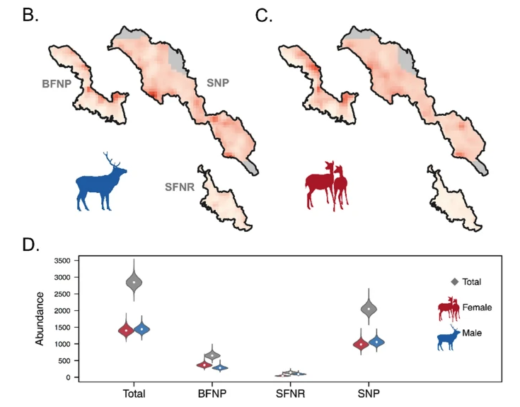
