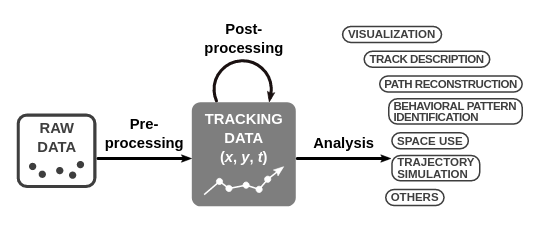
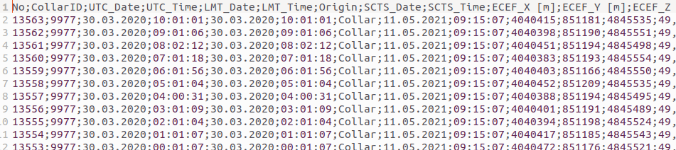
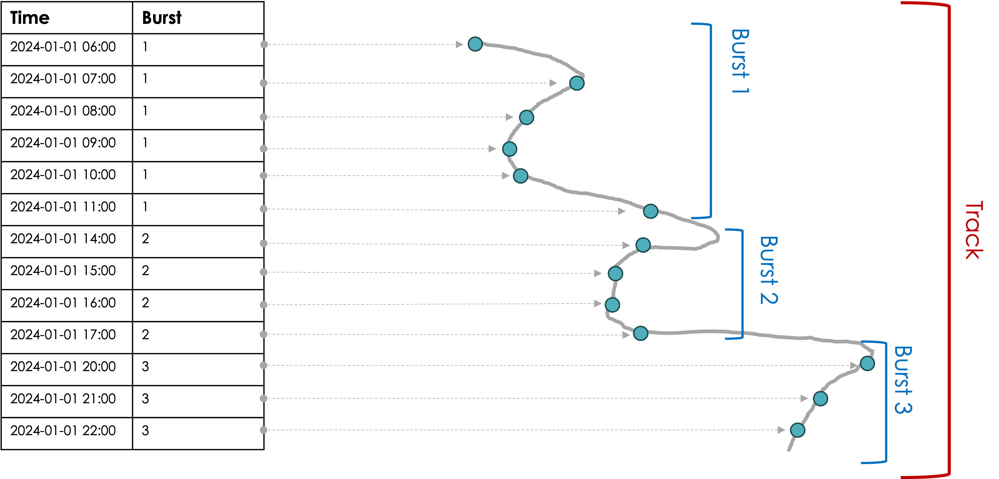
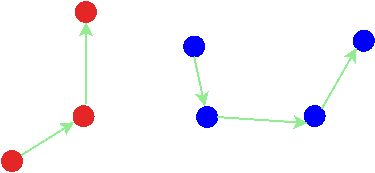
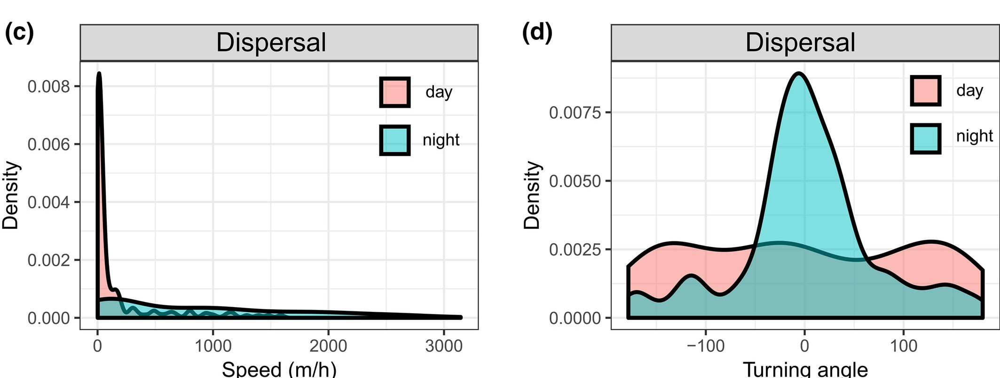
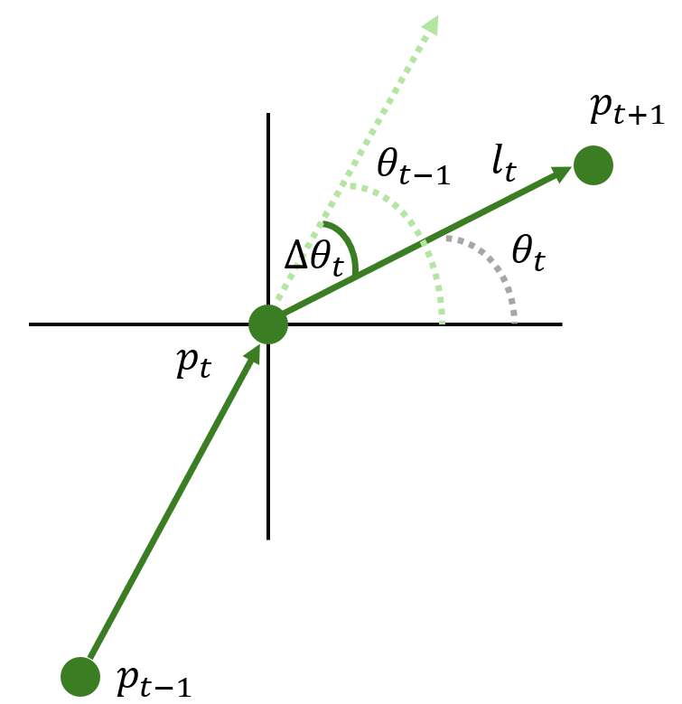
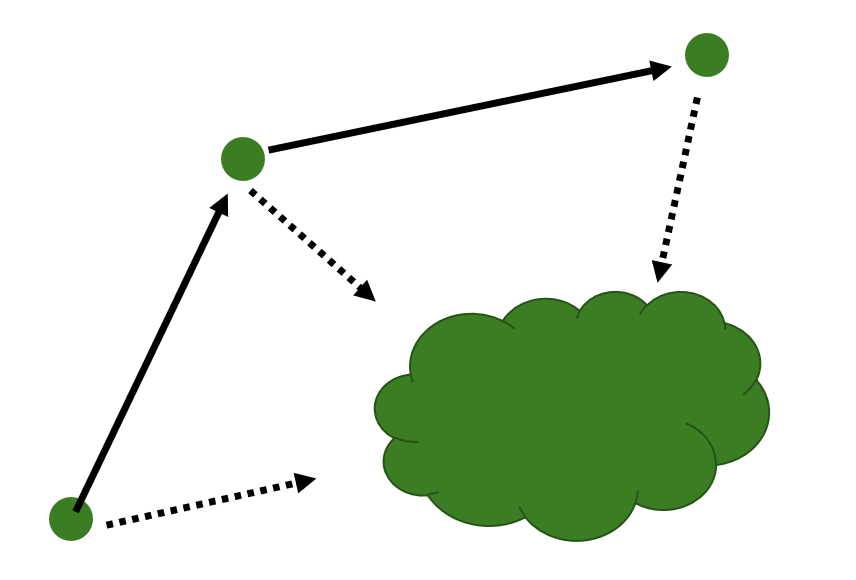
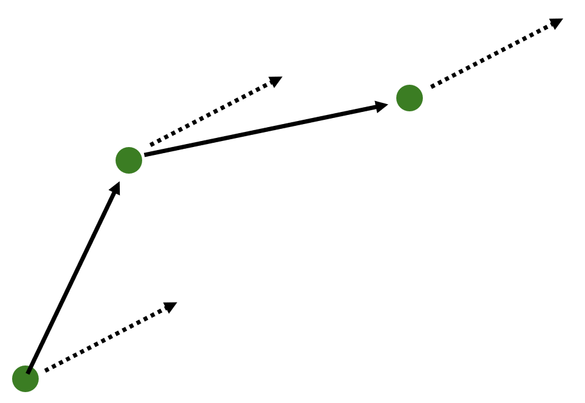

```{r setup}
#| include: false
library(tidyverse)
library(amt)
library(terra)

knitr::opts_chunk$set(
  echo = TRUE,
  warning = FALSE,
  message = FALSE,
  fig.height = 4,
  fig.width = 6
)
```
## Wo sind wir?

-   [13.04.2026: E01: Einführung]{style="color: #888;"}
-   [20.04.2026: E02: Erfassung von Wildtieren]{style="color: #888;"}
-   [27.04.2026: E03: Verbreitung 1]{style="color: #888;"}
-   [05.05.2026: E04: Verbreitung 2]{style="color: #888;"}
-   [05.2026: E05: Occupancy-Modelle 1 (online)]{style="color: #888;"}
-   [18.05.2026: E06: Occupancy-Modelle 2]{style="color: #888;"}
-   [01.06.2026: E07: Abundanz 1]{style="color: #888;"}
-   [08.06.2026: E08: Abundanz 2]{style="color: #888;"}
-   **15.06.2026: E09: Telemetrie 1: Random Walks etc.**
-   22.06.2026: E10: Telemetrie 2: Streifgebiete
-   29.06.2026: E11: Telemetrie 3: Habitatselektion (online)
-   06.07.2026: E12: Telemetrie 4: Habitatselektion

## Kurze Wiederholung/Vorschau


# Warum Bewegungsökologie?

## Tiere in Raum und Zeit verstehen

Tierbewegung ist ein fundamentaler ökologischer Prozess:

::: {.incremental}
- **Ressourcenzugang** — Nahrung, Wasser, Partner finden
- **Habitatnutzung** — Welche Lebensräume werden gewählt oder gemieden?
- **Dispersion & Ausbreitung** — Wie entstehen Metapopulationen?
- **Verhaltensökologie** — Nahrungssuche, Ruhe, Flucht als Verhaltenszustände
- **Naturschutz** — Wildtierkorridore, Barrieren (Straßen), Klimawandel
- **Epidemiologie** — Kontaktraten bestimmen Krankheitsausbreitung
:::

## Zwei Perspektiven auf Tierbewegung

:::: {.columns}

::: {.column width="50%"}
### Lagrange'sche Sichtweise
- Individuelle Tiere werden **verfolgt**
- GPS-Halsbänder, Sender, Telemetrie
- Studie auf Ebene der einzelnen **Individuen**
- Fragestellung: *Wo geht dieses Tier hin?*
:::

::: {.column width="50%"}
### Euler'sche Sichtweise
- Tiere werden von **fixen Punkten** beobachtet
- Beispielsweise Kamerafallen oder Transekte
- Studie auf **Populationsebene**
:::

::::

```{r}
#| echo: false
#| out-width: "60%"
#| fig-align: center
#| fig-cap: "Lagrange vs. Euler (Quelle: CMU 15-462)"
knitr::include_graphics("images/lagrange_vs_euler.png")
```

::: {.notes}
Wir fokussieren in dieser Vorlesung auf den Lagrange'schen Ansatz — GPS-Daten einzelner Tiere.
:::

# Von Punkten zu Schritten

## Typische Analysepipeline

```{r}
#| echo: false
#| out-width: "90%"
#| fig-align: center
#| fig-cap: "Workflow (nach Joo et al. 2020)"

```

::: {.incremental}
1. **Vorverarbeitung** — Rohdaten → x, y, t (GPS: direkt; GLS: Lichtintensität → Position)
2. **Nachverarbeitung** — Ausreißer erkennen und entfernen
3. **Analyse** — Home Ranges, Habitatwahl, Bewegungsmodelle …
:::

## Ortungen — die Grunddaten

```{r}
#| echo: false
#| out-width: "80%"
#| fig-align: center

```

- Typischerweise: Zeitreihe von Koordinaten (`x`, `y`) + Zeitpunkt `t`
- Je nach Sensor: Temperatur, Projektionskoordinate, Akkustatus, ... 

## Pfad, Zug und Schritt — Definitionen

:::: {.columns}

::: {.column width="70%"}
- **Pfad** (*Path*): Kontinuierliche Spur eines Tieres durch den Raum.
- **Bewegung** (*Move*): Jeder Pfad wird als Serie von Geraden dargestellt — Verlagerung zwischen zwei aufeinanderfolgenden Haltepunkten.
- **Schritt** (*Step*): Haltepunkte des Pfades in **regelmäßigen Zeitintervallen** — die Grundeinheit unserer Analysen.
:::

::: {.column width="30%"}
```{r}
#| echo: false
knitr::include_graphics("images/turchin.png")
```
:::

::::

::: {.notes}
Für mehr Details siehe Turchin 1998.
:::

## Bursts und Resampling

```{r}
#| echo: false
#| out-width: "85%"
#| fig-align: center
#| fig-cap: "Tracks und Bursts"

```

- Ein **Burst** ist eine Sequenz von Relocations desselben Individuums mit **gleichen Zeitintervallen** (mit Toleranz)
- `amt::track_resample()` → eine Relocation pro Zeitintervall
- `amt::filter_min_n_burst()` → Bursts mit zu wenigen Punkten entfernen

## Schritte berechnen

```{r}
#| echo: false
#| out-width: "70%"
#| fig-align: center

```

::: {.fragment}
```{r}
library(amt)
data("deer")

deer |>
  track_resample(rate = hours(6), tolerance = minutes(20)) |>
  filter_min_n_burst(min_n = 3) |>
  steps_by_burst() |>
  glimpse(width = 55)
```
:::

## Kenngrößen eines Schrittes

::: {.incremental}
- **`sl_`** — Schrittlänge: Distanz zwischen zwei aufeinanderfolgenden Ortungen
  - Abhängig vom Zeitintervall zwischen Ortungen
- **`ta_`** — Relative Richtungsänderung zwischen zwei aufeinanderfolgenden Schritten
  - 0 = geradeaus, ±π = Umkehr
- **NSD** — Net Squared Displacement: Wie weit bewegt sich das Tier vom Startpunkt?
  - Gut für Erkennung von Migration, Heimkehr, Dispersion
  
:::

# Statistische Verteilungen für Schritt und Richtung

## Warum brauchen wir Verteilungen?

Tiere bewegen sich **nicht deterministisch** — es gibt Variabilität in Schrittlängen und Richtungen.

::: {.fragment}
Wir modellieren diese Variabilität mit **Wahrscheinlichkeitsverteilungen**, um:

- beobachtete Bewegungen zu **beschreiben und zusammenzufassen**
- Bewegungen zu **simulieren** (Nullmodelle)
- Parameter zu **schätzen** und zwischen Verhaltensweisen oder Individuen zu vergleichen
- Zufallsbewegungsmodelle (z.B. Random Walk (RW)) formal zu **definieren**
:::


## Schrittlänge: Die Gamma-Verteilung {#sec-gamma}

:::: {.columns}

::: {.column width="55%"}
$$\text{sl} \sim \text{Gamma}(\alpha, \beta) \quad [\alpha, \beta > 0]$$

- $\alpha$ (**shape**): bestimmt die Form der Kurve
  - klein → stark rechtsschief (viele kurze Schritte)
  - groß → annähernd glockenförmig
- $\beta$ (**scale**): bestimmt den Skalierungsparameter
  - mittlere Schrittlänge $\propto \alpha \cdot \beta$
- Nur für **positive Werte** definiert → ideal für Distanzen

:::

::: {.column width="45%"}
```{r}
#| echo: false
#| fig-height: 4.5
#| fig-width: 4.5
#| fig-cap: "Gamma-Dichten für verschiedene Parameter"
tibble(
  x     = rep(seq(0, 15, length.out = 300), 3),
  alpha = rep(c(0.5, 2, 5), each = 300),
  beta  = rep(c(1,   1, 0.5), each = 300),
  dens  = dgamma(x, shape = alpha, scale = beta),
  label = paste0("\u03b1=", alpha, ", \u03b2=", beta)
) |>
  ggplot(aes(x, dens, col = label)) +
  geom_line(linewidth = 1.1) +
  scale_color_manual(values = c("#E07B39", "#2C6E49", "#1A3D2B")) +
  labs(x = "Schrittlänge", y = "Dichte", col = NULL) +
  theme_minimal(base_size = 13) +
  theme(legend.position = "bottom")
```
:::

::::

## Richtungen: Von-Mises-Verteilung {#sec-vonmises}

:::: {.columns}

::: {.column width="55%"}
$$\theta \sim \text{vonMises}(\mu,\; \kappa) \quad [\kappa \geq 0]$$

- $\mu$: mittlere Richtung (immer 0, da wir davon ausgehen, dass die Tiere gerade weiter gehen). 
- $\kappa$ (**Konzentration**): Wie stark ist die Richtung konzentriert?
  - $\kappa = 0$ → gleichmäßig auf dem Kreis → **kein Richtungssinn** (RW)
  - $\kappa \gg 0$ → starke Konzentration um $\mu$ → **gerichtete Bewegung** (CRW)
  
:::

::: {.column width="45%"}
```{r}
#| echo: false
#| fig-height: 4.5
#| fig-width: 4.5
#| fig-cap: "Von-Mises-Dichten für verschiedene κ"
library(circular)
theta <- seq(-pi, pi, length.out = 500)
tibble(
  theta = rep(theta, 3),
  kappa = rep(c(0.01, 1, 5), each = 500),
  dens  = map2_dbl(
    theta, kappa,
    \(t, k) dvonmises(circular(t), mu = circular(0), kappa = k)
  ),
  label = paste0("\u03ba = ", kappa)
) |>
  ggplot(aes(theta, dens, col = label)) +
  geom_line(linewidth = 1.1) +
  scale_x_continuous(
    breaks = c(-pi, -pi/2, 0, pi/2, pi),
    labels = c("-180\u00b0", "-90\u00b0", "0\u00b0", "90\u00b0", "180\u00b0")
  ) +
  scale_color_manual(values = c("#8FB8AD", "#2C6E49", "#1A3D2B")) +
  labs(x = "Richtung", y = "Dichte", col = NULL) +
  theme_minimal(base_size = 13) +
  theme(legend.position = "bottom")
```
:::

::::

::: {.notes}
κ ist DER Schlüsselparameter für Richtungskorrelation. κ=0 entspricht dem einfachen RW, großes κ dem CRW.
:::

## Verteilungen anpassen — in R mit `amt`

```{r}
data("deer")
stps <- deer |>
  track_resample(rate = hours(6), tolerance = minutes(20)) |>
  filter_min_n_burst(min_n = 3) |>
  steps_by_burst()
```

-------------

```{r}
# Schrittlänge: Gamma-Verteilung
(sl_fit <- fit_distr(stps$sl_, "gamma"))
```

------------

```{r}
# Richtung: Von-Mises-Verteilung
(dir_fit <- fit_distr(stps$direction_p, "vonmises"))
```

---

```{r}
#| layout-ncol: 2
#| echo: false
#| fig-cap:
#|   - "Schrittlängen-Histogramm mit angepasster Gamma-Verteilung"
#|   - "Richtungsverteilung mit angepasster Von-Mises-Verteilung"

# Schrittlänge
hist(stps$sl_, breaks = 40, freq = FALSE,
     main = "Schrittlänge", xlab = "sl_ [m]",
     col = "lightgreen", border = "white")
curve(dgamma(x, shape = sl_fit$params$shape,
             scale = sl_fit$params$scale),
      add = TRUE, col = "#E07B39", lwd = 2)

# Richtung
hist(as.numeric(stps$direction_p), breaks = 30, freq = FALSE,
     main = "Richtung", xlab = "direction_p [rad]",
     col = "lightblue", border = "white")
```

---------------

## Welche Eigenschaften braucht eine Verteilung?

Normalverteilung ist weit verbreitet, aber **ungeeignet** für Schrittlängen und Richtungen:


:::: {.columns}

::: {.column width="50%"}

```{r}
#| echo: false
#| fig-height: 3.5
#| fig-width: 4.5
#| fig-cap: "Normalverteilung: Werte von −∞ bis +∞"
curve(dnorm(x, mean = 0, sd = 5), from = -20, to = 20,
      xlab = "Wert", ylab = "Dichte", lwd = 2, col = "#1A3D2B")
abline(v = 0, lty = 2, col = "red")
text(1, 0.15, "< 0\nnicht\nmöglich!", col = "red", cex = 0.85)
```
:::

::: {.column width="50%"}


- Interaktive Gamma-Verteilung: <https://jmsigner.shinyapps.io/gamma/>
- Interaktive Von-Mises Verteilung: <https://jmsigner.shinyapps.io/vonmises/>
:::

::::


## Parameter spiegeln Verhaltensweisen wider

Parameter von Schrittlängen- und Richtungsverteilungen **können sich ändern** und zeigen damit unterschiedliche Verhaltenszustände an (z. B. Nahrungssuche vs. Ruhe):

```{r}
#| echo: false
#| out-width: "75%"
#| fig-align: center
#| fig-cap: "Moll et al. 2021: Tag vs. Nacht — verschiedene Parameter, verschiedene Verhaltensweisen"

```


# Bewegungsmodelle

## Vier Klassen von Bewegungsmodellen

Zufallspfade (diskrete Zeit) unterscheiden sich darin, ob sie **Richtungskorrelation** oder **Bias** aufweisen:

| Modell | Korrelation | Bias |
|--------|:-----------:|:----:|
| **RW** (Random Walk) — Einfacher Zufallspfad | ✗ | ✗ |
| **CRW** (Correlated Random Walk) — Korrelierter Zufallspfad | ✓ | ✗ |
| **BRW** (Biased Random Walk) — Gerichteter Zufallspfad | ✗ | ✓ |
| **BCRW** (Biased Correlated Random Walk) — Gerichtet & korreliert | ✓ | ✓ |

::: {.fragment}
Die Unterscheidung erfolgt durch die Parametrisierung der `sl_`- und `ta_`-Verteilungen.
:::

## Einfacher Zufallspfad (RW)

:::: {.columns}

::: {.column width="45%"}
### Schritt-Darstellung

$$l_t \sim \text{Gamma}(\alpha, \beta)$$
$$\theta_t \sim \text{vonMises}(\mu,\; \kappa = 0)$$

$$\Delta x_t = l_t \cos(\theta_t)$$
$$\Delta y_t = l_t \sin(\theta_t)$$

- $\theta_t$ ist **Absolutrichtung** — gleichmäßig verteilt ($\kappa = 0$)
- Jeder Schritt ist **unabhängig** vom vorherigen
- Positionen folgen einem Markov-Prozess 1. Ordnung
:::

::: {.column width="55%"}
```{r}
#| echo: false
#| fig-cap: "Einfacher Zufallspfad (RW)"
knitr::include_graphics("images/rw_step.png")
```
:::

::::

## Korrelierter Zufallspfad (CRW)

:::: {.columns}

::: {.column width="45%"}
### Schritt-Darstellung

$$l_t \sim \text{Gamma}(\alpha, \beta)$$
$$\Delta\theta_t \sim \text{vonMises}(0,\; \kappa > 0)$$

$$\theta_t = \theta_{t-1} + \Delta\theta_t$$

- $\Delta\theta_t$ ist **relative Richtungsänderung**
- $\theta_t$ hängt von $\theta_{t-1}$ ab → Richtungskorrelation
- Je größer $\kappa$, desto **geradliniger** die Bewegung
:::

::: {.column width="55%"}
```{r}
#| echo: false
#| fig-cap: "Korrelierter Zufallspfad (CRW)"

```
:::

::::

::: {.notes}
Der Unterschied zu RW ist subtil aber wichtig: beim CRW ist es die *relative* Richtungsänderung, die von-Mises-verteilt ist.
:::

## Gerichteter Zufallspfad (BRW)

:::: {.columns}

::: {.column width="50%"}
### Lokaler Bias
- Anziehung zu einem **nahen Ziel** (z. B. Wasserstelle, Schlafplatz)

```{r}
#| echo: false

```
:::

::: {.column width="50%"}
### Globaler Bias
- Anziehung zu einem **entfernten Ziel** (z. B. Zugvogelziel)

```{r}
#| echo: false

```
:::

::::

## Biased Correlated Random Walk (BCRW)

- Kombination aus **Richtungskorrelation** ($\kappa > 0$) und **globalem/lokalem Bias**
- Realistischstes Modell für viele Wildtiere

```{r}
#| echo: false
#| fig-height: 3.5
#| fig-cap: "Weißwedelhirsch mit Wald-Landschaft — ein typisches BCRW"

stps_bcrw <- deer |>
  track_resample(rate = hours(6), tolerance = minutes(20)) |>
  filter_min_n_burst(min_n = 3) |>
  steps_by_burst()

box <- ext(round(c(
  min(deer$x_) - 500, max(deer$x_) + 500,
  min(deer$y_) - 500, max(deer$y_) + 500
)))

sh_forest <- get_sh_forest() |>
  crop(box) |>
  as.data.frame(xy = TRUE)

ggplot() +
  geom_raster(data = sh_forest,
              aes(x = x, y = y,
                  fill = factor(forest, levels = c(1, 0),
                                labels = c("Wald", "Offenland")))) +
  geom_segment(data = stps_bcrw,
               aes(x = x1_, y = y1_, xend = x2_, yend = y2_),
               alpha = 0.5) +
  coord_equal(expand = FALSE) +
  scale_fill_manual(name = "Landnutzung",
                    values = c("forestgreen", "wheat")) +
  labs(x = "X [m]", y = "Y [m]") +
  theme_minimal(base_size = 11)
```


# Fallstudie: Moll et al. 2021

## Weißwedelhirsch-Dispersion

```{r}
#| echo: false
#| out-width: "75%"
#| fig-align: center
#| fig-cap: "Moll et al. 2021 — Schrittgeschwindigkeit und Richtungsverteilung für Tag/Nacht"

```

::: aside
Moll et al. (2021). *Ecology and Evolution.* <https://doi.org/10.1002/ece3.7354>
:::

## Hintergrund der Studie

Remington Moll beobachtete eine **seltene Langstrecken-Dispersion** bei *Odocoileus virginianus* (Weißwedelhirsch)[^moll].

[^moll]: Moll et al. (2021). Ecology and Evolution. doi:10.1002/ece3.7354

::: {.incremental}
- GPS-Tracking lieferte hochauflösende Ortungsdaten
- Analyse: Verteilung von **Schrittgeschwindigkeit** (Proxy für Schrittlänge) und **Richtung** — getrennt für Tag und Nacht
- **Hinweis**: Moll et al. verwenden *Geschwindigkeit* (Schrittlänge / Zeitintervall) statt Schrittlänge direkt — die biologische Interpretation bleibt gleich
:::

::: {.fragment}
::: {.callout-note}
### Diskussion (3 min)
Wie erwarten Sie, dass sich der Hirsch **tagsüber** vs. **nachts** während der Dispersion verhält?  
Welche Parameterunterschiede erwarten Sie in der Gamma- und Von-Mises-Verteilung?
:::
:::

## Ergebnisse: Tag vs. Nacht

:::: {.columns}

::: {.column width="50%"}
### Schrittgeschwindigkeit

| | Tag | Nacht |
|---|---|---|
| Gamma $\alpha$ | kleiner | größer |
| Gamma $\beta$ | kleiner | größer |
| Mittlere Geschw. | **niedrig** | **hoch** |

→ Viele kurze Schritte tagsüber  
→ Längere, schnellere Bewegung nachts
:::

::: {.column width="50%"}
### Richtung

| | Tag | Nacht |
|---|---|---|
| vonMises $\kappa$ | **klein** | **groß** |
| Richtungssinn | schwach | stark |
| Bewegungstyp | ≈ RW | CRW |

→ Tagsüber: ungerichtete Bewegung / Ruhe  
→ Nachts: gerichtete Dispersion
:::

::::

## Biologische Interpretation

::: {.incremental}
- **Nachtaktive, gerichtete Dispersion** (CRW, hohes $\kappa$):
  - Tier bewegt sich zielgerichtet und mit Richtungspersistenz
  - Große Schrittlängen/-geschwindigkeiten
  
- **Kryptisches Ruheverhalten am Tag** (≈ RW, kleines $\kappa$):
  - Geringe Geschwindigkeit → Rast, Nahrungssuche auf kleinem Raum
  - Richtung nahezu gleichmäßig auf dem Kreis verteilt
  
- **Methodische Schlussfolgerungen**:
  - Parameterschätzung von Gamma und Von-Mises ist **informativ über Verhaltensweisen**
  - Moll et al. nutzen genau diese Verteilungsunterschiede als Evidenz für Dispersionsbewegung
:::

