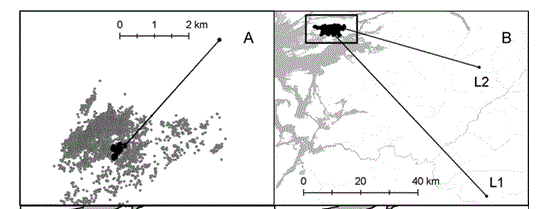
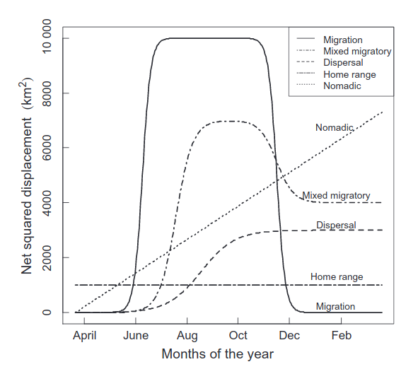
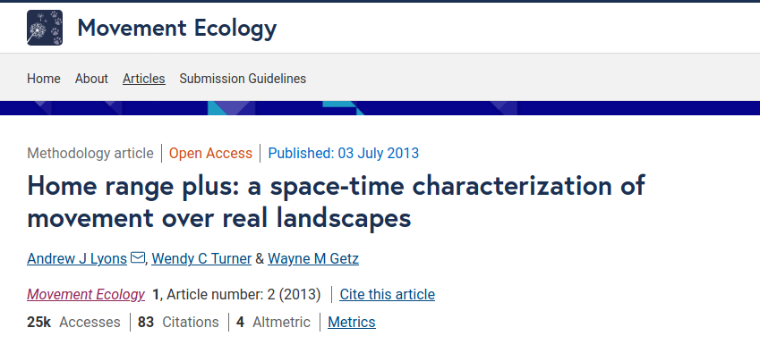
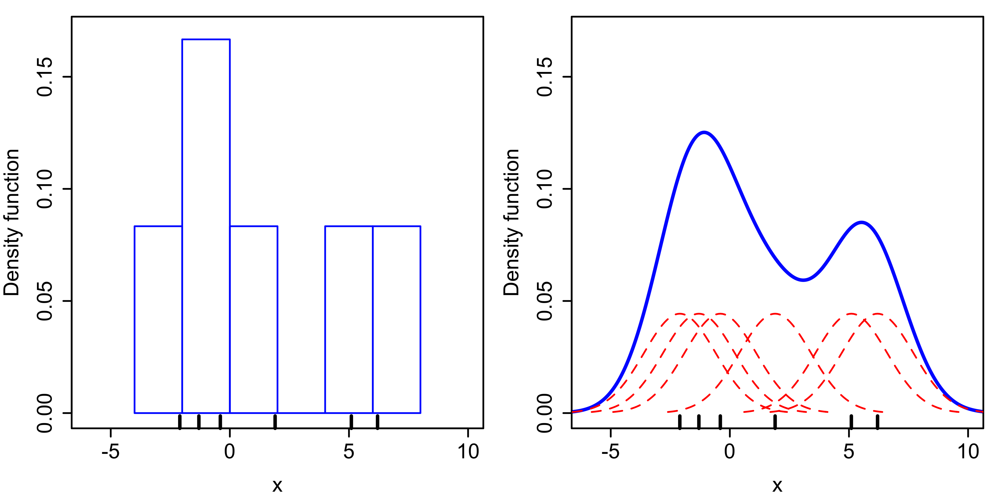
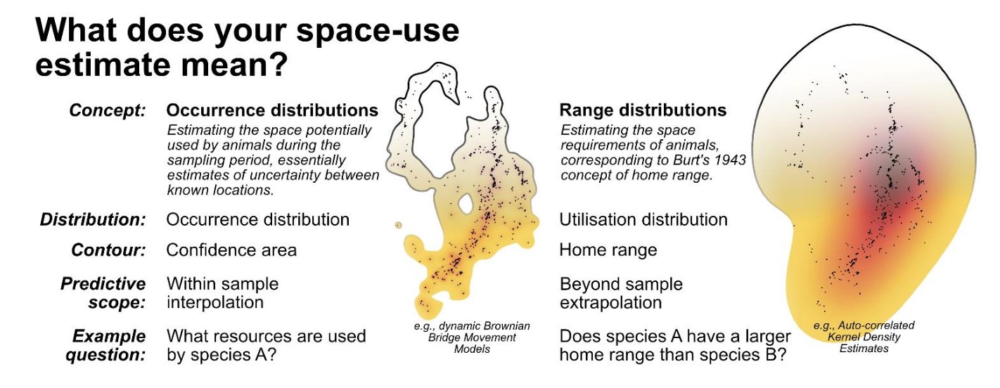
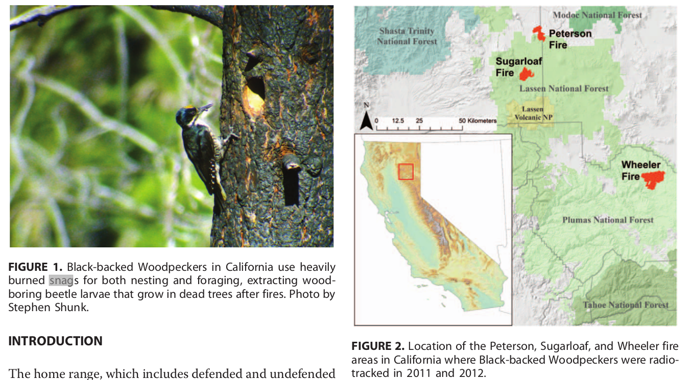
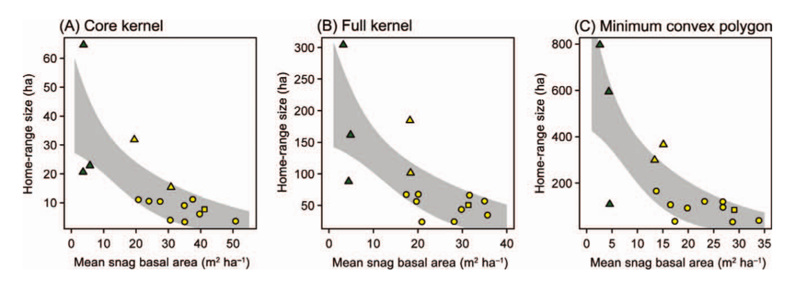

```{r setup}
#| include: false
library(tidyverse)
library(amt)
library(terra)
library(patchwork)

knitr::opts_chunk$set(
  echo = TRUE,
  warning = FALSE,
  message = FALSE,
  fig.height = 4,
  fig.width = 6
)
```

## Wo sind wir?

-   [13.04.2026: E01: Einführung]{style="color: #888;"}
-   [20.04.2026: E02: Erfassung von Wildtieren]{style="color: #888;"}
-   [27.04.2026: E03: Verbreitung 1]{style="color: #888;"}
-   [05.05.2026: E04: Verbreitung 2]{style="color: #888;"}
-   [05.2026: E05: Occupancy-Modelle 1 (online)]{style="color: #888;"}
-   [18.05.2026: E06: Occupancy-Modelle 2]{style="color: #888;"}
-   [01.06.2026: E07: Abundanz 1]{style="color: #888;"}
-   [08.06.2026: E08: Abundanz 2]{style="color: #888;"}
-   [15.06.2026: E09: Telemetrie 1: Random Walks etc]{style="color: #888;"}
-   **22.06.2026: E10: Telemetrie 2: Streifgebiete**
-   29.06.2026: E11: Telemetrie 3: Habitatselektion (online)
-   06.07.2026: E12: Telemetrie 4: Habitatselektion

## Kurze Wiederholung/Vorschau


```{r, include=FALSE, eval = FALSE}
library(amt)
library(tidyverse)
library(sf)
library(patchwork)
library(lubridate)

data(deer)
d1 <- deer[month(deer$t_) %in% (3:7), ]
write_csv(d1 %>% mutate(monat = lubridate::month(t_)) %>% select(x = x_, y = y_, ts = t_, monat), 
          here::here("daten/hirsch.csv"))
```

## Telemetrie (zur Wiederholung)

-   Fragestellungen zur Raumnutzung und Habitatselektion werden meist mit Telemetriedaten beantwortet.
-   Telemetrie: griechisch "Fernmessung".
-   Im Kontext der Wildtierbiologie ist damit in der Regel gemeint, dass ein Sender an einem Wildtier befestigt wird.
-   Am häufigsten ist das Aufzeichnen der räumlichen Position des Tieres, aber es gibt auch Sender, die Aktivität, Herzfrequenz, Geburten etc. aufzeichnen können.

------------------------------------------------------------------------

- Es gibt zwei weit verbreitete Systeme zur Lokalisierung von Wildtieren: VHF und GPS Telemetrie.
  - VHF steht für Very High Frequency Telemetrie. Dabei wird das Tier von mindestens zwei bekannten Punkten im Feld angepeilt und mittels einer Triangulation die Position des Tieres bestimmt.
  - Im Gegensatz dazu wird bei der GPS[^1] die Position des Tieres über Satelliten ermittelt. Der Vorteil der VHF Telemetrie liegt darin, dass die Sender meist günstiger und kleiner sind und somit können also deutlich mehr Tiergruppen mit VHF-Sendern telemetriert werden.

[^1]: GPS steht für Global Positioning System.

------------------------------------------------------------------------

- Der Stand der Technik für viele Großsäugetiere ist GPS-Telemetrie. Der Sender zeichnet die Position des Tieres in festgelegten Intervallen auf (z.B. jede Stunde) und speichert die Position und den Zeitpunkt der Messung.
- Je nach Ausführung des Senders werden die Positionen nur auf dem Sender gespeichert oder können auch direkt über das Mobilfunknetz oder Satelliten übertragen werden.
- Es gibt auch die Möglichkeit eines sogenannten *Dropoff*-Mechanismus. Dabei fällt das Halsband zu einem bestimmten Zeitpunkt ab.

------------------------------------------------------------------------

### Überlegen Sie:

Was ist ein Vorteil von VHF-Telemetrie gegenüber GPS-Telemetrie:

1.  Die Ortungen sind genauer, da man immer zwei Positionen aufnimmt.
2.  Man kann mehr Ortungen aufzeichnen, da diese nicht auf dem Sender gespeichert werden müssen.
3.  Man kann mehr Tierarten besendern, weil VHF-Sender leichter und kleiner sind.
4.  VHF-Sender haben keinen Vorteil, man sollte möglichst immer GPS-Sender verwenden.

:::: {.fragment}

### Antwort

Die richtige Antwort ist 3.

::::

------------------------------------------------------------------------

-   Sobald Tiere besendert und die Daten aus den Sendern ausgelesen wurden, kommt die Analyse solcher Daten ins Spiel.

-   Die Besenderung von Tieren ist sehr zeitaufwendig und die Sender können mehrere tausend Euro kosten, daher ist es wichtig, dass man die Daten so gut wie möglich analysiert und den größtmöglichen Wissensgewinn daraus zieht.

-   Telemetriedaten werden häufig verwendet für

    1.  die Analyse von Streifgebiete (Analyse der Raumnutzung),
    2.  Habitatselektion,
    3.  die Analyse von Bewegungsmustern,
    4.  finden von Verhaltenszustände oder
    5.  Bewegungsmuster.

------------------------------------------------------------------------


## Entfernen von Ausreißern

-   Häufig gibt einzelne Datenpunkte, die auf technische Fehler zurückzuführen sind.
-   Ein Ansatz diese zu entfernen wurde von Bjorneraas et al. 2010.



## Tracks und Bursts

Der aufgezeichnete Pfad (= Track) eines Tieres kann in unterschiedliche Abschnitte (= Burst) unterteilt werden. Jeder **Burst** hat eine konstante Taktung.


## Feststellen von Migration

-   Oft möchte man feststellen, ob ein Tier stationär (= ein Tier ist ortstreu) oder nicht ist.

-   Man sich die Positionsdaten visuell (z.B. in einem GIS) oder mit anderen deskriptiven Maßen anschauen.

-   Das "Net Square Displacement" oder *NSD* ist eine einfach Maßzahl, die sich aus der quadrierten Entfernung zur ersten Beobachtung berechnet[^2].

-   Aus dem NSD lassen sich dann unterschiedliche Verhaltensmuster ablesen. Z.B. zeigen Tiere mit einem Dispersionsverhalten komplett anderes NSD, als Tiere die ein Streifgebiet besitzen.

[^2]: Bunnefeld, N., Börger, L., van Moorter, B., Rolandsen, C. M., Dettki, H., Solberg, E. J., & Ericsson, G. (2011). A model‐driven approach to quantify migration patterns: individual, regional and yearly differences. Journal of Animal Ecology, 80(2), 466-476.

------------------------------------------------------------------------

Das NSD wird berechnet mit

$$NSD_{(t)} = (x_t - x_0)^2 + (y_t - y_0)^2$$.

Es gibt theoretische Verläufe für das NSD, die wir erwarten würden, wenn ein Tier einem bestimmten Raumnutzungstyp angehört.

------------------------------------------------------------------------



Unterschiedliche Funktionen können an die Daten angepasst werden und dann kann die beste Funktion mittels AIC ermittelt werden.

## Model für Migration

Ein Modell für Migration

$$
NSD = \frac{\delta}{1 + \exp\left(\frac{\theta_1 - t}{\phi_1}\right)} + \frac{-\delta}{1 + \exp\left(\frac{\theta_2 - t}{\phi_2}\right)}
$$

-   $\delta$: Migratinos Distanz in quadrierten Einheiten.
-   $\theta_1$ und $\theta_2$:
-   $\phi_1$ und $\phi_2$: Zeit, die für Hälfte der Migration benötigt wird.

## Model für Dispersion

Für Dispersion, kann das Model vereinfacht werden zu

$$
NSD = \frac{\delta}{1 + \exp\left(\frac{\theta - t}{\phi}\right)} 
$$

## Model für Streifgebiete

Und noch einfacher für das Streifgebietsmodel:

$$
NSD = c
$$

wobei $c$ eine Konstante ist.

------------------------------------------------------------------------

### Überlegen Sie

Überlegen Sie anhand der Grafik des NSDs eines Rothirsches, um welchen Bewegungstyp es sich handelt.

```{r, echo = FALSE, fig.width=6, fig.height=4, out.width="90%"}
mig <- function(x, gamma, theta_s, theta_a, phi_s, phi_a) {
   gamma / ( 1 + exp((theta_s - x) / phi_s)) + 
      (-gamma) / ( 1 + exp((theta_a - x) / phi_a))
}

xx <- 1:360
y <- mig(xx, 1000, 100, 260, 10, 10)

y <- rnorm(length(y) * 3, rep(y, 3) + 10, 50)
xx <- cumsum(rep(1, length(y)))

y[y < 0] <- 0

plot(xx, y, type = "l", ylab = "NSD", xaxt = "n", xlab = "Zeit")
axis(1, at = 180 + c(0, 360, 720), labels = paste0("Sommer ", 2017:2019))

```

------------------------------------------------------------------------

### Antwort

Es handelt sich hier um den Bewegungstyp Migration, wobei der Wintereinstand unten (NSD 0) und der Sommereinstand oben (NSD 1000) abgebildet sind. Handelt sich es immer um den gleichen Winter- und Sommereinstand? Da der Wintereinstand immer bei 0 sich befindet, handelt es sich immer um den gleichen. Der Sommereinstand befindet sich immer in der gleichen Entfernung zum Wintereinstand, weswegen es sich hier um den gleichen handeln könnte. Theoretisch sind aber auch andere mit der gleichen Distanz möglich.

## Was ist ein Streifgebiet

-   Es gibt verschiedene Erklärungsversuche aus der **Biologie** sowie aus der **Statistik**.
-   Das Fehlen eines Goldstandards für Streifgebiete, also eines *wahren* Streifgebietes, macht es schwierig, Streifgebietsschätzer miteinander zu vergleichen und den besten Streifgebietsschätzer zu finden.

## Biologische Sichtweise

-   Ein Streifgebiet ist das Gebiet, das ein Individuum zum bestreiten seines Lebensunterhaltes und seiner Fortpflanzung benötigt (nach Burt 1943)[^3].

-   Gelegentliche Ausflüge sind nicht zwingend zum Streifgebiet zu zählen.

-   Diese Definition lässt viel Interpretationsspielraum.

-   Es ist zum Beispiel nicht klar, was ein gelegentlicher Ausflug ist bzw. ab wann so ein Ausflug Teil eines Streifgebietes sein sollte und wann nicht.

[^3]: Burt, W. H. (1943). Territoriality and home range concepts as applied to mammals. Journal of mammalogy, 24(3), 346-352.

------------------------------------------------------------------------

-   Ein weitere Aspekt, der in der Definition von Burt nur unzureichend berücksichtigt ist, sind Gebiete die ein Tier kennt aber nur selten bis gar nicht aufsucht. Solche Gebiete lassen sich mit Telemetriedaten fast gar nicht erfassen.

-   Der Detailgrad eines Streifgebiets ist auch stark von der **Taktung**[^4] und der Lebensdauer des GPS-Senders abhängig.

-   Aus biologischer Sicht stellt ein Streifgebiet eine schwer quantifizierbare Einheit aus Erfahrung und kognitiven Fähigkeiten des Tieres dar, die zusätzlich von biotischen und abiotischen Umweltfaktoren beeinflusst wird.

[^4]: Unter Taktung versteht man in welchen Abständen die Position eines Tieres aufgezeichnet wird. Eine **Taktung** von 3 h würde bedeuten, dass alle 3 h die Position des Tieres aufgezeichnet wird.

------------------------------------------------------------------------

Die Definition von Burt 1943, wurde immer wieder überarbeitet, so z.B. von Börger et al. 2008[^5]:

[^5]: Börger, L., B. D. Dalziel, and J. M. Fryxell (2008). "Are there general mechanisms of animal home range behaviour? A review and prospects for future research". In: Ecology Letters 11.6. ISBN: 1461-023X, pp. 637-650. DOI: 10.1111/j.1461-0248.2008.01182.x.

> "Home ranges are the spatial expression of behaviours animals perform to survive and reproduce. These macroscopic patterns are determined by a large number of single movement steps, each of which results from the interactions among individual characteristics, individual state, and the external environment, and the moving animal in turn modifies both its individual state and the external environment. Home ranges are hence the resultant patterns of dynamic processes, which has profound consequences for the population-level effects of home range behaviour."

------------------------------------------------------------------------

Powell und Mitchell 2012[^6]

[^6]: Powell, R. A. and M. S. Mitchell (2012). "What is a home range?" In: Journal of Mammalogy 93.4, pp. 948-958. DOI: 10.1644/11-MAMM-S-177.1.

> "We propose that a home range is that part of an animal’s cognitive map that it chooses to keep up-to-date with the status of resources (including food, potential mates, safe sites, and so forth) and where it is willing to go to meet its requirements (even though it may not go to all such places)."

## Statistische Sichtweise

-   Aus statistischer Sicht ist ein Streifgebiet eine Schätzung einer Fläche im Raum von vielen (eventuell zeitlich geordneten) Positionen.
-   Diese Herangehensweise ignoriert viele Aspekte der vorhin beschriebenen biologischen Definition.
-   Es handelt sich also um eine starke Vereinfachung, die viele biologische Aspekte eines Streifgebietes vernachlässigt, bzw. nicht abbilden kann.

## Streifgebietsschätzer

-   Die Frage nach dem besten Schätzer ist in der Literatur umstritten und es gibt zahlreiche vergleichende Studien.
-   Dabei ist es oft wichtiger, nicht den optimalen Schätzer zu finden, sondern die Streifgebietsanalyse nicht als Analyse an sich zu betrachten, sondern als statistisches Maß oder Index, das/der die Raumansprüche von Wildtieren quantifizieren kann.
-   So ein Index kann dann als Grundlage für das Beantworten von biologisch relevanten Fragestellungen, die den Raumbedarf von Wildtieren untersuchen, dienen.

## Arten von Schätzern

1.  **Geometrische** Schätzer: Basieren oft auf Polygonen, die von den beobachteten Daten berechnet werden.
2.  **Wahrscheinlichkeitsbasierte** Schätzer: Es liegt ein Wahrscheinlichkeitsmodel vor (z.B. Kerndichteschätzer, stochastischer Prozess).

## Geometrische Schätzer

### Kleinste konvexe Polygone

-   Das kleinste konvexe Polygon (Minimum Convex Polygon oder auch *MCP*) ist die einfachste mögliche Methode.

-   Dabei wird um alle Ortungen ein konvexes Polygon gezeichnet.

-   Häufig werden sogenannte **Isoplethen** verwendet (d.h. anstatt alle Punkte werden z.B. nur 95 % für die Berechnung herangezogen).

------------------------------------------------------------------------

-   Um einen beliebigen Isoplethen für ein MCP-Streifgebiet zu berechnen, wird der Schwerpunkt der Punktewolke[^7] berechnet und dann die Distanz zu jedem einzelnen Punkt. Dann wird der Anteil der am nächsten zum Schwerpunkt liegenden Punkte der dem Isoplethen entspricht, für die Streifgebietsberechnung verwendet. Je nach Fragestellung werden häufig 50, 90, 95 oder 100% Isoplethen verwendet.

[^7]: Das ist nichts anderes als jeweils das arithmetische Mittel aus der X und der Y Koordinate.

------------------------------------------------------------------------

```{=html}
<div id="anim1" style="display:flex; flex-direction:column; align-items:center; gap:12px;">
  <svg viewBox="-40 -40 380 460" width="300" height="380" xmlns="http://www.w3.org/2000/svg">
    <path id="filled-path"
      d="M0,420 L240,360 L300,180 L300,0 L180,60 Z"
      fill="rgba(128,128,128,0.2)" stroke="currentColor" stroke-width="2.5"
      display="none"/>
    <path id="open-path" d="" fill="none" stroke="currentColor" stroke-width="2.5"/>
    <g fill="currentColor">
      <circle cx="0"   cy="420" r="5"/>
      <circle cx="60"  cy="360" r="5"/>
      <circle cx="120" cy="360" r="5"/>
      <circle cx="240" cy="360" r="5"/>
      <circle cx="300" cy="180" r="5"/>
      <circle cx="180" cy="60"  r="5"/>
      <circle cx="300" cy="0"   r="5"/>
    </g>
  </svg>
  <div style="display:flex; align-items:center; gap:12px;">
    <button class="prev-btn" disabled>← Zurück</button>
    <span class="step-label">1 / 7</span>
    <button class="next-btn">Weiter →</button>
  </div>
</div>
<script>
(function() {
  const root = document.getElementById("anim1");
  const steps = [
    { d: "", filled: false },
    { d: "M0,420 L240,360", filled: false },
    { d: "M0,420 L240,360 L300,180", filled: false },
    { d: "M0,420 L240,360 L300,180 L300,0", filled: false },
    { d: "M0,420 L240,360 L300,180 L300,0 L180,60", filled: false },
    { d: "M0,420 L240,360 L300,180 L300,0 L180,60 L0,420", filled: false },
    { d: "", filled: true },
  ];
  let current = 0;

  function render() {
    const s = steps[current];
    root.querySelector("#open-path").setAttribute("d", s.filled ? "" : s.d);
    root.querySelector("#filled-path").setAttribute("display", s.filled ? "" : "none");
    root.querySelector(".step-label").textContent = `${current+1} / 7`;
    root.querySelector(".prev-btn").disabled = current === 0;
    root.querySelector(".next-btn").disabled = current === steps.length - 1;
  }

  root.querySelector(".prev-btn").addEventListener("click", function() {
    current = Math.max(0, current - 1);
    render();
  });
  root.querySelector(".next-btn").addEventListener("click", function() {
    current = Math.min(steps.length - 1, current + 1);
    render();
  });

  render();
})();
</script>
```

------------------------------------------------------------------------

```{r mcp, echo = FALSE, fig.align='center', fig.cap="Beispiel für ein Streifgebiet mit einem kleinsten-konvexen-Polygon Schätzer (MCP).", fig.width=8, fig.height=6, out.width="75%"}
library(amt)
mcp <- hr_mcp(deer, levels = 1) %>% hr_isopleths()
mcp1 <- hr_mcp(deer, levels = 0.95) %>% hr_isopleths()
dat <- as_sf(deer)

tm <- list(
   theme_light(), 
   theme(axis.text.x = element_text(angle = 45, hjust = 1)))

p1 <- ggplot() + geom_sf(data = dat, alpha = 0.5) + tm
p2 <- ggplot() + geom_sf(data = mcp) + tm
p3 <- ggplot() + geom_sf(data = mcp) + geom_sf(data = dat, alpha = 0.5) + tm +
   labs(subtitle = "MCP100 (100 % Isopleth)")
p4 <- ggplot() + geom_sf(data = mcp1) + geom_sf(data = dat, alpha = 0.5) + tm +
   labs(subtitle = "MCP95 (95 % Isopleth)")

(p1 + p2) / (p3 + p4) + plot_annotation(tag_levels = "a", tag_suffix = ")")

```

------------------------------------------------------------------------

### Lokale konvexe Polygone

-   Eine Erweiterung der MCP-Streifgebiete stellen lokale konvexe Polygone (engl. Local Convex Hull) dar.
-   Dabei wird immer ein MCP100 für die $n$ nächsten Nachbarn berechnet. $n$ kann automatisch berechnet werden, eine Faustregel dafür ist: $n = \sqrt{\text{Anzahl Punkte}}$.
-   Die Polygone werden dann der Größe nach sortiert und zusammengeführt.

------------------------------------------------------------------------

```{=html}
<div id="anim2" style="display:flex; flex-direction:column; align-items:center; gap:12px;">
  <svg viewBox="-20 -20 340 460" width="300" height="400" xmlns="http://www.w3.org/2000/svg">
    <polygon class="tri1" points="0,420 60,360 120,360"
      fill="rgba(128,128,128,0.2)" stroke="black" stroke-width="2" display="none"/>
    <polygon class="tri2" points="240,360 120,360 300,180"
      fill="rgba(128,128,128,0.2)" stroke="black" stroke-width="2" display="none"/>
    <polygon class="tri3" points="300,180 180,60 300,0"
      fill="rgba(128,128,128,0.2)" stroke="black" stroke-width="2" display="none"/>
    <polygon class="edge2" points="0,420 240,360 120,360"
      fill="none" stroke="black" stroke-width="2" display="none"/>
    <circle class="p0" cx="0"   cy="420" r="6"/>
    <circle class="p1" cx="60"  cy="360" r="6"/>
    <circle class="p2" cx="120" cy="360" r="6"/>
    <circle class="p3" cx="240" cy="360" r="6"/>
    <circle class="p4" cx="300" cy="180" r="6"/>
    <circle class="p5" cx="180" cy="60"  r="6"/>
    <circle class="p6" cx="300" cy="0"   r="6"/>
  </svg>
  <div style="display:flex; align-items:center; gap:12px;">
    <button class="prev-btn" disabled>← Zurück</button>
    <span class="step-label">1 / 11</span>
    <button class="next-btn">Weiter →</button>
  </div>
</div>
<script>
(function() {
  const root = document.getElementById("anim2");
  const BLK = "black", RED = "red", YEL = "#f0c000";
  const steps = [
    { tri1:0, tri2:0, tri3:0, edge2:0, dots:[BLK,BLK,BLK,BLK,BLK,BLK,BLK] },
    { tri1:0, tri2:0, tri3:0, edge2:1, dots:[RED,YEL,YEL,BLK,BLK,BLK,BLK] },
    { tri1:1, tri2:0, tri3:0, edge2:0, dots:[RED,YEL,YEL,BLK,BLK,BLK,BLK] },
    { tri1:1, tri2:0, tri3:0, edge2:0, dots:[YEL,RED,YEL,BLK,BLK,BLK,BLK] },
    { tri1:1, tri2:0, tri3:0, edge2:0, dots:[YEL,YEL,RED,BLK,BLK,BLK,BLK] },
    { tri1:1, tri2:0, tri3:0, edge2:0, dots:[BLK,BLK,YEL,RED,YEL,BLK,BLK] },
    { tri1:1, tri2:1, tri3:0, edge2:0, dots:[BLK,BLK,YEL,RED,YEL,BLK,BLK] },
    { tri1:1, tri2:1, tri3:0, edge2:0, dots:[BLK,BLK,BLK,BLK,RED,YEL,YEL] },
    { tri1:1, tri2:1, tri3:1, edge2:0, dots:[BLK,BLK,BLK,BLK,RED,YEL,YEL] },
    { tri1:1, tri2:1, tri3:1, edge2:0, dots:[BLK,BLK,BLK,BLK,YEL,RED,YEL] },
    { tri1:1, tri2:1, tri3:1, edge2:0, dots:[BLK,BLK,BLK,BLK,YEL,YEL,RED] },
  ];
  let current = 0;

  function render() {
    const s = steps[current];
    ["tri1","tri2","tri3","edge2"].forEach(cls => {
      root.querySelector("."+cls).setAttribute("display", s[cls] ? "" : "none");
    });
    s.dots.forEach((col, i) => {
      root.querySelector(".p"+i).setAttribute("fill", col);
    });
    root.querySelector(".step-label").textContent = `${current+1} / 11`;
    root.querySelector(".prev-btn").disabled = current === 0;
    root.querySelector(".next-btn").disabled = current === steps.length - 1;
  }

  root.querySelector(".prev-btn").addEventListener("click", function() {
    current = Math.max(0, current - 1);
    render();
  });
  root.querySelector(".next-btn").addEventListener("click", function() {
    current = Math.min(steps.length - 1, current + 1);
    render();
  });

  render();
})();
</script>
```

------------------------------------------------------------------------

```{r locoh, echo = FALSE, fig.align='center', fig.cap="Beispiel für ein Steifgebiet mit einem LoCoH-Schätzer.", fig.width=8, fig.height=6, out.width="90%"}
locoh <- hr_locoh(deer, levels = 0.95, n = 29) %>% hr_isopleths()
mcp <- hr_mcp(deer, levels = 0.95) %>% hr_isopleths()
dat <- as_sf(deer)

tm <- list(
   theme_light(), 
   theme(axis.text.x = element_text(angle = 45, hjust = 1)))

p3 <- ggplot() + geom_sf(data = mcp) + tm + geom_sf(data = dat, alpha = 0.1)
p4 <- ggplot() + geom_sf(data = locoh) + tm + geom_sf(data = dat, alpha = 0.1)

p3 + p4 + plot_annotation(tag_levels = "a", tag_suffix = ")")

```

------------------------------------------------------------------------

-   Die LoCoH-Methode führt tendenziell zu kleineren Streifgebieten weil es Gebiete (Aussparung von Besenderung nie aufgesuchten Gebieten).
-   Dies kann sinnvoll sein (z.B. abgezäunte Flächen, Wasser für terrestrische Arten) oder Problematisch, wenn die Taktung nicht ausreichend ist.

------------------------------------------------------------------------

### Weitere geometrische Schätzer

Eine Erweiterung der LoCoH stellt die tLoCoH Methode dar, diese berücksichtigt neben dem räumlichen Aspekt auch die Zeit. Des weiteren gibt es weitere Verfahren, die eine 'Hülle' um die Punkte berechnen.



## Wahrscheinlichkeitstheoretische Schätzer

-   Wahrscheinlichkeitstheoretische Schätzer sind besser in der Statistik verankert.
-   Sie besitzen eine **Utilization Distribution (UD)** (Dichtefunktion).
-   Die UD gibt die relative Häufigkeit für die Nutzung im Raum an.

------------------------------------------------------------------------

### Kerndichteschätzer

-   Kerndichteschätzer ist sehr weit verbreitet.
-   Über jeden beobachteten Punkt wird eine zweidimensionale Normalverteilung gelegt.
-   Die Varianz dieser Normalverteilungen wird in diesem Zusammenhang als *Bandbreite* $h$ bezeichnet (siehe nächste Folie).
-   Die Dichten dieser Verteilungen werden addiert und normalisiert, sodass man eine UD erhält.

------------------------------------------------------------------------

Kerndichteschätzer im eindimensionalen Raum:



------------------------------------------------------------------------

```{r kde, echo = FALSE, fig.align='center', fig.cap="Beispiel für ein Steifgebiet mit einem Kerndichteschätzer für unterschiedliche Bandbreiten (h).", fig.height=6, fig.width=8, out.width="70%"}
k1 <- hr_kde(deer, levels = 0.95, h = 100) 
k2 <- hr_kde(deer, levels = 0.95, h = 500) 
k3 <- hr_kde(deer, levels = 0.95, h = 1000) 
k4 <- hr_kde(deer, levels = 0.95, h = 1500) 

tm <- list(
   theme_light(), 
   theme(axis.text.x = element_text(angle = 45, hjust = 1)))

p1 <- ggplot() + geom_sf(data = hr_isopleths(k1)) + tm + labs(subtitle = "h = 100")
p2 <- ggplot() + geom_sf(data = hr_isopleths(k2)) + tm + labs(subtitle = "h = 500")
p3 <- ggplot() + geom_sf(data = hr_isopleths(k3)) + tm + labs(subtitle = "h = 1000")
p4 <- ggplot() + geom_sf(data = hr_isopleths(k4)) + tm + labs(subtitle = "h = 1500")

(p1 + p2) / (p3 + p4) + plot_annotation(tag_levels = "a", tag_suffix = ")")

```

------------------------------------------------------------------------

-   Die richtige Bandbreite $h$ zu finden ist oft umstritten.
-   Einer gewissen Beliebtheit erfreut sich der Ansatz von Kie 2013[^8], wobei der kleinstmögliche Wert für $h$ verwendet wird, der noch eine zusammenhängende Fläche bei einem entsprechenden Isoplethen sicherstellt.

[^8]: Kie, J. G. (2013). A rule-based ad hoc method for selecting a bandwidth in kernel home-range analyses. Animal Biotelemetry, 1(1), 1-12.

------------------------------------------------------------------------

### Modellbasierte Schätzer

-   **autokorrelierte KDE (aKDE)**: Eine Erweiterung der klassischen KDE mit einem Modell für die Bewegung und **Autokorrelation** der Punkte.

-   **Brownian Bridges** ein weiterer beliebter Schätzer, der auf der Brownschen Teilchenbewegung beruht. Dabei wird die Bewegung zwischen zwei Ortungen anhand der Brownschen Teilchenbewegung simuliert.

-   Eine Erweiterung dieses Modells sind die dynamischen Brownian Bridges, dabei werden verschiedenen Verhaltenszustände (z.B. ob das Tier läuft oder ruht) des Tieres berücksichtigt.

## Was soll geschätzt werden

-   Fleming et al. 2015[^9]

[^9]: Fleming, C. H., W. F. Fagan, T. Mueller, et al. (2015). "Rigorous home range estimation with movement data: a new autocorrelated kernel density estimator". In: Ecology 96.5, pp. 1182-1188. DOI: 10.1890/14-2010.1.

> "The conceptual definition of home range given by Burt (1943) lacks an objective, mathematical description that can be statistically estimated from data. We view relocation data as a sample of a much longer, continuous trajectory that is only one of many possible movement-path realizations of a continuous-time stochastic process."

------------------------------------------------------------------------

Daraus ergebn sich zwei unterschiedliche Schätzziele:

-   **Occurrence distribution** (OD): Wo lief das Tier lang.
-   **Range distribution** (RD): Wo erwarten wir das Tier langfristig (z.B. über sein ganzes Leben).

Unterscheidung von *Occurrence Distribution* und *Range Distribution* nach Crane et al. 2020[^10].

[^10]: Crane, M., Silva, I., Marshall, B. M., & Strine, C. T. (2020). Lots of movement, little progress: A review of reptile home range literature. bioRxiv.

----------------------------



## Eigenschaften von Streifgebieten

-   Kartografische Darstellung von Streifgebieten, Streifgebietsgrößen und die Überlappungen verschiedener Streifgebietet.
-   Eine Überlappung kann zeitlich für ein Individuum oder simultan für mehrere Individuen sein.
-   Beispiele: Überlappen sich Sommer- und Wintersreifgebiete eines Individuums, wie ändert sich die Überlappung von männlichen und weiblichen Tieren im Jahresverlauf.

## Berechnen von Streifgebieten in R

-   Es gibt zahlreiche Pakete zur Berechnung von Streifgebieten in R, siehe dazu https://cran.r-project.org/web/views/Tracking.html und das Review von Joo et al. 2020[^11].

-   Wir werden das Paket `amt` verwenden.

[^11]: Joo, R., Boone, M. E., Clay, T. A., Patrick, S. C., Clusella‐Trullas, S., & Basille, M. (2020). Navigating through the r packages for movement. Journal of Animal Ecology, 89(1), 248-267.

## Wozu berechnet man Streifgebiete

1.  Fläche, die von Tieren genutzt wird (z. B. Elbroch und Wittmer[^12]).
2.  Veränderung im Raumanspruch.
3.  Verfügbarkeit für Habitatselektionsstudien.

[^12]: Elbroch, L. M., & Wittmer, H. U. (2013). The effects of puma prey selection and specialization on less abundant prey in Patagonia. Journal of Mammalogy, 94(2), 259-268.

------------------------------------------------------------------------

Tingley et al. (2014; <https://doi.org/10.1650/CONDOR-13-140.1>) untersuchten die Streifgebietsgrößen von Schwarzrückenspechten in Kalifornien.




------------------------------------------------------------------------

Die Streifgebietsgröße als Funktion der *snag*-Dichte:



*Achten Sie auf die y-Achse*.

------------------------------------------------------------------------

### Verfügbarkeit für Habitatselektionsstudien.

-   Für Habitatselektionsstudien muss das verfügbare und das genutzte Habitat quantifiziert werden.
-   Je nach Hierachieebene (mehr dazu nächste Woche), werden Streifgebiete gerne dazu verwendet genutztes oder verfügbares Habitat zu quantifizieren.
