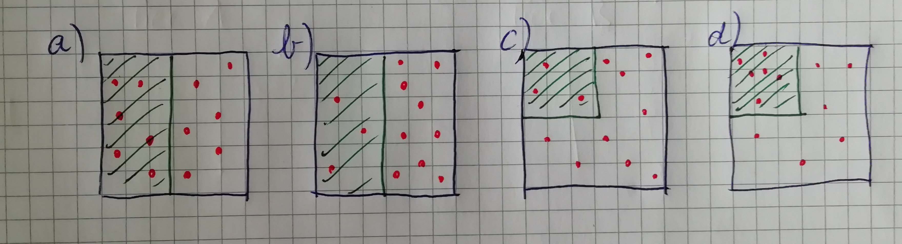
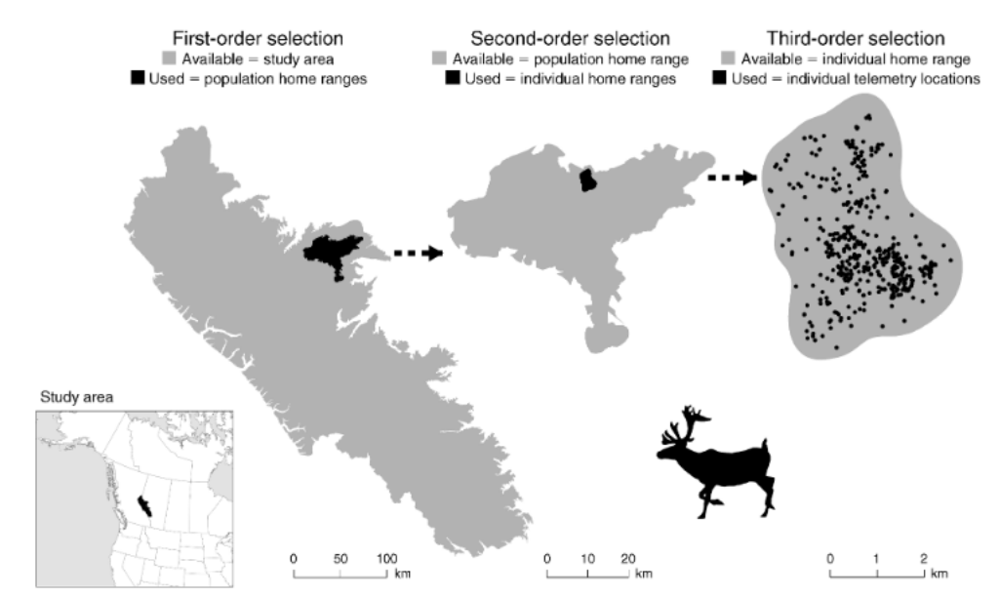

```{r setup}
#| include: false
library(tidyverse)
library(amt)
library(terra)

knitr::opts_chunk$set(
  echo = TRUE,
  warning = FALSE,
  message = FALSE,
  fig.height = 4,
  fig.width = 6
)
```

## Wo sind wir?

-   [13.04.2026: E01: Einführung]{style="color: #888;"}
-   [20.04.2026: E02: Erfassung von Wildtieren]{style="color: #888;"}
-   [27.04.2026: E03: Verbreitung 1]{style="color: #888;"}
-   [05.05.2026: E04: Verbreitung 2]{style="color: #888;"}
-   [05.2026: E05: Occupancy-Modelle 1 (online)]{style="color: #888;"}
-   [18.05.2026: E06: Occupancy-Modelle 2]{style="color: #888;"}
-   [01.06.2026: E07: Abundanz 1]{style="color: #888;"}
-   [08.06.2026: E08: Abundanz 2]{style="color: #888;"}
-   [15.06.2026: E09: Telemetrie 1: Random Walks etc]{style="color: #888;"}
-   [22.06.2026: E10: Telemetrie 2: Streifgebiete]{style="color: #888;"}
-   **29.06.2026: E11: Telemetrie 3: Habitatselektion (hybrid)**
-   06.07.2026: E12: Telemetrie 4: Habitatselektion (online)

## Kurze Wiederholung/Vorschau


## Habitatselektion: Ideen und Ziele

Letzte Einheit:

-   Streifgebiete zur Analyse von Raumnutzung von Wildtieren.
-   Was treibt/formt die Raumnutzung von Wildtieren?
-   In dieser Einheit werden Analysen von Telemetrie ausgeweitet und es geht darum Habitatselektion zu berechnen.
-   Habitatselektion: verfügbares Habitat wird mit dem von dem Tier genutzten Habitat verglichen.

------------------------------------------------------------------------

Ganz allgemein versteht man unter Habitatselektion, ob Tiere ihre Habitate (= Lebensräume) so nutzen, wie sie zur Verfügung stehen oder ob es eine Präferenz bzw. Meidung für bestimmte Lebensräume gibt.

------------------------------------------------------------------------

-   Studiengebiet mit nur zwei Habitaten (z.B. Wald und Offenland) und diese zu je 50% vorhanden sind,
-   Erwartung: 50% der Beobachtungen im Wald (grün schraffiert in der Abbildung) und 50% der Beobachtungen im Offenland.



------------------------------------------------------------------------

-   **a** Die eine Hälfte der Punkte ist im Wald und die andere Hälfte im Offenland. Die Nutzung entspricht der Verfügbarkeit.
-   In **b** ist es etwas anders, es befinden sich $\frac{3}{4}$ der Punkte im Offenland und nur $\frac{1}{4}$ der Punkte im Wald, bei gleicher Verteilung von Wald und Offenland. Das würde uns anzeigen, dass das Tier eine Präferenz (in dem beobachteten Zeitraum) für Offenland gegenüber Wald hat.


------------------------------------------------------------------------

-   In **c** gibt es keine Abweichung der Nutzung vom Angebot. Wald macht $\frac{1}{4}$ des Habitats aus und $\frac{3}{12} = \frac{1}{4}$ der Punkte wurden im Wald beobachtet. Demzufolge nutzt das Tier das Habitat genau wie es vorhanden ist.


------------------------------------------------------------------------

-   In **d** ist die Verteilung des Habitates gleich wie in **c**, aber die Verteilung der genutzten Punkte ist je zu $\frac{1}{2}$ auf die beiden Habitate verteilt. D.h. wiederum, dass man im Wald bei nur einem Viertel der Fläche die Hälfte der Punkte, an denen das Tier beobachtet wurde, verzeichnet. Das würde zu dem Schluss führen, dass es eine Präferenz für Wald gibt.


------------------------------------------------------------------------

Habitatselektionsstudien: Selektionsverhalten zu quantifizieren. Dabei gibt es einige Herausforderungen:

1.  man verschiedene Hierachieebenen berücksichtigen muss.
2.  man mehr als zwei Landnutzungsklassen hat (z.B. Wald, Offenland, Siedlung, unterschiedliche Waldtypen, etc.).
3.  man neben diskreten Kovariaten (wie z.B. Landnutzung) auch kontinuierlich skalierte Kovariaten berücksichtigen möchte (z.B., Seehöhe, Distanz zu Straßen).
4.  man zeitliche Aspekte berücksichtigen muss (z.B. Tag und Nacht, Jahresverlauf).
5.  man individuelle Unterschiede des Selektionsverhaltens von Tieren berücksichtigen möchte.

------------------------------------------------------------------------

### Überlegen Sie:

-   Für Tier A wurden 2039 Positionen aufgenommen, davon sind 1030 im Wald. Stimmen Sie der Aussage zu, dass es eine signifikante Selektion für Wald gibt?
    1.  Ja
    2.  Nein
    3.  Kann man so nicht sagen.
-   Für Tier B wurden lediglich 38 Positionen aufgenommen, davon sind 29 im Wald. Stimmen Sie der Aussage zu, dass es eine signifikante Selektion für Wald gibt?
    1.  Ja
    2.  Nein
    3.  Kann man so nicht sagen.

------ 

### Antwort

Die richtige Antwort ist jeweils 3. Man kann hier keine Aussagen treffen, da die Anteile der Lebensräume nicht bekannt sind. Die 1. Antwortmöglichkeit wäre richtig, wenn zwei Lebensräume mit einem Anteil von 50 % vorhanden sind.

## Hierachieebenen von Habitatselektion

Johnson 1980 stellte ein Konzept zur Betrachtung der verschiedenen Hierachieebenen von Habitatselektion vor[^1].

[^1]: Johnson, Douglas H. "The comparison of usage and availability measurements for evaluating resource preference." Ecology 61, no. 1 (1980): 65-71.

-   Die **erste Ebene** (First-order selection) untersucht, wo sich eine Population innerhalb eines Studiengebiets befindet. Das Studiengebiet (z.B. ein Nationalpark, Naturregion oder eine administrative Einheit) bildet dabei das verfügbare Habitat. Als genutztes Habitat wird ein von allen Tieren der Population genutztes Gebiet definiert (z.B. ein Streifgebiet mit allen Individuen).

------------------------------------------------------------------------

-   Das genutzte Habitat aus der ersten Hierachieebene bildet das verfügbare Habitat für die **zweite Hierachieebene** (Second-order selection). Als genutztes Habitat werden hier die einzelnen Streifgebiete der Tiere betrachtet.
-   Schlussendlich ist bei der **dritten Hierachieebene** (Third-order selection) das verfügbare Habitat das genutzte Habitat aus der zweiten Hierachieebene (also das Streifgebiet eines Individuums). Als genutzt werden die Punkte angesehen, an denen ein Tier -- meist durch Telemetrie -- beobachtet wurde.

------------------------------------------------------------------------



------------------------------------------------------------------------

### Überlegen Sie:

10 Rehe wurden für 6 Monate telemetriert. Als verfügbares Habitat wurde für jedes Reh das jeweilige Streifgebiet angenommen. Als genutztes Habitat wurden die Lokalisierungen angenommen. Um welche Hierachieebene von Habitatselektion handelt es sich bei diesem Beispiel?

1.  First-order Selektion
2.  Second-order Selektion
3.  Third-order Selektion

::: fragment
### Antwort

Third-order Selektion ist richtig.
:::

## Jacobs Index

Der Jacobs Index[^2] ist eine relativ einfache Kenngröße, mit der eine Tendenz für Präferenz bzw. Meidung unterschiedlicher Habitatklassen berechnet werden kann.

[^2]: Jacobs, J. (1974). Quantitative measurement of food selection. Oecologia, 14(4), 413-417.

------------------------------------------------------------------------

Der Jacobs Index $D_i$ für die $i$-te Habitatklasse reicht von $-1$ (starke Meidung) zu $+1$ (starke Präferenz) und wird wie folgt berechnet:

$$D_i = \frac{r_i - p_i}{r_i + p_i - 2r_ip_i}$$

wobei

-   $r_i$ der Anteil an genutztem Habitat und
-   $p_i$ der Anteil an verfügbaren Habitat ist,

jeweils für die $i$-te Habitatklasse.

------------------------------------------------------------------------

Als Beispiel verwenden wir die vier Situation von vorhin. Für **a** würde man den Jacobs Index für Wald wie folgt berechnen:


$$D_\text{wald} = \frac{r_\text{wald} - p_\text{wald}}{r_\text{wald} + p_\text{wald} - 2r_\text{wald}p_\text{wald}}$$

wobei

-   $r_\text{wald}$ der Anteil Lokalisierungen im Wald ist, in diesem Beispiel also 0.5.
-   $p_\text{wald}$ der Anteil Wald im Studiengebiet ist, in dem Beispiel also 0.5.

------------------------------------------------------------------------

Daraus ergibt sich ein Jacobs Index $D_\text{wald}$ von

$$D_\text{wald} = \frac{0.5 - 0.5}{0.5 + 0.5 - 2 * 0.5 * 0.5}  = 0$$

------------------------------------------------------------------------


Für das Beispiel **b** aus der Abbildung, würde sich der Jacobs Index so berechnen:

-   $r_\text{wald}$ der Anteil Lokalisierungen im Wald ist, in dem Beispiel also 0.25.
-   $p_\text{wald}$ der Anteil Wald im Studiengebiet ist, in dem Beispiel also 0.5.

------------------------------------------------------------------------

Und die Berechnung sieht dann wie folgt aus,

$$D_\text{wald} = \frac{0.25 - 0.5}{0.25 + 0.5 - 2 * 0.25 * 0.5}  = -0.5$$

damit ergibt sich ein Jacobs Index von $-0.5$, der auf eine Meidung von Wald hindeutet.

------------------------------------------------------------------------

### Überlegen Sie:

Das Bewegungsverhalten von einer Wildkatze wurde für 10 Monate mit einem GPS-Halsband verfolgt. 87 % aller Ortungen befinden sich im Wald. Das Studiengebiet weist einen Waldanteil von 38,5 % auf.

1.  Berechnen Sie den Jacobsindex.
2.  Wie interpretieren Sie den Wert des Jacobsindex?

::: fragment
### Antwort

```{r}
r <- 0.87
p <- 0.385

(r - p) / (r + p - 2 * r * p)
```

Es besteht eine starke Präferenz für den Wald.
:::

## $\chi^2$-Test zum Berechnen von Habitatselektion

Eine Verallgemeinerung des Jacobs Index und ein statistischer Signifikanztest kann mit dem $\chi^2$-Test erreicht werden. Dabei wird geprüft, ob die Verteilung von Punkten in $m$ Klassen von der erwarteten Verteilung abweicht.

-   $H_0$: Die Beobachtungen verteilen sich auf $m$ Klassen wie erwartet (oft gleichverteilt).
-   $H_1$: Die Beobachtungen verteilen sich auf $m$ Klassen **nicht** wie erwartet.

------------------------------------------------------------------------

Der Wert der Teststatistik ($\chi^2$)[^3] berechnet sich dann aus

[^3]: Ist der griechische Buchstabe 'chi'.

$$\chi^2 = \sum_{j = 1}^m \frac{(B_j - E_j)^2}{E_j}$$

dabei ist

-   $m$ die Anzahl an Habitatklassen (in unserem Beispiel mit Wald und Offenland wäre $m = 2$).
-   $j$ ist ein Index der von $j = 1, \dots, m$ läuft.
-   $B_j$ ist die Anzahl an beobachteten Punkten in der $j$-ten Kategorie und
-   $E_j$ ist die Anzahl an erwarteten Punkten.

------------------------------------------------------------------------

Wenn wir wieder das Beispiel **a** betrachten,


dann wäre $m = 2$, für den Wald $B_1 = 6$ und $E_1 = 6$ und für das Offenland $B_2 = 6$ und $E_2 = 6$. Daraus berechnet sich $\chi^2$ dann als

------------------------------------------------------------------------

$$
\begin{aligned}
\chi^2 &= \sum_{j = 1}^m \frac{(B_j - E_j)^2}{E_j} \\
&= \frac{(B_1 - E_1)^2}{E_1} + \frac{(B_2 - E_2)^2}{E_2} \\
&= \frac{(6 - 6)^2}{6} + \frac{(6 - 6)^2}{6} \\
&= 0
\end{aligned}
$$

Des Weiteren wissen wir per Definition, dass $\chi^2$ einer $\chi^2$-Verteilung mit $m - 1$ Freiheitsgraden folgt, d.h. wir können einen p-Wert analytisch ausrechnen oder in einer Tabelle nachschlagen.

In unserem Fall ist der p-Wert = 1, d.h., wir haben keinen Grund die Nullhypothese, dass die Verteilung der Klassen nicht der Erwartung entspricht, zu verwerfen.

------------------------------------------------------------------------

```{r}
#| echo: false
q1 <- chisq.test(c(30, 30, 40))
q2 <- chisq.test(c(20, 40, 40))
```

### Weitere Beispiele

-   100 Punkte eines Rehs verteilen sich gleich auf drei Landnutzungskategorien: Laubwald, Nadelwald und Offenland.
-   Die Verteilung der beobachteten Punkte ist 30, 30 und 40. Teststatistik: `r q1$statistic` und p-Wert: `r round(q1$p.value, 3)`, keine signifikante Abweichung der Habitatnutzung vom vorhandenen Habitat.

------------------------------------------------------------------------

-   Annahme einer Verteilung der beobachteten Punkte von 20, 40, 40 pro Habitatklasse (gleichbleibender Verfügbarkeit)
-   Neue Teststatistik von `r q2$statistic` und p-Wert von `r round(q2$p.value, 3)`.
-   **Wichtig**: wir können nicht sagen, welche Kategorie signifikant von der Erwartung abweicht (wahrscheinlich ist es der Laubwald) --- der $\chi^2$-Test sagt nur, dass mindestens eine Kategorie signifikant von der Erwartung abweicht.

------------------------------------------------------------------------

-   Um festzustellen, welche Kategorien signifikant von der Erwartung abweichen, haben Neu et al. 1974[^4] eine Methode zur Berechnung von Konfidenzintervallen für jede Klasse vorgestellt[^5].
-   Diese können dann mit der Verfügbarkeit der jeweiligen Klasse verglichen werden und wenn das Konfidenzintervall den Wert der Verfügbarkeit überlappt, kann man davon ausgehen, dass eine Habitatklasse genau so genutzt wird, wie sie verfügbar ist.
-   Zur Berechnung der Konfidenzintervalle wird für den Anteil jeder Habitatkategorie $p_i$ ein 95%-Konfidenzintervall berechnet. Dieses ergibt sich aus:

[^4]: Neu, C. W., Byers, C. R., & Peek, J. M. (1974). A technique for analysis of utilization-availability data. The Journal of Wildlife Management, 541-545.

[^5]: Diese Methode ist auch als Bonferroni-Korrektur in der Literatur bekannt.

------------------------------------------------------------------------

$$
\hat{p}_i - z_{(1-\frac{\alpha}{2m})} \sqrt{\frac{\hat{p}_i(1 - \hat{p}_i)}{n}} \le p_i \le
\hat{p}_i + z_{(1-\frac{\alpha}{2m})} \sqrt{\frac{\hat{p}_i(1 - \hat{p}_i)}{n}}
$$

wobei,

-   $\hat{p}_i$: der geschätzte Anteil der $i$-ten Habitatkategorie ist.
-   $m$ die Anzahl der Habitatkategorien ist.
-   $z_{(1-\frac{\alpha}{2m})}$ das $1 - \frac{\alpha}{2m}$ Quantil einer Standardnormalverteilung. Wobei $\alpha$ in der Regel 0.05 ist.
-   $n$ die Gesamtanzahl an Beobachtungen.

------------------------------------------------------------------------

### Ein Beispiel

Gibt es eine Bevorzugung von Wald gegenüber anderen Habitaten für einen rumänischen Bären?

```{r}
#| echo: false
set.seed(123)
library(amt)
lc <- rast(here::here("daten/clc.tif"))
dat <- read.table(here::here("daten/bears_RO.csv"), sep = ",", header = TRUE, 
                  stringsAsFactors = FALSE)
trk <- make_track(dat, X, Y, Name = Name, Sex = Sex, 
                  crs = 3844)
trk1 <- transform_coords(trk, 3035)
trk1 <- trk1[trk1$Name == "Bear13", ]

lc1 <- lc # kopieren von lc
lc1[] <- ifelse(lc[] == 311 | lc[] == 312 | lc[] == 313, 1, 0)

rp <- random_points(trk1, n = 1e4)
rp <- extract_covariates(rp, lc1)

tbl <- table(rp$case_, rp$clc)
pt <- prop.table(tbl, margin = 1)

ji <- function(genutzt, verfuegbar) {
  (genutzt - verfuegbar) / (genutzt + verfuegbar - 2 * genutzt * verfuegbar)
}

ji_anderes <- round(ji(genutzt = pt[2, 1], verfuegbar = pt[1, 1]), 2)
ji_wald <- round(ji(genutzt = pt[2, 2], verfuegbar = pt[1, 2]), 2)
```

### Jacobs-Index

-   Wald: `r ji_wald`.
-   Anderes: `r ji_anderes`.

### $\chi^2$-Test

```{r}
#| echo: false
chisq.test(x = tbl[2, ], p = pt[1, ])
```

------------------------------------------------------------------------

Anteile mit Konfidenzintervallen:

```{r tab1}
#| echo: false
p <- pt[2, ] 
n <- nrow(trk1)
fb <- 1.96 * sqrt((p * (1 - p)) / n)

data.frame(
    p = pt[2, ], 
    lci = pt[2, ] - fb, 
    uci = pt[2, ] + fb,
    avail = pt[1, ],
    row.names = c("Offenland", "Wald"))
```

------------------------------------------------------------------------

### Überlegen Sie:

Wie würden Sie folgende Ergebnisse eines $\chi^2$-Tests interpretieren:

```{r}
#| echo: false
set.seed(123)
l <- c("wald", "offenland", "landwirtschaft")
avail <- sample(l, 1000, TRUE, prob = c(0.2, 0.4, 0.4))
used <- sample(l, 1000, TRUE, prob = c(0.4, 0.2, 0.4))

chisq.test(table(used), p = c(0.2, 0.4, 0.4))
```

Gibt es Habitatselektion?

1.  Ja
2.  Nein
3.  Kann man so nicht sagen.

----

### Antwort

Die Nullhypothese lautet "Die Beobachtungen verteilen sich auf $m$ Klassen wie erwartet (= gleichverteilt)". Der p-Wert ist kleiner als $0{,}05$, weswegen die Nullhypothese verworfen werden kann. Das bedeutet, dass die Alternativhypothese "Die Beobachtungen verteilen sich auf $m$ Klassen nicht wie erwartet" angenommen werden kann. Es besteht also eine Habitatselektion (1. Antwortmöglichkeit).

Die Freiheitsgrade ($df$) betragen $2$. Es bestehen also 3 Habitattypen ($df = n - 1$).

