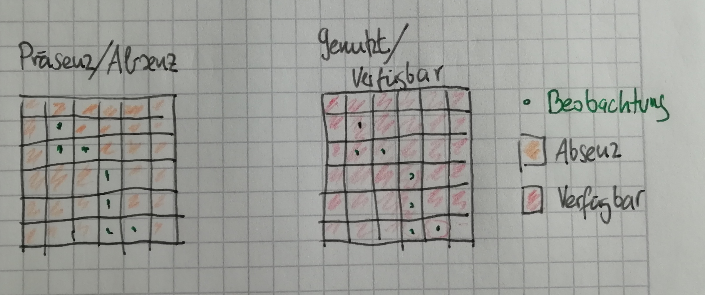
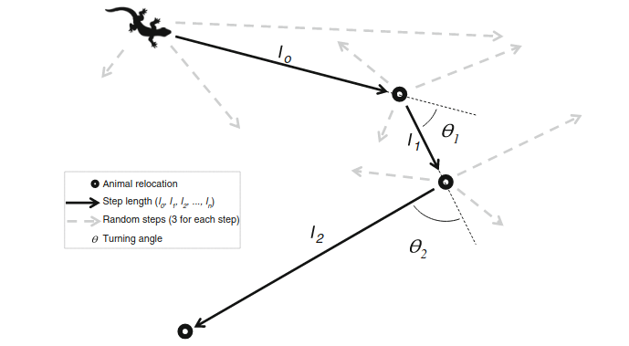

```{r setup}
#| include: false
library(tidyverse)
library(amt)

knitr::opts_chunk$set(
  echo = TRUE,
  warning = FALSE,
  message = FALSE,
  fig.height = 4,
  fig.width = 6
)
```

## Wo sind wir?

-   [13.04.2026: E01: Einführung]{style="color: #888;"}
-   [20.04.2026: E02: Erfassung von Wildtieren]{style="color: #888;"}
-   [27.04.2026: E03: Verbreitung 1]{style="color: #888;"}
-   [04.05.2026: E04: Verbreitung 2]{style="color: #888;"}
-   [11.05.2026: E05: Occupancy-Modelle 1 (online)]{style="color: #888;"}
-   [18.05.2026: E06: Occupancy-Modelle 2]{style="color: #888;"}
-   [01.06.2026: E07: Abundanz 1]{style="color: #888;"}
-   [08.06.2026: E08: Abundanz 2]{style="color: #888;"}
-   [15.06.2026: E09: Telemetrie 1: Random Walks etc]{style="color: #888;"}
-   [22.06.2026: E10: Telemetrie 2: Streifgebiete]{style="color: #888;"}
-   [29.06.2026: E11: Telemetrie 3: Habitatselektion (hybrid)]{style="color: #888;"}
-   **06.07.2026: E12: Telemetrie 4: Habitatselektion (online)**


## Resource Selection Functions (RSF)

-   Resource Selection Functions (RSF) bieten einen erweiterten Ansatz zum Analysieren von Habitatselektion bei Tieren.
-   Dabei werden in der Regel Präsenzpunkte (z.B. durch Telemetrie erhoben) mit verfügbaren Punkten (die auch genutzt werden können) verglichen.
-   Das häufigste Design zur Quantifizierung von Verfügbarkeit ist, dass aus einem Gebiet (z.B. Streifgebiet) viele zufällige Punkte gezogen werden.
-   RSF erlauben es beliebig viele Kovariaten in einem Modell zu berücksichtigen, Interaktionen mit nicht räumlichen Kovariaten (z.B. Tageszeit, Jagdzeit) und mehrere Tiere gleichzeitig zu berücksichtigen.

------------------------------------------------------------------------

RSFs werden häufig als

$$
w(\mathbf{X}(s); \mathbf{\beta}) = \exp(X_1(s)\beta_1 + \dots + X_k(s)\beta_k)
$$

definiert. Mit

-   $w(\cdot)$ ist die Habitatselektionsfunktion.
-   $\mathbf{X}(s)$ ist der Wert der Kovariaten $X$ an Position $s = (x, y)$ (im Raum).
-   $\mathbf{\beta}$ Sind die $1, \dots, k$ Selektionskoeffizienten.

Die $\mathbf{\beta}$ müssen geschätzt werden.

------------------------------------------------------------------------

-   $\mathbf{\beta}$ werden in der Regel mit einer logistischen Regression geschätzt.
-   Interpretation der $\mathbf{\beta}$ ist aber etwas anders, weil wir keine Präsenz/Absenz-Punkte haben (wie z.B. bei Occupancy-Modellen), sondern genutzte und *verfügbare* Punkte haben.



------------------------------------------------------------------------

### Überlegen Sie:

Für eine Studie werden 21 Rehe für 2 Jahre mit einem Telemetriesender ausgestattet und die Position wird alle 6 h aufgezeichnet. Danach wird über das Studiengebiet ein 1 \* 1 km Grid gelegt und in jeder Zelle gezählt wie oft ein Reh in der Zelle war. Es wurden 74 % der Zellen mindestens einmal besucht, kann man davon ausgehen, dass die restlichen 26 % der Zellen nicht genutzt wurden?

1.  Ja
2.  Nein

------------------------------------------------------------------------

### Antwort

Die richtige Antwort ist 2.

Die Telemetrieaufnahme ist nur eine Momentaufnahme. Der Sender löst nur alle 6 Stunden aus, weswegen das Tier außerhalb der Aufnahme die 26 % der Zellen nutzten könnte. Die Telemetrie findet außerdem nur für einen begrenzenten Zeitabschnitt im Leben des Tiers statt.

## Anpassen einer RSF

1.  Je nach Hierarchieebene (meist second- oder third-order) wird genutztes und verfügbares Habitat definiert.
2.  Im verfügbaren Habitat wird eine *große* Anzahl an zufälligen Punkten verteilt.
3.  An den genutzten und verfügbaren Punkten werden die Werte der Kovariaten extrahiert.
4.  Zur Schätzung der Selektionskoeffizienten wird eine logistische Regression an die Daten angepasst.

------------------------------------------------------------------------

### Ein Beispiel

Datensatz: Fischmarder in den USA[^1]

[^1]: Die Beispiele stammen aus Fieberg et al. 2021: <https://doi.org/10.1111/1365-2656.13441>


------------------------------------------------------------------------

Beobachtete Punkte:

```{r fisher_fig1}
#| fig-width: 9
#| fig-height: 6
#| dev: png
library(amt)
marder1 <- filter(amt_fisher, name == "Lupe")
```

------------------------------------------------------------------------

Als Nächstes muss die Verfügbarkeit quantifiziert werden. Z.B. mit einem MCP100-Streifgebiet:

```{r}
#| fig-width: 9
#| fig-height: 6
#| dev: png
verf <- hr_mcp(marder1, level = 1)
plot(verf, axes = TRUE)
```

------------------------------------------------------------------------

```{r}
#| fig-width: 9
#| fig-height: 6
#| dev: png
# Die Verfügbarkeit wird automatisch nochmals berechnet
m2 <- random_points(marder1) 
plot(m2)
```

------------------------------------------------------------------------

Hinzufügen von Kovariatenwerten. Wir berücksichtigen erst einmal nur eine Kovariate: Seehöhe.

```{r}
#| fig-width: 9
#| fig-height: 6
#| dev: png
dem <- get_amt_fisher_covars()$elevation
raster::plot(dem)
```

------------------------------------------------------------------------

An jedem Punkt (egal ob das Tier an diesem Punkt vorkam oder ob es ein Zufallspunkt ist), fragen wir den Wert der Seehöhe (`dem` = *digital elevation model*) ab.

```{r}
m3 <- extract_covariates(m2, dem)
head(m3)
```

------------------------------------------------------------------------

Die Verteilung der Kovariate (`dem`) an den genutzten und verfügbaren Punkten:

```{r}
#| fig-width: 9
#| fig-height: 6
#| echo: false
library(ggplot2)
ggplot(m3, aes(elevation, fill = case_)) +
    geom_density(alpha = 0.6) + theme_light() +
    labs(x = "Seehöhe", y = "Dichte", fill = "Genutzt")
```

------------------------------------------------------------------------

Anpassen eines Modells (logistische Regression):

:::: {.columns}

::: {.column width="65%"}


```{r}
mod1 <- glm(case_ ~ elevation, data = m3, 
            family = binomial())
summary(mod1)
```

:::

::: {.column width="35%"}

:::: {.fragment}

- `(Intercept)`: Im Kontext einer RSF ist der Intercept nicht relevant und sollte einfach ignoriert werden. 
- `elevation`: Ein positiver geschätzer Koeffizient für `elevation` gibt Hinweis darauf, dass höhere Gebiete bevorzugt werden. 

::::

:::

::::


## Interpretation von RSFs

-   Man spricht von einem "Relativen Risiko", dass ein Punkt genutzt wurde bzw. von einer Relativen Selektionsstärke (RSS).

-   Man kann sich das RSS so vorstellen: Wenn ein Tier die Wahl hat zwei Punkte aufzusuchen ($s_1$ und $s_2$) und sich $s_1$ und $s_2$ um genau eine Einheit der Kovariaten $X_1$ unterscheiden, dann wird die Wahrscheinlichkeit für $s_2$ gegenüber $s_1$ als $\exp(\beta_1)$ angegeben.

------------------------------------------------------------------------

Wenn wir uns Modell 1 anschauen:

```{r}
coef(mod1)
```

Nehmen wir für Punkt $s_1$ eine Seehöhe von 100 m und für Punkt $s_2$ eine Seehöhe von 101 m an. Die Relative Selektionsstärke für Punkt $s_2$ gegenüber Punkte $s_1$ ist dann:

$$
\begin{aligned}
RSS(s_2, s_1) &=\frac{w(s_2)}{w(s_1)} = \frac{\exp(101 \beta_\text{dem})}{\exp(100 \beta_{\text{dem}})} \\
&= \exp(101\beta_\text{dem} - 100 \beta_\text{dem}) \\ 
&= \exp((101 - 100)\beta_\text{dem}) \\ 
&= \exp(\beta_\text{dem})
\end{aligned}
$$

------------------------------------------------------------------------

Ein RSS von

-   $1$ bedeutet, es gibt keine Präferenz für $s_2$ gegenüber $s_1$.
-   $<1$ bedeutet, $s_1$ wird gegenüber $s_2$ bevorzugt (ein Wert von 0.5 heißt, dass sich die Selektionwahrscheinlichkeit für $s_2$ halbiert).
-   $>1$ bedeutet, $s_2$ wird gegenüber $s_1$ bevorzugt (ein Wert von 2 heißt, dass sich die Selektionwahrscheinlichkeit für $s_2$ verdoppelt).

------------------------------------------------------------------------

Wenn wir das eben gezeigte auf die Seehöhe anwenden: 

```{r}
exp(coef(mod1)[2])
```

:::: {.fragment}

Als Kontrolle können wir auch nochmals das RSS ausrechenen ($RSS(s_2, s_1) =\frac{w(s_2)}{w(s_1)}$). 


```{r}
exp(coef(mod1)[2] * 101) / exp(coef(mod1)[2] * 100)
```

::::

------------------------------------------------------------------------

### Überlegen Sie:

Was heißt ein RSS von 2?

1.  Die Wahrscheinlichkeit, dass Punkt $s_2$ gegenüber $s_1$ gewählt wird ist doppelt so hoch.
2.  Die Wahrscheinlichkeit, dass Punkt $s_2$ gegenüber $s_1$ gewählt wird ist halb so hoch.
3.  Die Wahrscheinlichkeit, dass Punkt $s_2$ gegenüber $s_1$ gewählt wird ist dreimal so hoch.
4.  Die Wahrscheinlichkeit, dass Punkt $s_2$ gegenüber $s_1$ gewählt wird ist gleich.

::: fragment
### Antwort

Die richtige Antwort ist 1
:::

------------------------------------------------------------------------

### Hinzufügen einer Interaktion

Mit einer Kovariate:

$$
w(\mathbf{X}(s); \mathbf{\beta}) = \exp(X_1(s)\beta_1 )
$$

Mit einer Interaktion mit Tageszeit / Jagdzeit oder ähnlichem

$$
w(\mathbf{X}(s); \mathbf{\beta}) = \exp(X_1(s)\beta_1  + X_1(s)X_2\beta_2)
$$

------------------------------------------------------------------------

In R wird eine Interaktion mit `:` geschrieben:

```{r}
#| echo: !expr -c(1:4)
m2a <- random_points(marder1) 
m2a$tod_ <- sample(c("day", "night"), nrow(m2a), TRUE)
m2a[m2a$case_, ]$tod_ <- as.character(time_of_day(marder1)$tod_)
m2a <- extract_covariates(m2a, dem)
mod2 <- glm(case_ ~ elevation + elevation:tod_, data = m2a, 
            family = binomial())
summary(mod2)
```

## Ausblick Step-Selection Functions

-   Eine zentrale Annahme bei RSFs ist, dass die Lokalisierungen unabhängig sind.
-   Diese Annahme trifft bei modernen Telmetriedaten mit kurzen Zeitabständen zwischen Lokalisierungen oft nicht mehr zu.
-   Eine Erweiterung der RSF sind Step-Selection Functions (SSFs).

------------------------------------------------------------------------



------------------------------------------------------------------------

-   Die Selektion-Funktion bleibt gleich, lediglich die Verfügbarkeit wird nun anders quantifiziert.
-   Die Schätzung der Selektionskoeffizienten erfolgt mit einer bedingten logistischen Regression (an der Interpretation ändert sich nichts).
-   Integrated SSF (iSSF) ermöglicht es Bewegung und Habitatselektion zu vereinigen (z.B. läuft ein Tier schneller/langsamer in Abhängigkeit von Kovariaten).

# Rückblick

## Was haben wir uns angeschaut

-   [13.04.2026: E01: Einführung]{style="color: #888;"}
-   [20.04.2026: E02: Erfassung von Wildtieren]{style="color: #888;"}
-   [27.04.2026: E03: Verbreitung 1]{style="color: #888;"}
-   [04.05.2026: E04: Verbreitung 2]{style="color: #888;"}
-   [11.05.2026: E05: Occupancy-Modelle 1 (online)]{style="color: #888;"}
-   [18.05.2026: E06: Occupancy-Modelle 2]{style="color: #888;"}
-   [01.06.2026: E07: Abundanz 1]{style="color: #888;"}
-   [08.06.2026: E08: Abundanz 2]{style="color: #888;"}
-   [15.06.2026: E09: Telemetrie 1: Random Walks etc]{style="color: #888;"}
-   [22.06.2026: E10: Telemetrie 2: Streifgebiete]{style="color: #888;"}
-   [29.06.2026: E11: Telemetrie 3: Habitatselektion (hybrid)]{style="color: #888;"}
-   [06.07.2026: E12: Telemetrie 4: Habitatselektion (online)]{style="color: #888;"}

# Weiterer Verlauf

## Prüfungsvorleistung

- Online in StudIP ab dem 13.7.26
- Am 13.7.26, stehe ich nochmals zwischen 9:00 und 12:00 für Fragen zu der Hausarbeit zur Verfügung. 
- Abgabe der Hausarbeit am 18.9.26

## Wenn Sie sich Wildtierökologie interessieren:

- Verteiler der Abteilung Wildtierwissenschaften: <https://listserv.gwdg.de/mailman/listinfo/studierende-wildtierwissenschaften>

